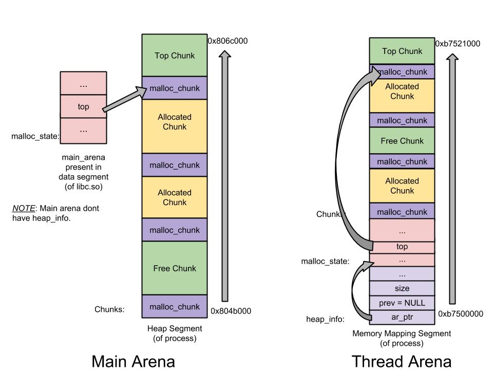
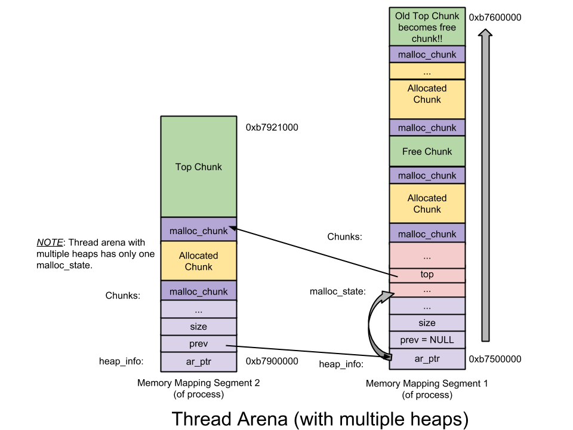
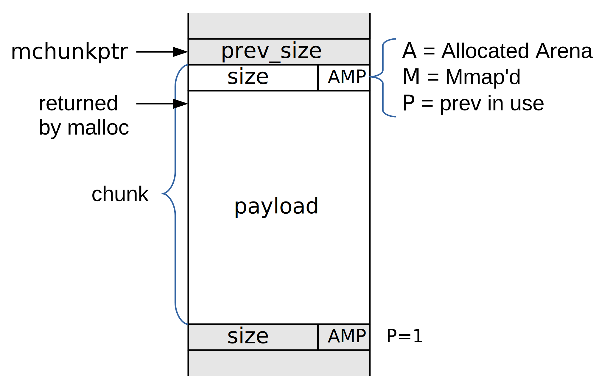
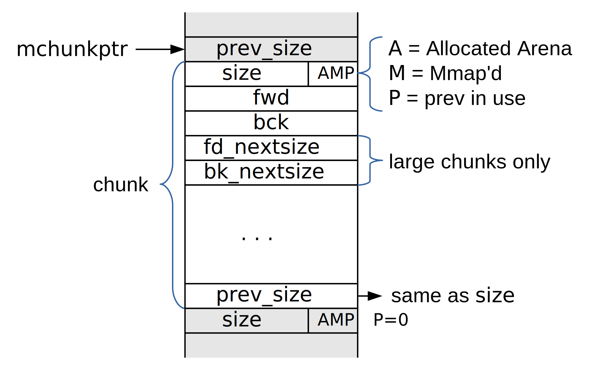

# 0x00 introduction

这篇是对笔记是对 [^Understanding] 学习的记录, 需要预备知识 [^layout], 其余 [^freebuf1] 与 [^freebuf2] 是阿里人对他的翻译整理补充, 同时给正经的开发人员裂墙安利 [^source].
学习这个主要目的是掌握堆运作的基本流程与可能存在的问题.
这个可以为堆安全问题 (double free, unlink, use-after-free etc) 学习与分析提供基础.
其次是尝试总结出一个相对一致的内存管理模型 (这个想法来自于组内的一次分享:The GC of JAVA).

目前 C 语言主要几种堆管理机制是:

* dlmalloc - General purpose allocator
* ptmalloc2 - Glibc
* jemalloc - freebsd and firefox
* tcmalloc - Google
* libumem - Solaris

在 linux 系统上`mem_strcut->start_brk`与`mm_struct->brk`分别限定了堆的起止地址, 进程可通过`malloc`,`calloc`,`realloc`,`free`,`brk`与`sbrk`来请求与释放 heap.
其中只有`brk`是唯一的系统调用, 其余的都是基于`brk`或`mmap`调用实现的.

* `brk`: 这个系统调用相对简单, 仅仅是改变`mm_struct->brk`, 新申请的区域不以 0 初始化.
* `mmap`:malloc 利用`mmap`调用创建私有匿名的映射段, 以 0 初始化.

在 ptmalloc2 设计时为了提高效率, 做了一点预设, 其中与`brk`和`mmap`相关的就是:

* 具有长生命周期的大内存分配使用 mmap.
* 特别大的内存分配总是使用 mmap.
* 具有短生命周期的内存分配使用 brk, 因为用 mmap 映射匿名页, 当发生缺页异常时,kernel 为缺页分配一个新物理页并清 0, 一个 mmap 的内存块需要映射多个物理页, 导致多次清 0 操作, 很浪费系统资源, 所以引入了 mmap 分配阈值动态调整机制保证在必要的情况下才使用 mmap 分配内存.

## 0x01 the ptmalloc2's behaviour

主要利用下面代码来初步窥视 glibc 中堆得一些具体行为, 引用源码来自 glibc 2.23.

```c
/* gcc mthread.c -lpthread */
#include <stdio.h>
#include <stdlib.h>
#include <pthread.h>
#include <unistd.h>
#include <sys/types.h>

void* threadFunc(void* arg) {
	printf("Before malloc in thread 1\n");
	getchar();
	char* addr = (char*) malloc(1000);
	printf("After malloc and before free in thread 1\n");
	getchar();
	free(addr);
	printf("After free in thread 1\n");
	getchar();
}

int main() {
	pthread_t t1;
	void* s;
	int ret;
	char* addr;

	printf("Welcome to per thread arena example::%d\n",getpid());
	printf("Before malloc in main thread\n");
	getchar();
	addr = (char*) malloc(1000);
	printf("After malloc and before free in main thread\n");
	getchar();
	free(addr);
	printf("After free in main thread\n");
	getchar();
	ret = pthread_create(&t1, NULL, threadFunc, NULL);
	if(ret)
	{
		printf("Thread creation error\n");
		return -1;
	}
	ret = pthread_join(t1, &s);
	if(ret)
	{
		printf("Thread join error\n");
		return -1;
	}
	return 0;
}
```
Before malloc in main thread:
这个阶段可以看见程序是没有堆空间的 (如果有会有一个 heap 表示出来, 且那个内存区域是 rw 的权限).

```x86asm
08048000-08049000 r-xp 00000000 fc:00 393219     /home/guowang/lsploits/hof/ptmalloc.ppt/mthread/a.out
08049000-0804a000 r--p 00000000 fc:00 393219     /home/guowang/lsploits/hof/ptmalloc.ppt/mthread/a.out
0804a000-0804b000 rw-p 00001000 fc:00 393219     /home/guowang/lsploits/hof/ptmalloc.ppt/mthread/a.out
b7e05000-b7e07000 rw-p 00000000 00:00 0
```
After malloc and before free in main thread:
主线程调用了`malloc(1000)`过后, 可以系统在数据段相邻的地方提供了 132KB 大小的空间, 这个空间被称为 arena, 也由于是主线程创建也被称为 main_arena.
132KB 比 1000 字节大太多, 后面主线程继续申请空间会先从 main_arena 这里扣除, 直到不够用系统会继续增加 arena 的大小.

```x86asm
08048000-08049000 r-xp 00000000 fc:00 393219     /home/guowang/lsploits/hof/ptmalloc.ppt/mthread/a.out
08049000-0804a000 r--p 00000000 fc:00 393219     /home/guowang/lsploits/hof/ptmalloc.ppt/mthread/a.out
0804a000-0804b000 rw-p 00001000 fc:00 393219     /home/guowang/lsploits/hof/ptmalloc.ppt/mthread/a.out
0804b000-0806c000 rw-p 00000000 00:00 0          [heap]
b7e05000-b7e07000 rw-p 00000000 00:00 0
```
After free in main thread:
在主线程调用 free 之后, 内存布局还没有变,`free()`操作并不是直接把内存给操作系统, 而是给库函数加以管理.
它会将已经释放的`chunk`(heap 的最小内存单位) 添加到`main_arean`的 bin(这是一种用于存储同类型 free chunk 的双链表数据结构) 中. 下次申请堆空间时候优先从 bin 中找合适的 chunk.

```x86asm
08048000-08049000 r-xp 00000000 fc:00 393219     /home/guowang/lsploits/hof/ptmalloc.ppt/mthread/a.out
08049000-0804a000 r--p 00000000 fc:00 393219     /home/guowang/lsploits/hof/ptmalloc.ppt/mthread/a.out
0804a000-0804b000 rw-p 00001000 fc:00 393219     /home/guowang/lsploits/hof/ptmalloc.ppt/mthread/a.out
0804b000-0806c000 rw-p 00000000 00:00 0          [heap]
b7e05000-b7e07000 rw-p 00000000 00:00 0
```
Before malloc in thread 1:
可以看到用户线程在没有申请对空间是没有默认线程堆空间的, 但是有默认线程栈.

```x86asm
08048000-08049000 r-xp 00000000 fc:00 393219     /home/guowang/lsploits/hof/ptmalloc.ppt/mthread/a.out
08049000-0804a000 r--p 00000000 fc:00 393219     /home/guowang/lsploits/hof/ptmalloc.ppt/mthread/a.out
0804a000-0804b000 rw-p 00001000 fc:00 393219     /home/guowang/lsploits/hof/ptmalloc.ppt/mthread/a.out
0804b000-0806c000 rw-p 00000000 00:00 0          [heap]
b7604000-b7605000 ---p 00000000 00:00 0
b7605000-b7e07000 rw-p 00000000 00:00 0          [stack:11284]
```
After malloc and before free in thread 1:
在 thread1 调用`malloc()`后创建了堆空间 (no_main_arena), 其起始地址是 0xb7500000 与前面的 data segment 不连续可以猜测这是由`mmap`分配的.
非主线程每次利用`mmap`像操作申请`MAX_HEAP_SIZE`(32 位系统默认 1M) 大小的虚拟内存, 在从其中切割出 0xb7521000-0xb7500000 给用户线程.

```x86asm
08048000-08049000 r-xp 00000000 fc:00 393219     /home/guowang/lsploits/hof/ptmalloc.ppt/mthread/a.out
08049000-0804a000 r--p 00000000 fc:00 393219     /home/guowang/lsploits/hof/ptmalloc.ppt/mthread/a.out
0804a000-0804b000 rw-p 00001000 fc:00 393219     /home/guowang/lsploits/hof/ptmalloc.ppt/mthread/a.out
0804b000-0806c000 rw-p 00000000 00:00 0          [heap]
b7500000-b7521000 rw-p 00000000 00:00 0
b7521000-b7600000 ---p 00000000 00:00 0
b7604000-b7605000 ---p 00000000 00:00 0
b7605000-b7e07000 rw-p 00000000 00:00 0          [stack:11284]
```
After free in thread 1:
内存的 layout 也没有发生变化, 这个主线程行为一致.

```x86asm
08048000-08049000 r-xp 00000000 fc:00 393219     /home/guowang/lsploits/hof/ptmalloc.ppt/mthread/a.out
08049000-0804a000 r--p 00000000 fc:00 393219     /home/guowang/lsploits/hof/ptmalloc.ppt/mthread/a.out
0804a000-0804b000 rw-p 00001000 fc:00 393219     /home/guowang/lsploits/hof/ptmalloc.ppt/mthread/a.out
0804b000-0806c000 rw-p 00000000 00:00 0          [heap]
b7500000-b7521000 rw-p 00000000 00:00 0
b7521000-b7600000 ---p 00000000 00:00 0
b7604000-b7605000 ---p 00000000 00:00 0
b7605000-b7e07000 rw-p 00000000 00:00 0          [stack:11284]
```

# 0x10 the implementation of ptmalloc2

## 0x11 arena

从 ptmalloc 看到了"主线程和用户线程 1 都有自己的 arena", 但是是事实上没有并不是为每线程的 arena, 系统最多支持的 arena 的个数取决于 core 的个数和系统位数`(core*2+1)`.

```c
...
int n = __get_nprocs ();

              if (n >= 1)
                narenas_limit = NARENAS_FROM_NCORES (n);
              else
                /* We have no information about the system.  Assume two
                   cores.  */
                narenas_limit = NARENAS_FROM_NCORES (2);
...

#define NARENAS_FROM_NCORES(n) ((n) * (sizeof (long) == 4 ? 2 : 8))
  .arena_test = NARENAS_FROM_NCORES (1)
```

1: 主线程调`malloc()`后创建`main_arena`:

```c
#define arena_for_chunk(ptr) \
  (chunk_non_main_arena (ptr) ? heap_for_ptr (ptr)->ar_ptr : &main_arena)
```

```c
/* check for chunk from non-main arena */
#define chunk_non_main_arena(p) ((p)->size & NON_MAIN_ARENA)
```

```c
static struct malloc_state main_arena =
{
  .mutex = _LIBC_LOCK_INITIALIZER,
  .next = &main_arena,
  .attached_threads = 1
};
```

2: 用户线程创建调用`malloc()`经过一些调用后进入`arena_get2()`, 如果没有达到进程的`arena`你上限则调用`_int_new_arena()`为当前线程创建`arena`, 如果达到上限, 会复用现有的`arena`(遍历有 arena 组成的链表并尝试上锁, 如果锁失败, 尝试下一个, 如果成功则返回其`arena`, 表示其可以被当前线程所使用)

```c
static mstate
internal_function
arena_get2 (size_t size, mstate avoid_arena)
{
  mstate a;

  static size_t narenas_limit;

    ...
    repeat:;
      size_t n = narenas;
      if (__glibc_unlikely (n <= narenas_limit - 1))
        {
          if (catomic_compare_and_exchange_bool_acq (&narenas, n + 1, n))
            goto repeat;
          a = _int_new_arena (size);
	  if (__glibc_unlikely (a == NULL))
            catomic_decrement (&narenas);
        }
      else
        a = reused_arena (avoid_arena);  // 复用!
    }
  return a;
}
```

3: 如果在`arena`链表里面没有找到可以用的, 会阻塞到有可用的为止.

```c
static mstate
reused_arena (mstate avoid_arena)
{
  mstate result;
  ...

  /* No arena available without contention.  Wait for the next in line.  */
  LIBC_PROBE (memory_arena_reuse_wait, 3, &result->mutex, result, avoid_arena);
  (void) mutex_lock (&result->mutex); // 这里, 在看注释
  ...

  return result;
}

```

## 0x12 data struct in heap

glibc 中堆管理对几个术语下定义 [^wiki]:

> Chunk: A small range of memory that can be allocated (owned by the application), freed (owned by glibc), or combined with adjacent chunks into larger ranges. Note that a chunk is a wrapper around the block of memory that is given to the application. Each chunk exists in one heap and belongs to one arena.

> Arena: A structure that is shared among one or more threads which contains references to one or more heaps, as well as linked lists of chunks within those heaps which are "free". Threads assigned to each arena will allocate memory from that arena's free lists.

> Heap: A contiguous region of memory that is subdivided into chunks to be allocated. Each heap belongs to exactly one arena.

管理过程中主要涉及的三个核心结构体如下:

### malloc_chunk

`malloc_chunk`是`chunk header`, 一个`heap`被分为多个`chunk`, 其大小有用户请求所决定, 每一个`chunk`都有自己的`malloc_chunk`.

```c
struct malloc_chunk {

  INTERNAL_SIZE_T      prev_size;  /* Size of previous chunk (if free).  */
  INTERNAL_SIZE_T      size;       /* Size in bytes, including overhead. */

  struct malloc_chunk* fd;         /* double links -- used only if free. */
  struct malloc_chunk* bk;

  /* Only used for large blocks: pointer to next larger size.  */
  struct malloc_chunk* fd_nextsize; /* double links -- used only if free. */
  struct malloc_chunk* bk_nextsize;
};
```

### heap_info

`heap_info`是`heap header`, 因为`no_main_arena`可以包含多个`heap`, 为了方便管理就每`heap`一个`heap_info`.
如果当前 heap 不够用时候,`malloc`会调用`mmap`来分配新对空间, 新空间会被添加到`no_main_arena`. 这种情况`no_main_arena`就包含多个`heap_info`.
`main_arena`不包含多个`heap`所以也就不含有`heap_info`.

```c
typedef struct _heap_info
{
  mstate ar_ptr; /* Arena for this heap. */
  struct _heap_info *prev; /* Previous heap. */
  size_t size;   /* Current size in bytes. */
  size_t mprotect_size; /* Size in bytes that has been mprotected
                           PROT_READ|PROT_WRITE.  */
  /* Make sure the following data is properly aligned, particularly
     that sizeof (heap_info) + 2 * SIZE_SZ is a multiple of
     MALLOC_ALIGNMENT. */
  char pad[-6 * SIZE_SZ & MALLOC_ALIGN_MASK];
} heap_info;
```

### malloc_state

`malloc_state`是`arena header`, 每个`no_main_arean`可能包含多个`heap_info`, 但是只能有一个`malloc_state`,`malloc`其中包含`chunk`容器的一些信息.
不同于`no_main_arena`,`main_arena`的`malloc_state`并不是 sbrk heap segement 的一部分, 而是一个全局变量 (main_arena) 属于 libc.so 的 data segment.

```c
struct malloc_state
{
  /* Serialize access.  */
  mutex_t mutex;

  /* Flags (formerly in max_fast).  */
  int flags;

  /* Fastbins */
  mfastbinptr fastbinsY[NFASTBINS];

  /* Base of the topmost chunk -- not otherwise kept in a bin */
  mchunkptr top;

  /* The remainder from the most recent split of a small request */
  mchunkptr last_remainder;

  /* Normal bins packed as described above */
  mchunkptr bins[NBINS * 2 - 2];

  /* Bitmap of bins */
  unsigned int binmap[BINMAPSIZE];

  /* Linked list */
  struct malloc_state *next;

  /* Linked list for free arenas.  Access to this field is serialized
     by free_list_lock in arena.c.  */
  struct malloc_state *next_free;

  /* Number of threads attached to this arena.  0 if the arena is on
     the free list.  Access to this field is serialized by
     free_list_lock in arena.c.  */
  INTERNAL_SIZE_T attached_threads;

  /* Memory allocated from the system in this arena.  */
  INTERNAL_SIZE_T system_mem;
  INTERNAL_SIZE_T max_system_mem;
};
```

### heap segment relationship with arena

图示`main_arena`与`no_main_arean(single heap)`


图示`no_main_arena(multiple heap)`


## 0x13 chunk

>Glibc's malloc is chunk-oriented. It divides a large region of memory (a "heap") into chunks of various sizes. Each chunk includes meta-data about how big it is (via a size field in the chunk header), and thus where the adjacent chunks are. When a chunk is in use by the application, the only data that's "remembered" is the size of the chunk. When the chunk is free'd, the memory that used to be application data is re-purposed for additional arena-related information, such as pointers within linked lists, such that suitable chunks can quickly be found and re-used when needed. Also, the last word in a free'd chunk contains a copy of the chunk size (with the three LSBs set to zeros, vs the three LSBs of the size at the front of the chunk which are used for flags).[^wiki]

`chunk`有两个状态分别是: `allocated chunk`，`free chunk`.

* allocated chunk:

1: `malloc_chunk->prev_size`如果前的`chunk`的是 free 的, 那这域里面填充前面的`chunk`的 size. 如果前`chunk`是 allocated, 这个地方包含前一个`chunk`的用户数据.
2: `malloc_chunk->size`是当前`allocated chunk`的大小 (包含头部), 最后 3bit 是 flag 的信息 [^wiki].
3: 其他的区域在`allocted chunk`(比如 fd,bk) 是没有意义的, 它们的位置被用户存放数据.

* free chunk

1: `malloc_chunk->prev_size`, 不能有两个 free 的 chunk 相邻 (一般合并为一个), 因此`free chunk`的`malloc->prev_size`是个`allocated chunk`的用户数据.
2: `malloc_chunk->size`记录当前`free chunk`的`size`.
3: `malloc_chunk->fd`(forwar pointer) 指向同一个 bin 的前一个 chunk.
4: `malloc_chunk->bk`(backward pointer) 指向同一个 bin 的后一个 chunk.

## 0x15 bins

因为`ptmalloc`内存分配都是以`chunk`为单位的, 对空闲的`chunk`, 采用分箱式内存管理方式, 根据空闲`chunk`大小和使用情况将其放在四种不同的`bin`中, 这四个空闲 chunk 的容器包括`fast bins`,`small bins`和`large bins`,`unsorted bins`.

`glibc`中用于记录`bin`的数据结构有两个 [^source].

* fastbinsY: 这是一个数组里面记录所有的 fast bins.
* bins: 也是一个数组, 记录 fast bins 之外的 bins, 分别是:1:unsorted bin;2-63:small bin;64-126: large bin.

```c
struct malloc_state
{
    ....
  /* Fastbins */
  mfastbinptr fastbinsY[NFASTBINS];
    ...
  /* Normal bins packed as described above */
  mchunkptr bins[NBINS * 2 - 2]; // #define NBINS 128
  // bins 数组能存放 254 个 mchunkptr 指针, 被用来存放 126 头结点指针. 
  ...
};
```

### fast bins

* number: 10

* data struct: 单链表 (fd only), 在 fast_bin 中的操作 (添, 删) 都在表尾操作. 更具体点就是 LIFO 算法: 添加操作 (free) 就是将新的 fast chunk 加入链表尾, 删除操作 (malloc) 就是将链表尾部的 fast chunk 删除. 需要注意的是, 为了实现 LIFO 算法,fastbinsY 数组中每个 fastbin 元素均指向了该链表的尾结点, 而尾结点通过其 fd 指针指向前一个结点, 依次类推.

* chunksize: 10 个 fast_bin 中包含的 chunk 的 size 是按照 8 递增排列的, 即第一个 fast_bin 中所有 chunk size 均为 16 字节, 第二个 fast bin 中为 24 字节, 依次类推. 在进行 malloc 初始化的时候, 最大的 fast_chunk_size 被设置为 80 字节, 因此默认情况下大小为 16 到 80 字节的 chunk 被分类到 fast chunk.

* free chunk: 不会对 free chunk 进行合并操作. 设计 fast bins 的初衷就是进行快速的小内存分配和释放, 因此系统将属于 fast bin 的 chunk 的 P(未使用标志位) 总是设置为 1, 这样即使当 fast bin 中有某个 chunk 同一个 free chunk 相邻的时候, 系统也不会进行自动合并操作, 但是可能会造成额外的碎片化问题.

* initialization: 第一次调用 malloc(fast bin) 的时候, 系统执行_int_malloc 函数, 该函数首先会发现当前 fast bin 为空, 就转交给 small bin 处理, 进而又发现 small bin 也为空, 就调用`malloc_consolidate`函数对`malloc_state`结构体进行初始化,`malloc_consolidate`函数主要完成以下几个功能:
1. 首先判断当前`malloc_state`结构体中的 fast bin 是否为空, 如果为空就说明整个`malloc_state`都没有完成初始化, 需要对`malloc_state`进行初始化.
2. `malloc_state`的初始化操作由函数`malloc_init_state(av)`完成, 该函数先初始化除 fast bin 之外的所有的 bins(构建双链表), 再初始化 fast bin.

* malloc operation：即用户通过`malloc`请求的大小属于 fast chunk 的大小范围 (! 用户请求 size 加上 16 字节就是实际内存 chunk size), 在初始化的时候 fast bin 支持的最大内存大小以及所有 fast bin 链表都是空的, 所以当最开始使用 malloc 申请内存的时候, 即使申请的内存大小属于 fast chunk 的内存大小, 它也不会交由 fast bin 来处理, 而是向下传递交由 small bin 来处理, 如果 small bin 也为空的话就交给 unsorted bin 处理.

* free operation: 主要分为两步: 先通过`chunksize`函数根据传入的地址指针获取该指针对应的`chunk`的大小；然后根据这个`chunk`大小获取该`chunk`所属的 fast bin, 然后再将此 chunk 添加到该 fast bin 的链尾即可. 整个操作都是在`_int_free()`函数中完成.


### small bins

* number: 62

* chunk size: 同一个 small_bin 里面的 chunk_size 大小是一样的, 第一个 small_bin 的 chunk_size 为 16 字节, 后面以 8 为等差递增, 即最后一个 small_bin 的 chunk_size 为 512bytes.

* merge: 相邻的 free_chunk 需要进行合并操作, 即合并成一个大的 free chunk.

* malloc operation: 类似于 fast bins, 最初所有的 small bin 都是空的, 因此在对这些 small bin 完成初始化之前, 即使用户请求的内存大小属于 small chunk 也不会交由 small bin 进行处理, 而是交由 unsorted bin 处理, 如果 unsorted bin 也不能处理的话, 会依次遍历后续的所有 bins, 找出第一个满足要求的 bin, 如果所有的 bin 都不满足的话, 就转而使用`top chunk`.
1. 如果`top chunk`大小不够, 那么就扩充`top chunk`, 这样能满足需求.
2. 如果`top chunk`满足的话, 那么久从中切割出用户请求的大小, 剩余的部分放入`unsorted bin`的`remainder chunk`, 此外这个`chunk`还成为了`last remainder chunk`以改善局部性`当随后的请求是请求一块 small chunk 并且 last remainder chunk 是 unsorted bin 中唯一的 chunk,last remainder chunk 就分割成两部分: 返回给用户的 user chunk, 添加到 unsorted bin 中的 remainder chunk. 此外, 这一 remainder chunk 还会成为最新的 last remainder chunk. 因此随后的内存分配最终导致各 chunk 被分配得彼此贴近`.

* free operation: 当释放 small chunk 的时候, 先检查该 chunk 相邻的 chunk 是否为 free, 如果是的话就进行合并操作: 合并成新的 chunk, 然后将它们从 small bin 中移动到 unsorted bin 中.

### large bins

* number: 63

* chunk_size: 前 32 个 large_bin 依次以 64 字节递增, 即第一个 large bin 中 chunk size 为 512-575 字节, 第二个 large bin 中 chunk size 为 576-639 字节, 紧随其后的 16 个 large bin 依次以 512 字节步长为间隔; 之后的 8 个 bin 以步长 4096 为间隔; 再之后的 4 个 bin 以 32768 字节为间隔; 之后的 2 个 bin 以 262144 字节为间隔; 剩下的 chunk 放在最后一个 large bin 中,large bin 的位置是递减的.

* merge operation: 相邻的 free_chunk 合并为一个更大的 free_chunk.

* malloc operation: 初始化完成之前的操作类似于 small_bin, 初始化完成之后, 首先确定用户请求的大小属于哪一个 large bin, 然后判断该 large bin 中最大的 chunk 的 size 是否大于用户请求的 size.
1. 如果大于, 就从尾开始遍历该 large bin, 找到第一个 size 相等或接近的 chunk, 分配给用户. 如果该 chunk 大于用户请求的 size 的话, 就将该 chunk 拆分为两个 chunk：前者返回给用户, 且 size 等同于用户请求的 size；剩余的部分做为一个新的 chunk 添加到 unsorted bin 中.
2. 如果小于, 那么就依次查看后续的 large bin 中是否有满足需求的 chunk, 需要注意的是鉴于 bin 的个数较多 (不同 bin 中的 chunk 极有可能在不同的内存页中), 如果按照上一段中介绍的方法进行遍历的话 (即遍历每个 bin 中的 chunk), 可能会发生多次`page_fault`, 进而严重影响速度, 所以 ptmalloc 设计了 Binmap 结构体来帮助提高 bin-by-bin 的检索速度.Bitmap 记录了各个 bin 中是否为空, 如果通过 binmap 找到了下一个非空的 large bin 的话, 就按照上一段中的方法分配 chunk, 否则就使用 top chunk 来分配合适的内存.

* free opertation: 当释放 large chunk 的时候, 先检查该 chunk 相邻的 chunk 是否为 free, 如果是的话就进行合并操作: 将这些 chunks 合并成新的 chunk, 后将它们移到 unsorted bin.

### unsorted bins

回收的 chunk 块必须先放到 unsorted bins 中, 分配内存时会查看 unsorted bins 中是否有合适的 chunk, 如果找到满足条件的 chunk, 则直接返回给用户, 否则 unsorted bins 的所有 chunk 放入 small_bin 或是 large_bin 中.

* number: 1 个
* chunk size: 无限制


### references

[^Understanding]: [Understanding glibc malloc](https://sploitfun.wordpress.com/2015/02/10/understanding-glibc-malloc/comment-page-1/)
[^freebuf1]: [Linux 堆内存管理深入分析（上）](http://www.freebuf.com/articles/system/104144.html)
[^freebuf2]: [Linux 堆内存管理深入分析（下）](http://www.freebuf.com/articles/security-management/105285.html)
[^source]: [glibc 内存管理 ptmalloc 源代码分析.pdf](http://www.valleytalk.org/wp-content/uploads/2015/02/glibc%E5%86%85%E5%AD%98%E7%AE%A1%E7%90%86ptmalloc%E6%BA%90%E4%BB%A3%E7%A0%81%E5%88%86%E6%9E%901.pdf)
[^layout]: [memory layout](http://duartes.org/gustavo/blog/post/anatomy-of-a-program-in-memory/)
[^wiki]: [glibc/wiki/](https://sourceware.org/glibc/wiki/MallocInternals#Overview_of_Malloc)
