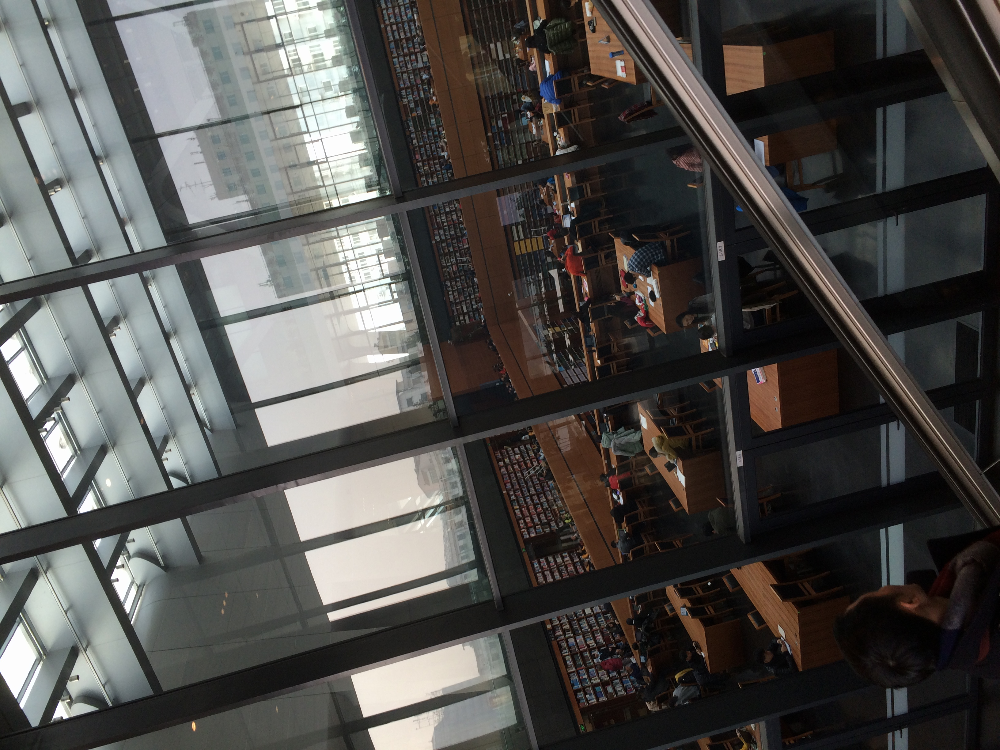
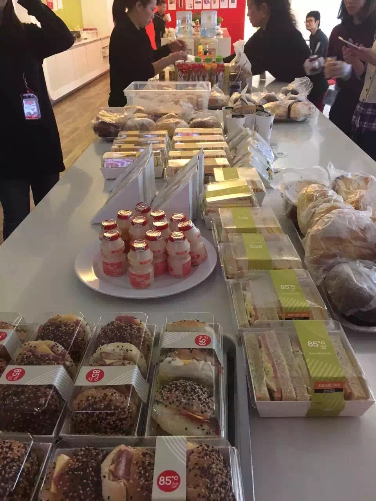
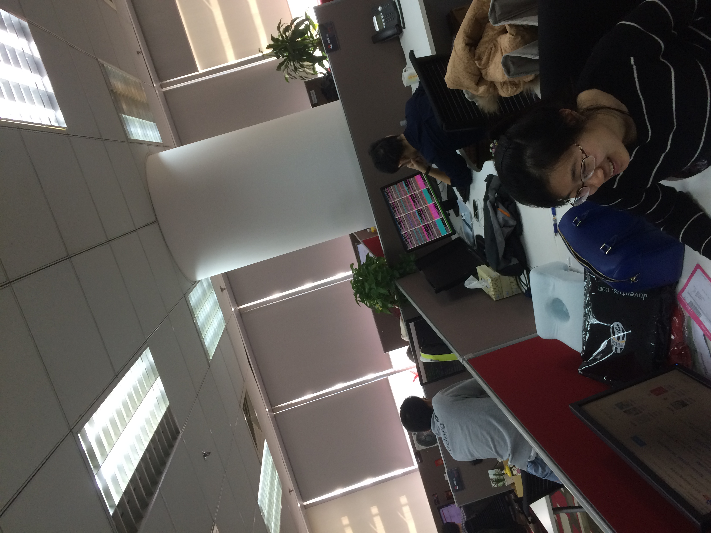
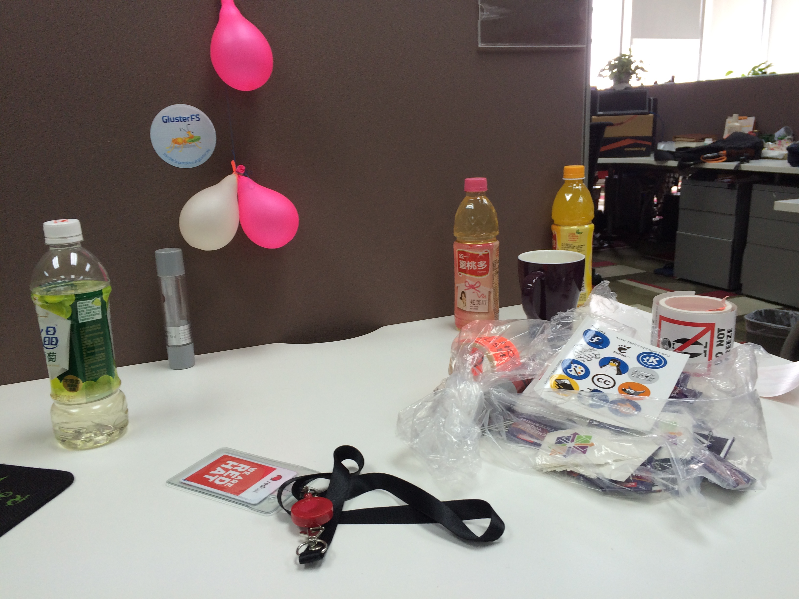
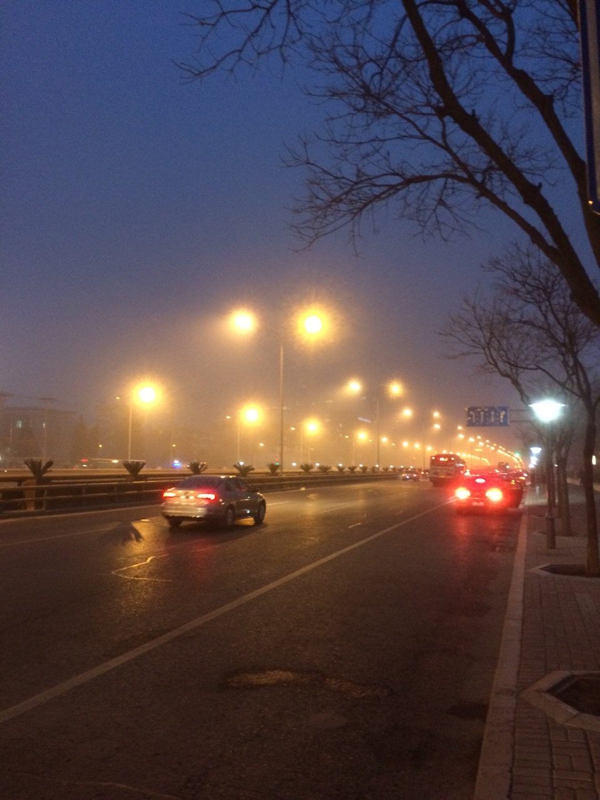
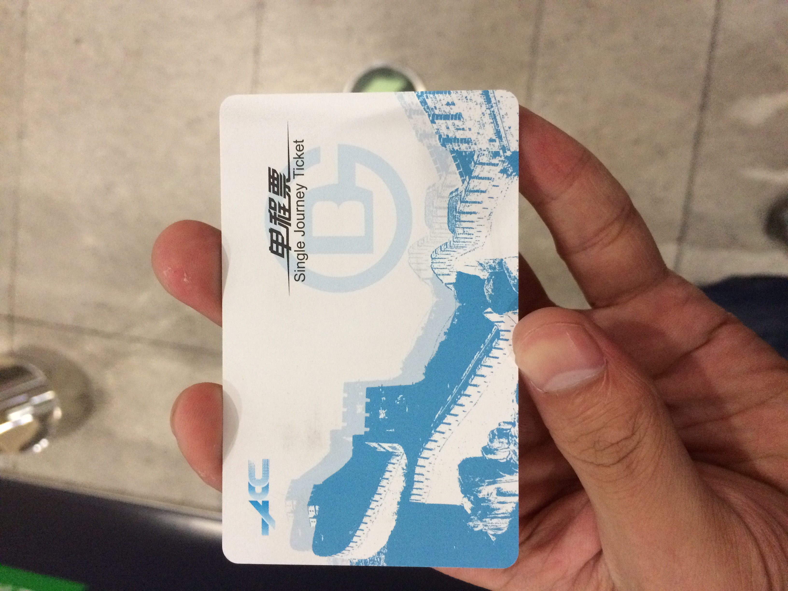

> 自南京到北京.
> 发现北方的冷和南方的冷不同, 南方的冷是侵入式的湿冷像个小妖精慢慢把你腐蚀, 北方的冷干燥像个暴躁的汉子来的猛烈如狂风卷席.

# 契机の旧都

学校的生活既无聊又无聊, 每天按时上下课, 自己看看书玩玩代码, 无聊中想找点变化, 就有了找份实习感受一下职场的念头.
15 年 11 月左右, 约了南邮大表哥来看妹子, 和他讲到学校的生活和自己的想法, 遂被要去了简历, 内推面试通过了, 获得进入了红厂实习的机会, 拿到 offer 的时还是蛮震惊的, 居然能面过红帽.

## 京城の试炼

### 初访都城

2015 年 12 月 22 早上 9 点 30 左右到的北京五道口地铁站, 拖着行李箱走到地铁站外, 北方真的好冷！
电话联系了二房东, 找到了马上要住的宿舍, 很小也很破, 落差感难免, 不过也是那时候第一次感受到了北方的暖气真是个好东西.
当天下午 2 点左右跑去了公司想看一下, 走在路上外面真冷, 融科 C 外面立着 VMware 的牌子, 在想想南京立判高下, 一想以后要在这里上班对住处的失望暂时忘却了.
进了公司才发现不能提前入职, 不过还是见到了 Team leader, 而后去了宜家买了一堆床上用品, 规划接下来两天的玩法.(嘿嘿嘿)

### 圣诞节

昨天, 到了工位, 领了设备和办公用品.
环顾周围, 感受到工程师对美得欣赏大抵上是相同的: 黑色有棱角的设计, 冷色的终端配色,codeing 时候听着 douban.fm 等等.
在一说今天是圣诞节, 回想我在上大学之前是没有圣诞节的, 上了大学过后发现同学们过圣诞节我才感受到洋节日的气氛, 往年的今天我总是能收到苹果之类的, 但是今年不在难免有点怀念大学时光. 可能这就是围城.
虽然公司提供了很不错的圣诞早餐, 但是还是不如在学校来的好玩呢.

### Team

作为一个开源软件公司, 它的社区气氛很浓, 到处可见社区的小玩意, 当然公司本身也是雇了社区的人.
同事们的技术能力也很厉害, 偷拍同事显示器可以看到密密麻麻的小终端, 这样的东西我的眼睛是处理不过来的哈.

大家上班幸福感很高 (上图为证), 很好玩的一个 team, 当然他们的职业水平也很厉害, 而我是菜鸟, 能和他们一起工作真是幸运!

### 工作

我的 title 是 intern, 感觉好笼统哦, 主要任务学习 kernel, 做一些 nfs bug 测试之类的事情.
mentor 是 jh 和 yc, 两位富有经验的工程师让我知道了`rhel kernel`的开发流程和 bug 的生命周期.
jh 之前在 hw 做了多年研发, 扎实的专业背景知识和对系统编程的理解让我这个曾经狂妄的小菜顿感羞愧.
yc 是是前 sun 的雇员, 像个热情的大哥, 我实习生周末进不了公司, 他把自己的卡借我, 对我信任和无私帮助让这个小北漂感到了关怀 (嘿嘿嘿).

### 生活

因为图近, 所以在学校时候就安排好了住处 -- 五道口附近床位, 还是要感谢大表哥帮我线下确认, 入住过后发现很多厉害的人在北京和我一样因为没有足够的预算而选床位.
印象比较深的是: 中科大的研究生 (午出夜归), 清华直博的微软实习生, 哈工大在能动所实习的研究生和他一起的天大化学研究生同学, 报考北大哲学博士的南方人, 苏科院学建筑的小伙; 那么多优秀人在北京和我挤在一起不知道是难过还是开心.
这段生活经历让我体会到北漂这个词更多含义: 精神上的孤独, 物质上的贫乏, 不过有的是对未来的信心.

### 离职

2016 年 6 月 29 日, 一张单程票送走我第一次实习经历.
返程的路上, 整理了想法, 对过去的总结, 眼下的不足, 未来的展望.

28 晚上自南京出发,29 号签完手续就撤退准备期末考, 有点急了.
到了学校, 返程路上的想法被扯碎了, 仿佛回到了原点, 又是几天废我青春的生活.

## 尾

要谢谢同事的关照, 祝各位工作顺利, 有缘再见.
