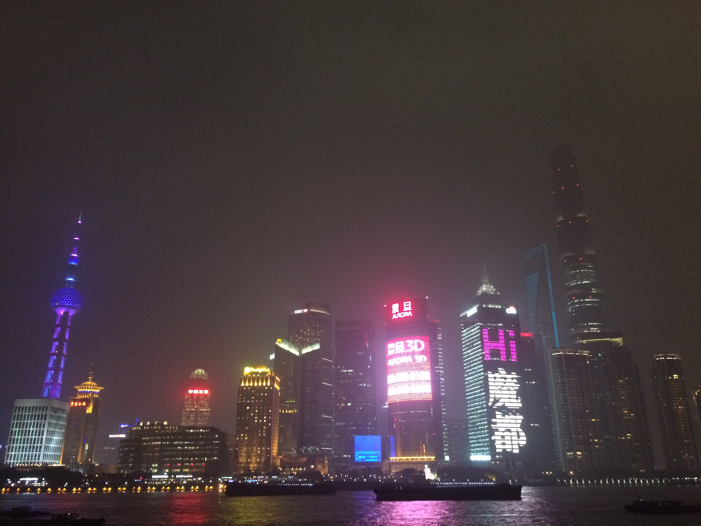
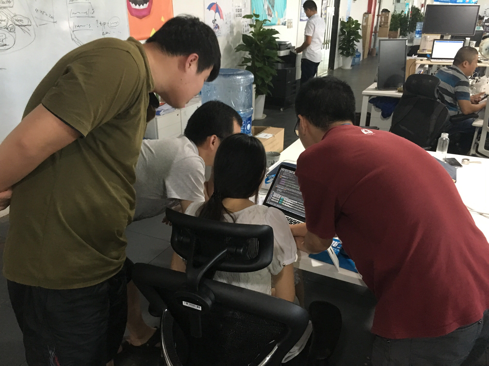
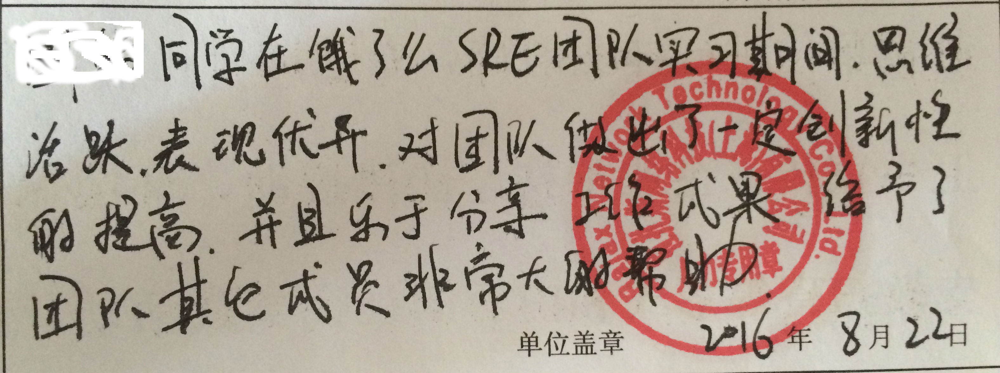

> 从北京到上海.
> 北方热也与南方不一样, 南方的热软绵绵的好像中了分筋错骨手一样有力使不出来, 北方的热好像铁砂布打磨着你让你狂躁.

# 试炼の魔都

六月上旬, 寻思着京城好远而实习补贴很少, 因未毕业导致往返学校的开销导致收不抵支, 就准备华东找个新实习并提出了离职.
然后在拉钩上面投了个简历, 就收到了面试, 和面试官 (现在的 leader) 聊聊一下 Linux, 然后就收到了 offer, 于是就来到现在的饿了么 -- 一家年轻的互联网公司.

## 魔都初访

7 月 4 日, 期末考试完, 因为南京不断下雨导致考完南京几日游得计划泡汤了, 所以提前跑路到上海投奔郝姨, 准备提前入职.
时间好快, 上次来上海还是 2014 年 2 月下旬, 当时产生的印象就是上海好贵, 这一次除了租房对好贵的印象有所改变.
租房真是个心痛的事情, 为此还交了 500 块学费, 一把辛酸泪!
发现房子离得近且不错的的贵, 离得近且便宜的很破, 离得远且不错的也贵, 离得远且小一点相对便宜, 然后我选了离得远且小一点的.

## 入职

7 月 6 日, 大清早带着对新工作一点期望赶着上海的早高峰上路了, 地铁上人真像网文里面所描述的讲沙丁鱼, 前进的铁壳就是罐头, 每条鱼都带着情愿或者不情愿的情绪被罐头运去目的地. 我被这样一挤, 就有点情绪, 开始思考鱼生的意义, 作为一个沙丁鱼到底为了什么? 可能沙丁鱼的一生本身是没有什么意义的, 只有独立鱼格才能赋予它鱼生的意义吧.
被运到目的地, 签完合同办完新人入职手续, 领了新 mac pro, 过了几天领了那个很贵的椅子, 又过了过了一段时间领了显示器, 这样的待遇传统行业真的不敢想, 互联网公司真是时代的弄潮儿.
7 月 6 日 6 点下班, 追讨被坑的 500 块, 身心疲惫, 坐上回九亭的地铁上又开始思考鱼生的意义, 有种感觉出拳塞进了棉花, 进入了贤者模式.

## team

工作了一段时间可以感觉到团队有活力, 同事也很厉害!

重要的是 team 有爱, 以图为证:

## 工作

Team 是年后成立的, 想起来老大吃饭时候的一句吐槽:

> 没有组建 sre team 之前我是真正的 sre, 现在我是 team 负责参加会的.

在 SRE team, 我主要是实践一些底层技术, 具体应用在排障, 调优, 写一些 linux 相关的需求, 都是蛮好玩的.
我的 mentor 就是老大, 老大是公司前 100 号员工, 技术了得, 人称汤神!
有时候是和孙老师一起玩, 他鼓励独立思考, 实践自己想法, 充分尊重思维多样性; 对思维多样性的尊重是我知道但是没有太认真付诸实践的东西, 在这里受教了!

## 生活

这次实习比之前多了地铁路程,50 分钟单程的车程感觉有点远, 但是一想中环附近的房租就平衡好多了, 租房的价格也比北京便宜太多了.
魔都对比于京城对我来说优势: 离家近, 气候湿润, 雾霾不是特别出名, 离学校近, 以后不太可能在去北京了.
一日三餐好像都和公司有关, 早餐是饿了么早餐, 可以说是物美价廉; 午餐 team 一起, 天天逛商城吃; 晚餐选择加班餐, 管饱不要钱.

## 离职

时间真快, 两个月, 开学了.
边上的巨巨离职读研了, 巨巨边上的巨巨的边上巨巨请假回学校了, 组里面空荡荡的.
我也要离职回学校了, 有点不想走, 因为学校的管理又不得不走, 希望学校出现点变化.
临走带走了老大对我的实习评语:

## 不足

* 知识储备: 
1. 真切的感受知识储备的不足, 在繁长的 log 面前有时候不能定位到主要问题的主要方面, 浪费大量时间;
2. 对 linux 工作中用的子系统理解不够深入, 如果理解深入可以把部分需求做的更细致.

* 语言层面:
1. 我之前抱着语言不重要的心态, 现在认识到技以载道, 组内用 golang, 我需要熟练使用 golang 来表述我对技术的理解.
* 当然还有其他不过我认为其余的不如上面两个重要.
