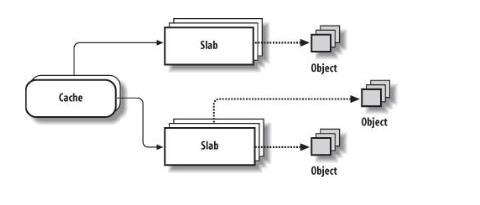

---
author: sn0rt
comments: true
date: 2016-11-19
layout: post
tag: linux
title: the data struct of slab
--- 

slab 分配器是 kernel 主要用来解决内存内碎片问题，还有其它的优势比如加速分配和引入老化机制,最初的设计应该是借鉴了 Solaris 2.4。linux 内部的 slab 最初的实现非常精巧且非常非常久远。

用户态观察(准确的讲这个文件输出的内容是在 sulb.c 里面实现的，不算是传统意义上的 slab)

```bash
cat /proc/slabinfo
slabinfo - version: 2.1
# name            <active_objs> <num_objs> <objsize> <objperslab> <pagesperslab> : tunables <limit> <batchcount> <sharedfactor> : slabdata <active_slabs> <num_slabs> <sharedavail>
nf_conntrack_expect      0      0    224   36    2 : tunables    0    0    0 : slabdata      0      0      0
nf_conntrack         204    204    320   51    4 : tunables    0    0    0 : slabdata      4      4      0
rpc_inode_cache       51     51    640   51    8 : tunables    0    0    0 : slabdata      1      1      0
xfs_dqtrx              0      0    528   62    8 : tunables    0    0    0 : slabdata      0      0      0
xfs_dquot              0      0    472   69    8 : tunables    0    0    0 : slabdata      0      0      0
...
```

设计示意图如下:



每种 cache 里面包含不同类型的对象的集合，cache 用 slab 组织这些对象，slab 在物理页面上连续，每个 slab 包含多个对象，每个 slab 根据里面空闲对象的数量来分类归属于 full，empty，partial 中的一种。

在 Linux 3.10 中 cache 用 kmem_cache 结构体来实现：

```c
struct kmem_cache {
// 可被调整缓存的参数，由 cache_chain_mutex 锁保护
	unsigned int batchcount;
	unsigned int limit; // 指定了 per-CPU 列表中保存的对象上限。如果超出，内核会将 batchcount 个对象返回到 slab
	unsigned int shared;

	unsigned int size; // 指定缓存管理区对象的长度
	u32 reciprocal_buffer_size; 

// 在每次分配和释放时访问
	unsigned int flags;		/* constant flags */
	unsigned int num;		/* # of objs per slab */

// cache 的伸缩
	/* order of pgs per slab (2^n) */
	unsigned int gfporder;

	/* force GFP flags, e.g. GFP_DMA */
	gfp_t allocflags;

	size_t colour;			/* cache 着色的范围 */
	unsigned int colour_off;	/* colour 着色的 offset */
	struct kmem_cache *slabp_cache;
	unsigned int slab_size;

	/* 构造函数 func */
	void (*ctor)(void *obj);

// cache 的构造或移除 
	const char *name; // cache 的名字
	struct list_head list;
	int refcount;
	int object_size;
	int align;

// debug 和统计信息不关注

// 每 cpu 每 内存节点的数据
	/* 
	 * We put array[] at the end of kmem_cache, because we want to size
	 * this array to nr_cpu_ids slots instead of NR_CPUS
	 * (see kmem_cache_init())
	 * We still use [NR_CPUS] and not [1] or [0] because cache_cache
	 * is statically defined, so we reserve the max number of cpus.
	 *
	 * We also need to guarantee that the list is able to accomodate a
	 * pointer for each node since "nodelists" uses the remainder of
	 * available pointers.
	 */
	struct kmem_cache_node **node; // ULK3 里面的 kmem_list3 结构体
	struct array_cache *array[NR_CPUS + MAX_NUMNODES]; // 数组指针，每一项对应 cpu 或 numa 节点
};
```

kmem_cache_node 就是 ULKe3 中 kmem_list3 演化过来的,

```c
/*
 * The slab lists for all objects.
 */
struct kmem_cache_node {
	spinlock_t list_lock;

#ifdef CONFIG_SLAB
// slab 的三种分类，partial，full，free 组织链表
// partial 链表放在第一个性能更好一点
	struct list_head slabs_partial;
	struct list_head slabs_full;
	struct list_head slabs_free;
	unsigned long free_objects; // 所有未使用的对象
	unsigned int free_limit; // 指定了所有 slab 上容许未使用对象的最大数目
	unsigned int colour_next;	// 每节点的着色
	struct array_cache *shared;	// 指向所有 cpu 共享的本地 cache
	struct array_cache **alien;	// on other nodes
	unsigned long next_reap;	// 用于页框回收
	int free_touched;		// 用于 slab 分配器的页框回收
#endif

// 移除了部分不关注的信息
...
};
```

不同于 Solaris 2.4 实现，Linux 自引入 slab 就是要考虑多处理器情况，而 array_cache 结构体的目的正是优化多处理下一些性能问题，更好的利用 cpu 的高速缓存。在分配和释放对象时候，以 LIFO 序从 _alloc 分发缓存过热的对象。减少链表的操作。减少自旋锁的操作。

每一个 array_cache 结构体描述一个本地 cache 的中 free 对象。

```c
struct array_cache {
	unsigned int avail; // available 指向当前可用对象指针的数量
	unsigned int limit; // 缓存在收缩之后空闲对象数量上限
	unsigned int batchcount; // 在 per-CPU 列表为空的情况下，从 cache 的 slab 中获取对象的数目
	unsigned int touched; // 从 cache 移除时 touched 为 1，cache 收缩时则 0.
	spinlock_t lock;
	void *entry[]; /* 下面注释写的蛮清楚的       
			 * Must have this definition in here for the proper
			 * alignment of array_cache. Also simplifies accessing
			 * the entries.
			 *
			 * Entries should not be directly dereferenced as
			 * entries belonging to slabs marked pfmemalloc will
			 * have the lower bits set SLAB_OBJ_PFMEMALLOC
			 */
};
```

slab 结构体用来组织对象,它总是被串在三中之前所述的链表中的一个中(partial, full, free)。slab 描述符可能会被存放在两个地方：存放在 slab 外部，位于 cache_size 指向的一个普通高速缓存中；存放在 slab 的内部，位于分配给 slab 的内存的第一个页框的起始位置。

```c
struct slab {
        union {
                struct {
                        struct list_head list; 
                        unsigned long colouroff; // 第一个 obj 的着色 offset
                        void *s_mem;            // 第一个 obj 的地址包含着色 offset
                        unsigned int inuse;     // 当前被用的 obj 的数量
                        kmem_bufctl_t free;
                        unsigned short nodeid;
                };
                struct slab_rcu __slab_cover_slab_rcu;
        };
};
```
