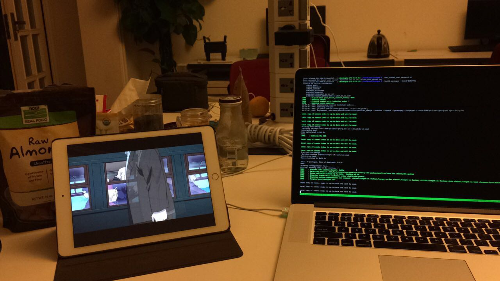
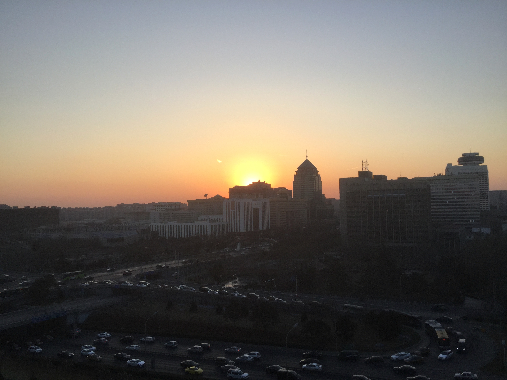
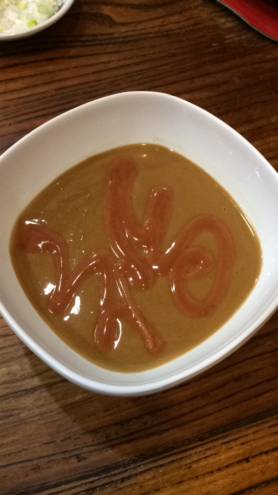
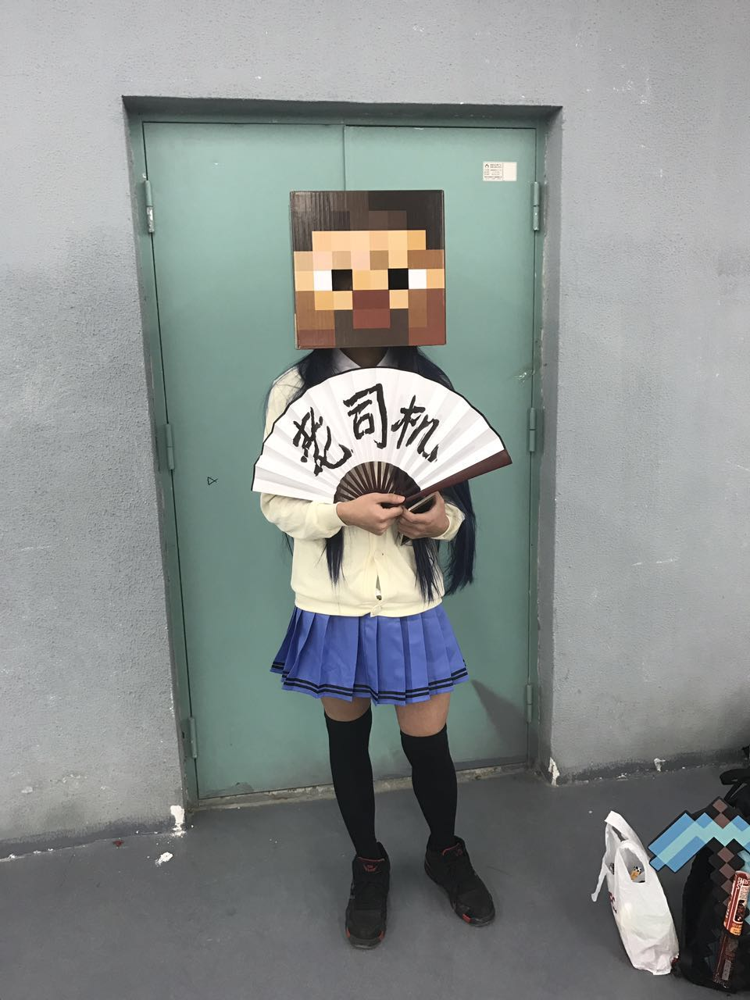

> 以为自上次离开北京就不会在来北京的工作的，但是事实上北京的工作机会比其他城市多太多。

# 0x00 再访京城准备入职

这次来北京不同于上一次的心境，可能是经历多了一点。

熟悉项目本身花了一周工作日，这时候不得不感叹优秀的项目管理可以帮新人入手节约大量时间，不过因为客观条件限制很多时间在等待编译，这个期间主要看文档和钢之炼金术师，还有和老板聊天。

当时北京办公室常驻 3 人，一个全栈，老板和合伙人，在工作期间 carrie(一个美丽的小姐姐)总是问我吃不吃零食，我总是说吃，嘿嘿，办公室的零食因为我到来与日俱减。被小姐姐打趣到完全不同于另一个腼腆的实习生，问什么都不吃。因为我之前没有尝过这些零食，这一波吃到好多好吃的。

熟悉项目的时间过的很快，北京还是很冷。周四那天晚上可能就是 2017 年最冷的一天了，老板约上和我一起实习在北京远程办公的小伙伴吃了个饭，聊了聊天，这样公司 base 北京的人都见过一面了。

后来去见了两个师兄，逛了南锣鼓巷，吃了个铜炉，吹了会牛 b，谈了谈人生，聊了聊职业规划。

1.20 号晚上去找之前一起在上海实习的朋友，并和另一个菊苣一起吃了个晚饭，第二天和朋友去参加冬日祭。

1.21 号早上就到南京转车准备回家过年了。

# 0x01 在学校工作

正式办公开始于元宵节后，第一月刚刚接到任务还是蛮有压力的，主要是解决 intel 显卡在 pc 颁布 release 过程中的一些诡异情况，这个 case 主要靠抱大腿和多尝试解决的；后面几个月因为掌握了工作方法并不感觉压力大。

谈一下我的 mentor，一个非常 nice 的印度人，主要通过英语文本在 slack 上沟通工作问题，偶尔还会被安利一波印度电影，不过因为时差和语言差异直接沟通有时沟通并不是特别顺利。还记得 kernel 配置的问题，还被怼了一下，😁，现在想一想感觉自己还是 too naive，

在谈一下在远程办公的感受，在学校办公的体验真的超级棒，工作环境好，图书馆一楼的雅座有茶水供应有钢琴听，累了或者任务完成后可以骑车转学校，既可以享受学校的熟悉和便利的环境，还能周末和同学玩，这是好怀恋啊。

# 0x02 离职

合同写到 5.30 离职，其实到 6 月 15 才离职，因为毕业设计的耽误和新的 release 的发布，我延长路我的工作日期。在产品的 bbs 里面看到用户的反馈，对产品的想象，有种满足感。

在离职前没几天还是收到了挽留,不过因为一些原因终究是离开的,自此整个学生时代的实习生涯结束了。o~ 我逝去的青春 哈哈哈

在最后还是蛮感谢老板能让我体验一下多文化跨时区的远程实习，让我有了段轻松美好的回忆。
