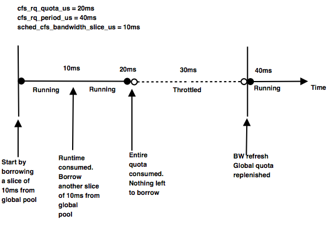

之前线上 229 kernel 在使用 cgroup cpu 子系统导致 crash，后又有在 3.10.0-514.26.2.el7 kernel 又出现 crash，让我对这个特性额外的关注了一下。

在分析 cfs bandwidth control 特性之前需要先知道 fair group scheduling 是什么，引用 zhihu[^zhihu]的一个回答。

>  普通进程的组调度支持(Fair Group Scheduling), 2.6.24(2008 年１月发布)
>
>  2.6.23 引入的 CFS 调度器对所有进程完全公平对待。但这有个问题，设想当前机器有２个用户，有一个用户跑着 9 个进程，还都是 CPU 密集型进程；另一个用户只跑着一个 X 进程，这是交互性进程。从 CFS 的角度看，它将平等对待这 10 个进程，结果导致的是跑 X 进程的用户受到不公平对待，他只能得到约 10% 的 CPU 时间，让他的体验相当差。基于此，组调度的概念被引入[6]。CFS 处理的不再是一个进程的概念，而是调度实体(sched entity), 一个调度实体可以只包含一个进程，也可以包含多个进程。因此，上述例子的困境可以这么解决：分别为每个用户建立一个组，组里放该用户所有进程，从而保证用户间的公平性。该功能是基于控制组(control group, cgroup)的概念，需要内核开启 CGROUP 的支持才可使用。

巧的是知乎的这个回答里面也提到了 cfs bandwidth control 是什么

>  组调度带宽控制(CFS bandwidth control) ,  3.2(2012 年 1 月发布)
>
>组调度的支持，对实现多租户系统的管理是十分方便的，在一台机器上，可以方便对多用户进行 CPU 均分．然后，这还不足够，组调度只能保证用户间的公平，但若管理员想控制一个用户使用的最大 CPU 资源，则需要带宽控制．
>针对 CFS 组调度，引入了此功能, 该功能可以让管理员控制在一段时间内一个组可以使用 CPU 的最长时间．
>

# 0x00 CFS bandwidth control design

先看看大佬是如何设计[^roadmap]这个系统的(关注企业应用)，分为 bandwidth control 和 CFS bandwidth control 看设计。

首先是 bandwidth control 设计要先考虑两个主要面：

> * The actual amount of CPU time available to a group is highly variable as it is dependent on the presence and execution patterns of other groups, a machine can the not be predictably partitioned without intimately understanding the behaviors of all co-scheduled applications.
> * The maximum amount of CPU time available to a group is not predictable. While this is closely related to the first point, the distinction is worth noting as this directly affects capacity planning.

因为 SCHED_RT 也实现了 bandwidth control，这里区分出我关注的 CFS bandwidth control。

> we have now opted for global specifcation of both enforcement interval (cpu.cfs_ period_us) and allowable bandwidth (cpu.cfs_ quota_us). By specifying this, the group as a whole will be limited to cpu.cfs_quota_us units of CPU time within the period of cpu.cfs_period_us.
>
> Of note is that these limits are hierarchical, unlike SCHED_RT we do not currently perform feasibility evaluaion regarding the defined limits. If a child has a more permissive bandwidth allowance than its parent, it will be indirectly throttled when the parent’s quota is exhausted.
>
> Additionally, there is the global control: `/proc/sys/ kernel/sched_cfs_bandwidth_slice_us`

大佬们在论文里讨论了两个方案，在 cfs bandwidth v4 版本后引入了 Hybrid global pool 实现。

如果仅实现 local pool 设计下，在大型的 SMP 系统中，计算剩余时间和存储剩余时间是一个多对多的关系，而锁的竞争导致开销大，而如果仅 tracking quota globally 依然是不能解决前面所述的问题，唯一的好处就是当 quota 没有用完，消耗的时间计算比较有效率，是因为本地 cpu 变量修改的是无锁。因此大佬们选择了一个混合方案以此来改善性能。

>To each task_group a new cfs_bandwidth structure has been added. This tracks (globally) the allocated and consumed quota within a period. 
>
> However, consumption does not occur against this pool directly; as in the local pool approach above there is a local, per cfs_rq, store of granted and consumed quota. This quota is acquired from the global pool in a (user configurable) batch size. When there is no quota available to re-provision a running cfs_rq, it is locally throttled until the next quota refresh. 
>
>Bandwidth refresh is a periodic operation that occurs once per quota period within which all throttled run-queues are unthrottled and the global bandwidth pool is replenished.


 
# 0x01 实现分析
 
1: 核心数据结构:

根据大佬们论文里面的设计讨论，global cpu runtime pool 的实现就是 cfs_bandwidth 结构体，其作为 task_group 的最后一个字段。quota 是限于的每 period 中的，根据我的理解,正常 task group 被调度的情况下$$period >= quota >= runtime$$，但是时间的消耗不上立刻直接反应在 global pool 中，而是在每 cfs_rq 中 local pool 中记录已经获取和消化的配额，这个配额从  global pool 中以预配置的大小获取。当没有配额来填充 cfs 中的 local pool 时候，这个 task_group 会被限制到下一次 quota 的重新分配。

```c
struct cfs_bandwidth {
#ifdef CONFIG_CFS_BANDWIDTH
        raw_spinlock_t lock;
        // /sys/fs/cgroup/cpu/cpu.cfs_period_us defulat: 100ms
        ktime_t period;
        
        // quota 为时间配额，runtime 是实际消耗的时间
        u64 quota, runtime;
        
        // 是 tg 中控制配额的常数比
        s64 hierarchical_quota;
        // 时间片的到期时间
        u64 runtime_expires;

        int idle, period_active;
        
        // period_timer 每隔 cfs_period_us 来刷新 quota。
        // slack_timer 应该是论文 6.3 的第一个问题。
        struct hrtimer period_timer, slack_timer; 
        struct list_head throttled_cfs_rq;

        /* statistics 注释说明是统计相关的，不关注 */
        int nr_periods, nr_throttled;
        u64 throttled_time;
#endif
};
```

而 local pool，就是嵌入在 cfs_rq 中的这些字段了。

```c
struct cfs_rq {
...
#ifdef CONFIG_SMP
#ifdef CONFIG_FAIR_GROUP_SCHED
...
#ifdef CONFIG_CFS_BANDWIDTH
        int runtime_enabled; // 这个字段在 account_cfs_rq_runtime 入口做判断使用
        u64 runtime_expires; // 时间片的到期时间
        s64 runtime_remaining; // 进程组的剩余时间片

        u64 throttled_clock, throttled_clock_task; // tg 被节流过后的信息
        u64 throttled_clock_task_time; //
        int throttled, throttle_count; //
        struct list_head throttled_list; // 
#endif /* CONFIG_CFS_BANDWIDTH */
#endif /* CONFIG_FAIR_GROUP_SCHED */
};
```

2: 核心函数：


根据我的理解这就是论文[^roadmap]里面的 account_cfs_rq_quota()的函数就是 account_cfs_rq_runtime() 函数，在 update_curr() 中被调,参数 delta_exec = now - curr->exec_start。account_cfs_rq_runtime() 函数本身逻辑非常少，直接从__account_cfs_rq_runtime()关注。


```c
static void __account_cfs_rq_runtime(struct cfs_rq *cfs_rq,
                                     unsigned long delta_exec)
{
        /* dock delta_exec before expiring quota (as it could span periods) */
        cfs_rq->runtime_remaining -= delta_exec; // 剩余时间减去进程已经运行的时间。
        expire_cfs_rq_runtime(cfs_rq); // 检查 local pool 的时间片到期时间，如果没有到期就把到期时间再往后续一口

        if (likely(cfs_rq->runtime_remaining > 0)) // 分支预测，也就是说代码暗示我们 local pool 剩余时间还有。
                return;

        /*
         * if we're unable to extend our runtime we resched so that the active
         * hierarchy can be throttled
         */
         // 如果 local pool 没有剩余时间，就从 global pool 不能借时间。借不到的话就设置 curr 重新调度。
        if (!assign_cfs_rq_runtime(cfs_rq) && likely(cfs_rq->curr)) 
                resched_task(rq_of(cfs_rq)->curr);
}
```

assign_cfs_rq_runtime() 可以看到`expires = cfs_b->runtime_expires;`后`cfs_rq->runtime_expires = expires;` 和 `cfs_rq->runtime_remaining += amount;`这两波操作就能理解 local pool 重 global pool 借时间的细节了。

```
/* returns 0 on failure to allocate runtime */
static int assign_cfs_rq_runtime(struct cfs_rq *cfs_rq)
{
        struct task_group *tg = cfs_rq->tg;
        struct cfs_bandwidth *cfs_b = tg_cfs_bandwidth(tg);
        u64 amount = 0, min_amount, expires;

        /* note: this is a positive sum as runtime_remaining <= 0 */
        min_amount = sched_cfs_bandwidth_slice() - cfs_rq->runtime_remaining;

        raw_spin_lock(&cfs_b->lock);
        if (cfs_b->quota == RUNTIME_INF)
                amount = min_amount;
        else {
                /*
                 * If the bandwidth pool has become inactive, then at least one
                 * period must have elapsed since the last consumption.
                 * Refresh the global state and ensure bandwidth timer becomes
                 * active.
                 */
                if (!cfs_b->timer_active) {
                        __refill_cfs_bandwidth_runtime(cfs_b); // 重新填满时间
                        __start_cfs_bandwidth(cfs_b);
                }

                if (cfs_b->runtime > 0) {
                        amount = min(cfs_b->runtime, min_amount);
                        cfs_b->runtime -= amount;
                        cfs_b->idle = 0;
                }
        }
        expires = cfs_b->runtime_expires;
        raw_spin_unlock(&cfs_b->lock);

        cfs_rq->runtime_remaining += amount;
        /*
         * we may have advanced our local expiration to account for allowed
         * spread between our sched_clock and the one on which runtime was
         * issued.
         */
        if ((s64)(expires - cfs_rq->runtime_expires) > 0)
                cfs_rq->runtime_expires = expires;

        return cfs_rq->runtime_remaining > 0;
}
```

3: enqueue 调用流程

```
const struct sched_class fair_sched_class = {
        .next                   = &idle_sched_class,
         // kernel 面向对象设计,在 core.c 中被调用。
        .enqueue_task           = enqueue_task_fair,
```

```
/*
 * The enqueue_task method is called before nr_running is
 * increased. Here we update the fair scheduling stats and
 * then put the task into the rbtree:
 */
static void
enqueue_task_fair(struct rq *rq, struct task_struct *p, int flags)
{
        struct cfs_rq *cfs_rq;
        struct sched_entity *se = &p->se;
        
        // 因为需要支持组调度，而组调度下面 se 是有层次结构的，所以遍历所有调度实体。
        // 如果没有组调度是没有必要获取层次信息。
        for_each_sched_entity(se) { 
                if (se->on_rq) // 如果 se 已经在就绪队列上
                        break;
                cfs_rq = cfs_rq_of(se); // 获取当前 se 所在的 cfs_rq
                enqueue_entity(cfs_rq, se, flags); // enqueue_entity 完成 se 的真正插入操作
```


```
static void
enqueue_entity(struct cfs_rq *cfs_rq, struct sched_entity *se, int flags)
{
        /*
         * Update the normalized vruntime before updating min_vruntime
         * through callig update_curr().
         */
         // 如果当前 se 不是被唤醒，或者 se 已经是在运行的了，则更新 se 的 vruntime。
        if (!(flags & ENQUEUE_WAKEUP) || (flags & ENQUEUE_WAKING))
                se->vruntime += cfs_rq->min_vruntime;

        /*
         * Update run-time statistics of the 'current'.
         */
        update_curr(cfs_rq); // 这里通向 local pool 的更新流程, 参考核心函数分析部分。
        enqueue_entity_load_avg(cfs_rq, se, flags & ENQUEUE_WAKEUP);
        account_entity_enqueue(cfs_rq, se); // 记账，更新 cfs->nr_running 和 load 等
        update_cfs_shares(cfs_rq); // 更新 se 的权重
        
        // 如果当前 se 是被唤醒的
        if (flags & ENQUEUE_WAKEUP) {
                place_entity(cfs_rq, se, 0);
                enqueue_sleeper(cfs_rq, se);
        }

        update_stats_enqueue(cfs_rq, se);
        check_spread(cfs_rq, se);
        if (se != cfs_rq->curr)
                __enqueue_entity(cfs_rq, se);
        se->on_rq = 1;

        if (cfs_rq->nr_running == 1) {
                list_add_leaf_cfs_rq(cfs_rq);
                check_enqueue_throttle(cfs_rq); // cfs_rq 限流检查
        }
}
```

```
/*
 * When a group wakes up we want to make sure that its quota is not already
 * expired/exceeded, otherwise it may be allowed to steal additional ticks of
 * runtime as update_curr() throttling can not not trigger until it's on-rq.
 */
static void check_enqueue_throttle(struct cfs_rq *cfs_rq)
{
        if (!cfs_bandwidth_used()) // 如果限流没有开
                return;

        /* an active group must be handled by the update_curr()->put() path */
        if (!cfs_rq->runtime_enabled || cfs_rq->curr) // 如果 runtime 没有启用
                return;

        /* ensure the group is not already throttled */
        if (cfs_rq_throttled(cfs_rq)) // 已经限流操作了
                return;

        /* update runtime allocation */
        account_cfs_rq_runtime(cfs_rq, 0); // 再抢救一下试试
        if (cfs_rq->runtime_remaining <= 0)
        // 抢救无效，限流开始。
        // 具体实现：就是 task group 限流的尾插到 cfs_rq 维护的已经限流的列表里面。
                throttle_cfs_rq(cfs_rq); 
}
```

[^zhihu]: [现在的 Linux 内核和 Linux 2.6 的内核有多大区别？](https://www.zhihu.com/question/35484429)
[^roadmap]: [CPU bandwidth control for CFS Roadmap](https://landley.net/kdocs/ols/2010/ols2010-pages-245-254.pdf)
