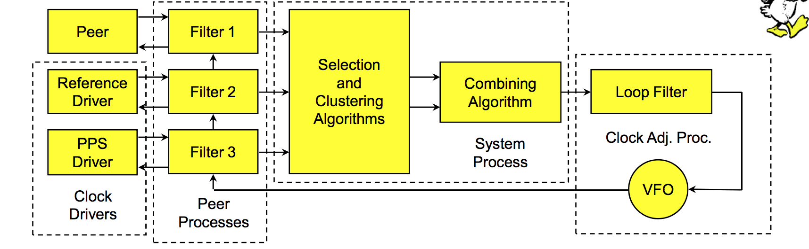
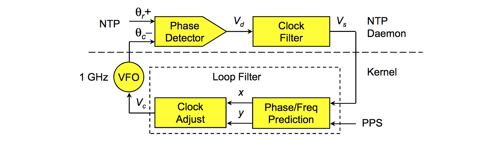
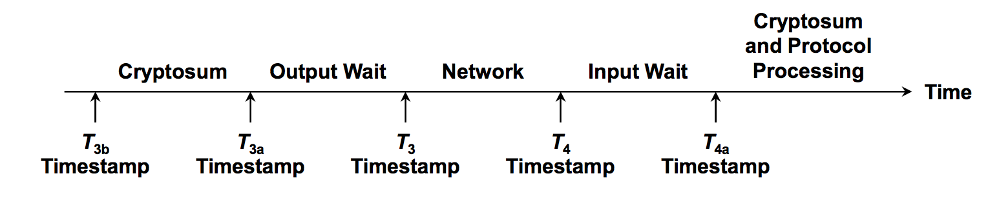

​	之前和同事聊天，同事问我服务器有网络延迟存在是如何同步时间的？鉴于之前知识背景我只能说参考一下NTP（Synchronization Approaches for Packet-Based Networks [^Clock_Synchronization]）服务。认真想一想就该发现时间服务作为现代社会的基础设施应该有相当一段历史了。

​	还是先关注计算机，在计算机中时钟是`振荡器 + 计数器 `。计数器是正数，振荡器是记录时间流失，振荡器的质量（准确度和稳定性）决定着时钟的质量。目前常见的振荡器是晶体振荡器简称晶振。

​	在实际的Linux time subsystem中2.6.16前后差别较大，在2.6.16通过时钟中断配合一个修正来实现的，这就有几个问题：时钟的分辨率不够高；时间有可能倒退。不过在2.6.16后Linux中使用高分辨率时钟计时器[^linux_ppt],Linux 时间子系统中可以时钟来源，一般选其中一个使用。目前Linux常用的时间来源是cpu内部的TSC，精度能到cpu主频分之1，不过因为时间相关的系统调用原因`(clock_gettime)`，目前Linux能提供的时间精度是`1ns`。

​	前面描述了Linux系统中时间，但是现实中很多业务需要时间保持同步，也就是说需要时间同步相关的服务。最早的时间同步协议是`Daytime Protocol(rfc 867)`和`Time Protocol(rfc 868)`,都是基于tcp的，前者是4字节描述时间，后者是字符串描述时间，有个共同的缺点是只能精确到秒；而且还有网络延迟导致的误差。

​	后来`David L. Mills`提出了NTP协议，最早的是`ntp (rfc 958)`，但是目前市面上主要用的是`ntp v3 (rfc 1305)`和`ntp v4 (rfc 5905)`,ntp协议解决了之前时间的协议的精度问题，理论精度到233皮秒；也解决因为网络网络延迟问题。不同于之前时间协议基于tcp，ntp协议是基于udp的。

​	典型的NTP客户端将定期轮询不同网络上的三个或更多服务器。为同步其时钟，客户端必须计算其时间偏移量和来回通信延迟。
时间偏移“θ”定义为：$$\theta = {(t_1 - t_0) + (t_2 - t_3 ) \over 2}$$ 
往返延迟“δ”为：$$\delta = {(t_3 - t_0 ) - ( t_2- t_1 )}$$

其中：
: t0 是请求数据包传输的客户端时间戳，
: t1 是请求数据包回复的服务器时间戳，
: t2 是响应数据包传输的服务器时间戳
: t3 是响应数据包回复的客户端时间戳。

​	“θ”和“δ”的值通过**过滤器**并进行统计分析,异常值被剔除，并从最好的三个剩余候选中导出估算的时间偏移。然后调整时钟频率以逐渐减小偏移，创建一个反馈回路。

​	其实有了“θ”和“δ”就可以修正系统时间了，但是这并不太够，首先如果客户端的时钟频率快于服务端，那么下一次的测试发现时间又不对的了，所以ntp还需要修改了时钟的频率；其次是在真实环境下ntp部署模式是层级化的，还需要同步ntp上层ntp，所以还需要同步与上层ntp server的关系，不过这个情况不是我这次关注的点。

​	根据之前描述，知道了ntp 同步会修改时间差，会修改client服务区的时钟频率。修改时间差时如果发现客户端发现服务区和客户端的时间差小于128ms，ntp会平滑的的将128ms误差调整到几个毫秒级，换句话说ntp同步时间永远有误差，之所以这么做时因为ntp的反馈控制系统需要一个输入θr+。 后修改频率，因为不仅要考虑到要避免时间跳变，还要避免频率跳变，所以频率的变化也要是连续的。

​	ntp服务在实现上一般是多线程，每个服务有2个线程，一个接受信息(the peer process) 另一个发送请求 (the poll process)。	这里copy一下mills老先生的ppt[^NTP_Precision_Time_Synchronization]。

> Selection 算法主要是做拜占庭容错,丢弃不正确的服务器
>
> Cluster 算法主要是从统计学角度来区分Selection算法选出来可用的服务器，区分出哪个时间更加准确。
>
> Combine 算法是用来统计被选择的正确服务的平均数，生成最终的offset。

​	phase detector是用来测试本机时间和标准时间相差有多大，得出一个差值 Vc，将这个差值给一个clock filter。clock filter的作用是减少`network jitter`,它通过算法[^Clock_Filter_Algorithm]选择较合适样本，并拒绝因为网络拥塞和包冲突导致的采样噪点，然后讲数据传给内核。然后到kernel 里面一个**锁相回路**[^Phase_locked_loop]，最后生成一个控制信号，来调整频率。这样修改时间的差值修正了（网络延迟的问题），频率的不同步的问题也通过loop filter 解决了。

​	其实还有个点，就是os收到数据包和应用层的数据包时间不一致，而且发送时间和os实际发送时间不一致。mills老先生把之前ntp协议中的时间其实还做了更细颗粒的的划分

老先生在2008年发现T3b在freebsd最小大约是16μs，言外之意就是建议在bsd上跑ntp server。这个时间的度量基本没有高精度解（在我看来。

[^linux_ppt]: [Transforming the Linux time subsystems 2006](https://www.landley.net/kdocs/ols/2006/ols2006v1-pages-333-346.pdf)

[^Clock_Filter_Algorithm]:[Clock Filter Algorithm](https://www.eecis.udel.edu/~mills/ntp/html/filter.html) 

[^Phase_locked_loop]: [Phase-locked loop](https://en.wikipedia.org/wiki/Phase-locked_loop)

[^Clock_Synchronization]: [Clock Synchronization in Distributed Systems Using NTP and PTP](http://www.cs.wayne.edu/~hzhang/courses/8260/Lectures/Chapter%2021%20-%20Clock%20Synchronization%20in%20Distributed%20Systems%20Using%20NTP%20and%20PTP.pdf)

[^NTP_Precision_Time_Synchronization]: https://www.eecis.udel.edu/~mills/database/brief/precise/precise.pdf