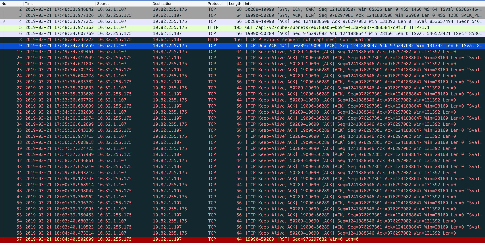
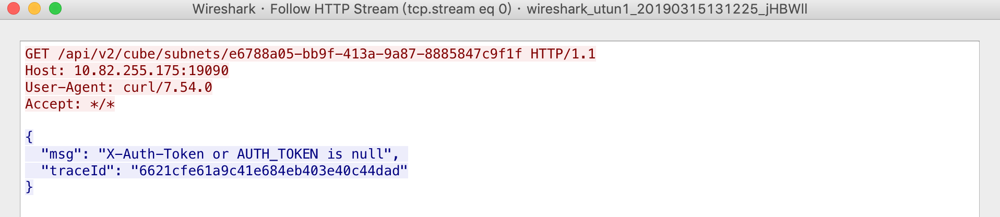
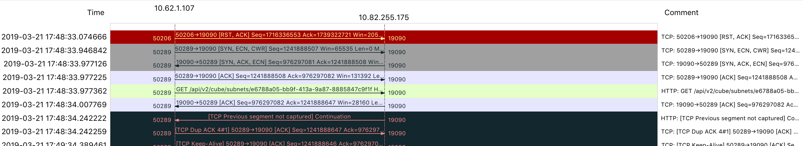
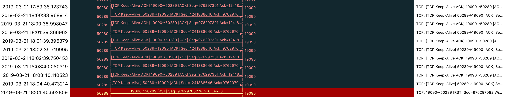
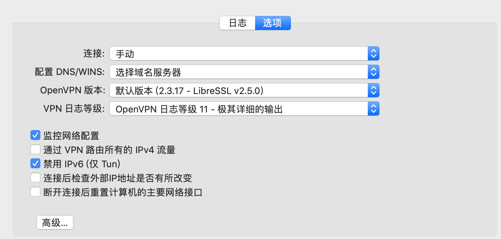
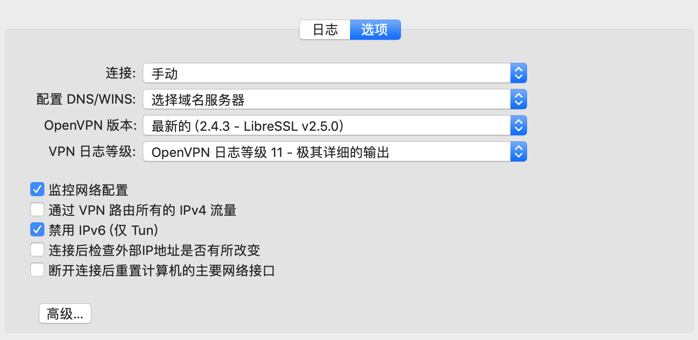
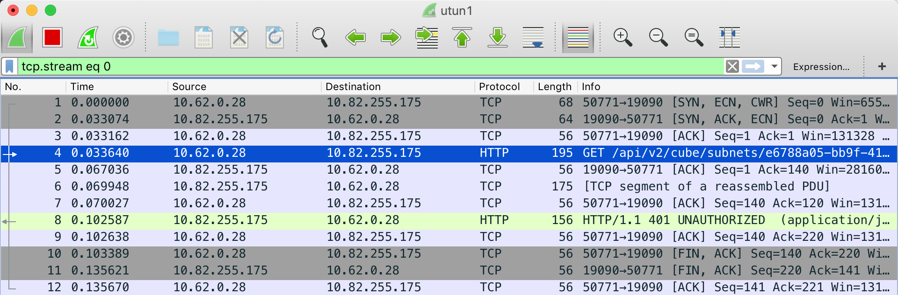
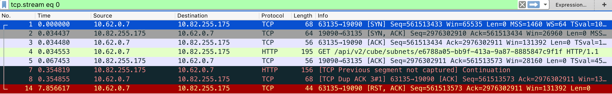

​	到新环境熟悉内部接口，postman去调试内部服务接口发现接口没有返回，换个电脑调用正常。初步怀疑是自己电脑问题，遂打开wireshark 根据目标主机ip结合路由信息判断的走的`utun1`接口出流量。

​	上图通过wireshark看到我获取cube接口`GET`请求发出去，多次尝试依然都是`http`的response的没有被用户进程收到，wireshark报错`tcp previos sgement not captured` 。单独点开`tcp segment`可以在wireshark中看到response是回来了但是没有成功的被应用层接收到(如下图)。

​	换个更直观的tcp flow的图（忽略里面的ECN协商的）：在tcp握手过完成过后，客户端发送请求，服务端返回数据，在`17:48:34.242222`时间片之前丢了一个wireshark说没有抓到（可能是丢了），也就是说在服务端响应过后可能丢了一个包，然后看到三次握手时候的ack重复出现。

​	之后是一堆的keeplive ack的报文，keeplive超时时间到了过后服务端reset了tcp connection。

​	通过Google发现网络上的文章都是说存在网络链路质量问题导致丢包。但是我的环境是使用的`openvpn`链接到开发环境，也就是说`openvpn`提供的链路可能有问题，遂尝试点开vpn客户端探索一下可配置项，发现`openvpn`版本是使用v2.3.17版本。

无脑尝试换到2.4.3 。

居然发现一切正常了。非常可能和`openvpn`的版本有关系。

## 猜想验证1

​	搜索发现一个wireshark的[issue](https://osqa-ask.wireshark.org/questions/57120/syn-ecn-cwr-packet-rst-packet),猜想会不会和mac的`enc`实现有关系？

​	尝试在mac 通过`sudo sysctl -w net.inet.tcp.ecn_initiate_out=0`和`sudo sysctl -w net.inet.tcp.ecn_negotiate_in=0`关闭`ecn`，发现wireshakre显示的tcp的握手时符合预期，但是网络时依然不通的，初步排除了mac os tcp ecn的可能。(rst是我C-c了curl发出的

## 猜想尝试2

​	打开客户端的配置文件发现`openvpn`的配置模式是`tun`+`udp`,看上去是构建一个`overlay`的网络，猜测可能是服务端和客户端的`ssl`版本不兼容，在overlay网络数据解密的时候出现异常。如果是这样那么应该是所有走`tun`设备的tcp流量都有问题（和之前错误的tcp行为一致），结合之前同事让我`ssh`登录服务器也没有正常登录。

​	因为没有搜索到`openvpn`相关的兼容性的`changelog`，短时间无法验证暂时搁置。

[TCP Previous Segment is no captured](https://osqa-ask.wireshark.org/questions/52843/what-means-tcp-previous-segment-is-not-captured-packet-info)

[大咖讲网络 Wireshark的提示](https://community.emc.com/community/support/chinese/teamblog/blog/2016/04/26/%E5%A4%A7%E5%92%96%E8%AE%B2%E7%BD%91%E7%BB%9C-wireshark%E7%9A%84%E6%8F%90%E7%A4%BA)

[tcp reset 的若干原因相对全面](https://www.cnblogs.com/JohnABC/p/6323046.html)