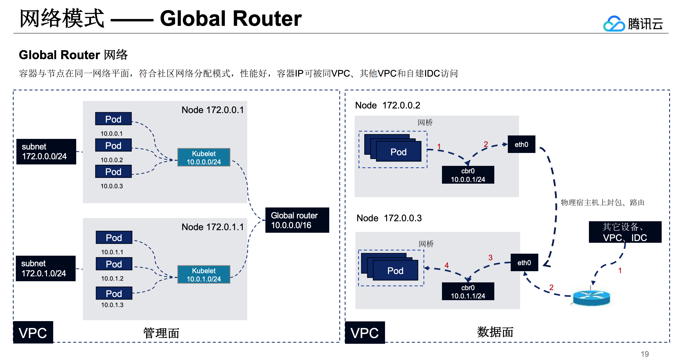

​	当 pod 的 CIDR 和所属的 node 不属于同一个cidr上时候，在部分云上就会有pod和node网络互通的问题，而route controller就是被设计用来创建路由解决这个问题的方案。

​	如果计划让k8s启动的pod从指定的cidr中分配ip常见的方式是通过指定KCM的启动参数`cluster-cidr`来指定POD CIDR，service也可以通过KCM的`service-cluster-ip-range`参数指定CIDR。

​	cloud provider 启动时候通过判断AllocateNodeCIDRs与ConfigureCloudRoutes的与逻辑来判断k8s的pod是否从指定的cidr中分配IP，AllocateNodeCIDRs字段的意义是` AllocateNodeCIDRs enables CIDRs for Pods to be allocated and, if ConfigureCloudRoutes is true, to be set on the cloud provider.`,ConfigureCloudRoutes字段的意义是`configureCloudRoutes enables CIDRs allocated with allocateNodeCIDRs to be configured on the cloud provider.`

```go
// startControllers starts the cloud specific controller loops.
func startControllers(c *cloudcontrollerconfig.CompletedConfig, stop <-chan struct{}, cloud cloudprovider.Interface) error {
...
	// If CIDRs should be allocated for pods and set on the CloudProvider, then start the route controller
	if c.ComponentConfig.KubeCloudShared.AllocateNodeCIDRs && c.ComponentConfig.KubeCloudShared.ConfigureCloudRoutes {
    // 这里判断是否实现了cloud provider route相关接口
		if routes, ok := cloud.Routes(); !ok {
			glog.Warning("configure-cloud-routes is set, but cloud provider does not support routes. Will not configure cloud provider routes.")
		} else {
			var clusterCIDR *net.IPNet
			if len(strings.TrimSpace(c.ComponentConfig.KubeCloudShared.ClusterCIDR)) != 0 {
				_, clusterCIDR, err = net.ParseCIDR(c.ComponentConfig.KubeCloudShared.ClusterCIDR)
				if err != nil {
					glog.Warningf("Unsuccessful parsing of cluster CIDR %v: %v", c.ComponentConfig.KubeCloudShared.ClusterCIDR, err)
				}
			}

			routeController := routecontroller.New(routes, client("route-controller"), c.SharedInformers.Core().V1().Nodes(), c.ComponentConfig.KubeCloudShared.ClusterName, clusterCIDR)
			go routeController.Run(stop, c.ComponentConfig.KubeCloudShared.RouteReconciliationPeriod.Duration)
  ...
}
```

​	这个Run函数保持着cloud provider 运行controller 的一贯风格，并没有什么特别要注意的地方。

```go
func (rc *RouteController) Run(stopCh <-chan struct{}, syncPeriod time.Duration) {
...

   // TODO: If we do just the full Resync every 5 minutes (default value)
   // that means that we may wait up to 5 minutes before even starting
   // creating a route for it. This is bad.
   // We should have a watch on node and if we observe a new node (with CIDR?)
   // trigger reconciliation for that node.
   go wait.NonSlidingUntil(func() {
      if err := rc.reconcileNodeRoutes(); err != nil {
         glog.Errorf("Couldn't reconcile node routes: %v", err)
      }
   }, syncPeriod, stopCh)
...
}
```

​	这里地方的实现唯一值得说道的是`reconcile`的函数命名，在k8s的controller中讲现实世界变成声明式中的过程称为`reconcile`。

```go
func (rc *RouteController) reconcileNodeRoutes() error {
   routeList, err := rc.routes.ListRoutes(context.TODO(), rc.clusterName)
...
   return rc.reconcile(nodes, routeList)
}
```

​	这个是实际reconcile的过程，就是找到现实世界和期望世界差距，然后通过cloud proivder route所提供的接口操作云上的route资源进行添加/删除操作将其变成期望的模样。

```go
func (rc *RouteController) reconcile(nodes []*v1.Node, routes []*cloudprovider.Route) error {
   // nodeCIDRs maps nodeName->nodeCIDR
   nodeCIDRs := make(map[types.NodeName]string)
   // routeMap maps routeTargetNode->route
   routeMap := make(map[types.NodeName]*cloudprovider.Route)
   for _, route := range routes {
      if route.TargetNode != "" {
         routeMap[route.TargetNode] = route
      }
   }

   wg := sync.WaitGroup{}
   rateLimiter := make(chan struct{}, maxConcurrentRouteCreations)

   for _, node := range nodes {
      // Skip if the node hasn't been assigned a CIDR yet.
      if node.Spec.PodCIDR == "" {
         continue
      }
      nodeName := types.NodeName(node.Name)
      // Check if we have a route for this node w/ the correct CIDR.
      r := routeMap[nodeName]
      if r == nil || r.DestinationCIDR != node.Spec.PodCIDR {
         // If not, create the route.
         route := &cloudprovider.Route{
            TargetNode:      nodeName,
            DestinationCIDR: node.Spec.PodCIDR,
         }
         nameHint := string(node.UID)
         wg.Add(1)
         go func(nodeName types.NodeName, nameHint string, route *cloudprovider.Route) {
            defer wg.Done()
            err := clientretry.RetryOnConflict(updateNetworkConditionBackoff, func() error {
               startTime := time.Now()
               // Ensure that we don't have more than maxConcurrentRouteCreations
               // CreateRoute calls in flight.
               rateLimiter <- struct{}{}
               glog.Infof("Creating route for node %s %s with hint %s, throttled %v", nodeName, route.DestinationCIDR, nameHint, time.Since(startTime))
               err := rc.routes.CreateRoute(context.TODO(), rc.clusterName, nameHint, route)
               <-rateLimiter

               rc.updateNetworkingCondition(nodeName, err == nil)
               if err != nil {
                  msg := fmt.Sprintf("Could not create route %s %s for node %s after %v: %v", nameHint, route.DestinationCIDR, nodeName, time.Since(startTime), err)
                  if rc.recorder != nil {
                     rc.recorder.Eventf(
                        &v1.ObjectReference{
                           Kind:      "Node",
                           Name:      string(nodeName),
                           UID:       types.UID(nodeName),
                           Namespace: "",
                        }, v1.EventTypeWarning, "FailedToCreateRoute", msg)
                  }
                  glog.V(4).Infof(msg)
                  return err
               }
               glog.Infof("Created route for node %s %s with hint %s after %v", nodeName, route.DestinationCIDR, nameHint, time.Now().Sub(startTime))
               return nil
            })
            if err != nil {
               glog.Errorf("Could not create route %s %s for node %s: %v", nameHint, route.DestinationCIDR, nodeName, err)
            }
         }(nodeName, nameHint, route)
      } else {
         // Update condition only if it doesn't reflect the current state.
         _, condition := v1node.GetNodeCondition(&node.Status, v1.NodeNetworkUnavailable)
         if condition == nil || condition.Status != v1.ConditionFalse {
            rc.updateNetworkingCondition(types.NodeName(node.Name), true)
         }
      }
      nodeCIDRs[nodeName] = node.Spec.PodCIDR
   }
...
   wg.Wait()
   return nil
}
```

​	目前[腾讯云 TKE](<https://yuerblog.cc/wp-content/uploads/%E8%85%BE%E8%AE%AF%E4%BA%91%E5%AE%B9%E5%99%A8%E6%9C%8D%E5%8A%A1TKE%E4%BA%A7%E5%93%81%E4%BB%8B%E7%BB%8D.pdf>)的global router网络模式就是符合上述描述，在global router 模式下route controller 会在节点启动的时候去云上注册路由，下图中节点172.0.0.1上kubelet上报ready时候route controller会去vpc中注册10.0.0.0/24的路由，并且172.0.0.1上的pod都是从10.0.0.0/24的cidr分配IP的，这样就实现了和vpc的互通。



