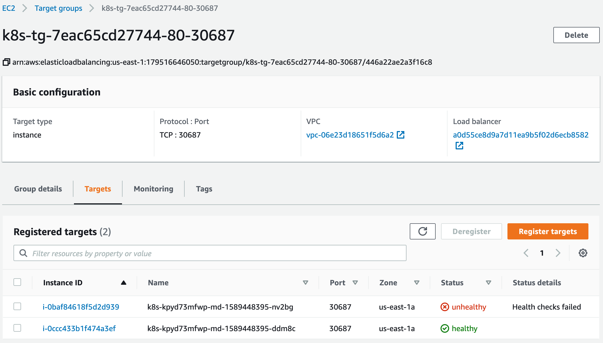

因为业务需要在`POD`中获取客户端的正式地址，通过调研发现只要创建`service`的是`spec.externalTrafficPolicy` 字段指定为`Local`即可。

这片文章探究一下`Local`这个字段是如何实现的。

创建一个 `service` 展示如下，之所以使用 `nlb` 是因为 aws 的 `nlb`是可以透传客户端原地址。

```yaml
apiVersion: v1
kind: Service
metadata:
  annotations:
    service.beta.kubernetes.io/aws-load-balancer-type: nlb
  name: "service-2048-local"
  namespace: "2048-game"
spec:
  type: LoadBalancer
  externalTrafficPolicy: Local
  ports:
  - port: 80
    targetPort: 80
    protocol: TCP
  selector:
    name: "2048-game"
```

```shell
$ kubectl --kubeconfig kubeconfig -n 2048-game get svc -o wide
NAME                 TYPE           CLUSTER-IP       EXTERNAL-IP                                                               PORT(S)        AGE   SELECTOR
service-2048-local   LoadBalancer   192.168.104.28   a7c77732499c111ea9b5f02d6ecb8582-1465649123.us-east-1.elb.amazonaws.com   80:30636/TCP   22h   name=2048-game
```

`service` 的 `externalTrafficPolicy`的默认配置是`ClusterIP`，如果使用默认的值，出于对`kubernetes`与`cloud-provider-aws`的理解，我知道当我流量通过 `nlb`会被 `targetgroup`转发到机器的`nodeport`，然后被转发到目标容器中。

如果指定了 `externalTrafficPolicy` 为 `local`可以将流量转发只会被转发到运行`POD`的节点上。在AWS上做到这样的效果是得益于`nlb`的健康检查，`targetgroup`的健康检查会发现没有运行 `POD` 的`healthCheck`端口是不通的。



## k8s 是如何实现

通过 `service`的文件我知道了健康检查端口是`30965`，在集群的两个节点上探查健康检查的端口

```bash
# curl http://10.188.166.140:30965//healthz
{
	"service": {
		"namespace": "2048-game",
		"name": "service-2048-local"
	},
	"localEndpoints": 2
}
```

```bash
# curl http://10.188.166.141:30965//healthz
{
	"service": {
		"namespace": "2048-game",
		"name": "service-2048-local"
	},
	"localEndpoints": 0
}
```

`kube-proxy`就根据上面的两个地方的差异生成不同的 `iptables`规则，如果当前节点健康检查`localEndpoints`不为`0`，那么当前节点就会生成转发规则指向目标容器，如果没有就生成`DROP`规则丢弃`nlb`的健康检查，这样流量就不会被转发到这个没有运行`POD`的节点上。

## 运行POD节点的转发规则

当前的 `service`的`externalTrafficPolicy`为`local`

```
# iptables-save | grep 30687
-A KUBE-NODEPORTS -s 127.0.0.0/8 -p tcp -m comment --comment "2048-game/service-2048-local:" -m tcp --dport 30687 -j KUBE-MARK-MASQ
-A KUBE-NODEPORTS -p tcp -m comment --comment "2048-game/service-2048-local:" -m tcp --dport 30687 -j KUBE-XLB-66B67NPFXW65VVJM

# iptables-save | grep KUBE-XLB-66B67NPFXW65VVJM
:KUBE-XLB-66B67NPFXW65VVJM - [0:0]
-A KUBE-NODEPORTS -p tcp -m comment --comment "2048-game/service-2048-local:" -m tcp --dport 30687 -j KUBE-XLB-66B67NPFXW65VVJM
-A KUBE-XLB-66B67NPFXW65VVJM -s 10.188.166.0/24 -m comment --comment "Redirect pods trying to reach external loadbalancer VIP to clusterIP" -j KUBE-SVC-66B67NPFXW65VVJM
-A KUBE-XLB-66B67NPFXW65VVJM -m comment --comment "Balancing rule 0 for 2048-game/service-2048-local:" -m statistic --mode random --probability 0.50000000000 -j KUBE-SEP-TVXZJYL67XY2CHS2
-A KUBE-XLB-66B67NPFXW65VVJM -m comment --comment "Balancing rule 1 for 2048-game/service-2048-local:" -j KUBE-SEP-UCWOW7PLEZDILT5N

# iptables-save | grep KUBE-SEP-TVXZJYL67XY2CHS2
:KUBE-SEP-TVXZJYL67XY2CHS2 - [0:0]
-A KUBE-SEP-TVXZJYL67XY2CHS2 -s 10.188.166.159/32 -j KUBE-MARK-MASQ
-A KUBE-SEP-TVXZJYL67XY2CHS2 -p tcp -m tcp -j DNAT --to-destination 10.188.166.159:80 // here is
-A KUBE-SVC-66B67NPFXW65VVJM -m statistic --mode random --probability 0.50000000000 -j KUBE-SEP-TVXZJYL67XY2CHS2
-A KUBE-XLB-66B67NPFXW65VVJM -m comment --comment "Balancing rule 0 for 2048-game/service-2048-local:" -m statistic --mode random --probability 0.50000000000 -j KUBE-SEP-TVXZJYL67XY2CHS2
```

可以看到直接 DANT 出去了

## 没有运行POD节点的转发规则

当前的 `service`的`externalTrafficPolicy`为`local`

```
# iptables-save | grep 30687
-A KUBE-NODEPORTS -s 127.0.0.0/8 -p tcp -m comment --comment "2048-game/service-2048-local:" -m tcp --dport 30687 -j KUBE-MARK-MASQ
-A KUBE-NODEPORTS -p tcp -m comment --comment "2048-game/service-2048-local:" -m tcp --dport 30687 -j KUBE-XLB-66B67NPFXW65VVJM

# iptables-save | grep KUBE-XLB-66B67NPFXW65VVJM
:KUBE-XLB-66B67NPFXW65VVJM - [0:0]
-A KUBE-NODEPORTS -p tcp -m comment --comment "2048-game/service-2048-local:" -m tcp --dport 30687 -j KUBE-XLB-66B67NPFXW65VVJM
-A KUBE-XLB-66B67NPFXW65VVJM -s 10.188.166.0/24 -m comment --comment "Redirect pods trying to reach external loadbalancer VIP to clusterIP" -j KUBE-SVC-66B67NPFXW65VVJM
-A KUBE-XLB-66B67NPFXW65VVJM -m comment --comment "2048-game/service-2048-local: has no local endpoints" -j KUBE-MARK-DROP
```

可以看到`DROP`的规则，`nlb`做健康检查都不会通过，流量也就不会到这个没有运行`POD`的节点上。

## 简单回顾一下`externalTrafficPolicy`为`Cluster`

```
# iptables-save | grep 30687
-A KUBE-NODEPORTS -p tcp -m comment --comment "2048-game/service-2048-local:" -m tcp --dport 30687 -j KUBE-MARK-MASQ
-A KUBE-NODEPORTS -p tcp -m comment --comment "2048-game/service-2048-local:" -m tcp --dport 30687 -j KUBE-SVC-66B67NPFXW65VVJM
```

```
# iptables-save | grep KUBE-SVC-66B67NPFXW65VVJM
:KUBE-SVC-66B67NPFXW65VVJM - [0:0]
-A KUBE-NODEPORTS -p tcp -m comment --comment "2048-game/service-2048-local:" -m tcp --dport 30687 -j KUBE-SVC-66B67NPFXW65VVJM
-A KUBE-SERVICES -d 192.168.61.194/32 -p tcp -m comment --comment "2048-game/service-2048-local: cluster IP" -m tcp --dport 80 -j KUBE-SVC-66B67NPFXW65VVJM
-A KUBE-SVC-66B67NPFXW65VVJM -m statistic --mode random --probability 0.50000000000 -j KUBE-SEP-TVXZJYL67XY2CHS2
-A KUBE-SVC-66B67NPFXW65VVJM -j KUBE-SEP-UCWOW7PLEZDILT5N
```

```
# iptables-save | grep KUBE-SEP-TVXZJYL67XY2CHS2
:KUBE-SEP-TVXZJYL67XY2CHS2 - [0:0]
-A KUBE-SEP-TVXZJYL67XY2CHS2 -s 10.188.166.159/32 -j KUBE-MARK-MASQ
-A KUBE-SEP-TVXZJYL67XY2CHS2 -p tcp -m tcp -j DNAT --to-destination 10.188.166.159:80
-A KUBE-SVC-66B67NPFXW65VVJM -m statistic --mode random --probability 0.50000000000 -j KUBE-SEP-TVXZJYL67XY2CHS2
```

```
-A KUBE-SEP-TVXZJYL67XY2CHS2 -p tcp -m tcp -j DNAT --to-destination 10.188.166.159:80
-A KUBE-SEP-UCWOW7PLEZDILT5N -s 10.188.166.186/32 -j KUBE-MARK-MASQ
```

可以看到最一个是做`IP`地址的伪装，自动选择合适的地址做原地址转换。

