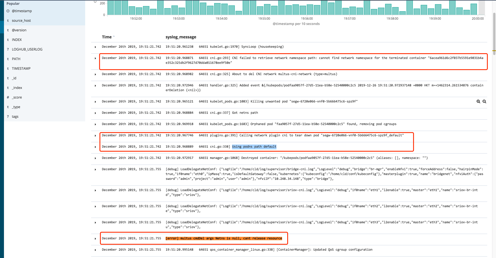

这周协助同事解决线上`CNI`插件删除`POD`但是报错信息说 `network namespace` 为空，具体错误信息如下图


看了一眼代码感觉不是我一时半会能搞定的事情，就借这个问题为契机阅读一下`kubelet`的部分代码，熟悉一下`kubelet`是如何删除`POD`网络，如果以后又要处理这样问题就可以有的放矢。

在线上分析可以看到`kubelet`的启动参数含有是 `--network-plugin=cni`，根据这个信息为线索梳理`kubelet`是如何销毁一个 `pod` 的`network namespace `。

准备以`kubelet网络部分的初始化`，`kubelet如何销毁POD`，`kubelet如何使用CNI回收网络资源`这样的形式去组织这篇。

## kubelet 网络部分的初始化

因为匆匆打开 `kubelet` 代码感觉有点复杂，单纯的看销毁逻辑让我困惑为什么`kubelet` 调用这个 `plugin` 的实现，而不是那一个实现，所以计划梳理一下 `kubelet` 是如何启动并开始它的主流程。

`kubelet` 启动准备工作实在是有些多，简单整理一下调用函数直接的关系从主函数调用开始 `NewKubeletCommand()` -> `Run(kubeletServer, kubeletDeps, utilfeature.DefaultFeatureGate, stopCh)`->`run(s, kubeDeps, featureGate, stopCh)`->`RunKubelet(s, kubeDeps, s.RunOnce)`

这个函数会调用`createAndInitKubelet()`，第二个参数是`ContainerRuntimeOptions`结构体，其中有个字段就是上层传下来的`NetworkPluginName`，在我们的`case`中这个值是从命令行去来的`cni`字符串。

```go
// RunKubelet is responsible for setting up and running a kubelet.  It is used in three different applications:
//   1 Integration tests
//   2 Kubelet binary
//   3 Standalone 'kubernetes' binary
// Eventually, #2 will be replaced with instances of #3
func RunKubelet(kubeServer *options.KubeletServer, kubeDeps *kubelet.Dependencies, runOnce bool) error {
...
	k, err := createAndInitKubelet(&kubeServer.KubeletConfiguration,
		kubeDeps,
		&kubeServer.ContainerRuntimeOptions, // 插件名字就是这个变量的一个字段
...
		kubeServer.NodeStatusMaxImages)
	if err != nil {
		return fmt.Errorf("failed to create kubelet: %v", err)
	}
```

```go
func createAndInitKubelet(kubeCfg *kubeletconfiginternal.KubeletConfiguration,
	kubeDeps *kubelet.Dependencies,
	crOptions *config.ContainerRuntimeOptions, // 上述参数的形参
...
	nodeStatusMaxImages int32) (k kubelet.Bootstrap, err error) {
	// TODO: block until all sources have delivered at least one update to the channel, or break the sync loop
	// up into "per source" synchronizations

	k, err = kubelet.NewMainKubelet(kubeCfg,
		kubeDeps,
		crOptions, // 一路将变量传递到下面函数
...
	return k, nil
}
```

```go
// NewMainKubelet instantiates a new Kubelet object along with all the required internal modules.
// No initialization of Kubelet and its modules should happen here.
func NewMainKubelet(kubeCfg *kubeletconfiginternal.KubeletConfiguration,
	kubeDeps *Dependencies,
	crOptions *config.ContainerRuntimeOptions, // container runtime 选项参数
...
	// TODO: These need to become arguments to a standalone docker shim.
	pluginSettings := dockershim.NetworkPluginSettings{
		HairpinMode:        kubeletconfiginternal.HairpinMode(kubeCfg.HairpinMode),
		NonMasqueradeCIDR:  nonMasqueradeCIDR,
		PluginName:         crOptions.NetworkPluginName, // NetworkPluginName 变量值 cni
		PluginConfDir:      crOptions.CNIConfDir,
		PluginBinDirString: crOptions.CNIBinDir,
		PluginCacheDir:     crOptions.CNICacheDir,
		MTU:                int(crOptions.NetworkPluginMTU),
	}
... 
	switch containerRuntime {
	case kubetypes.DockerContainerRuntime: // 这个值是 docker，也就是我们场景的值
		// Create and start the CRI shim running as a grpc server.
		streamingConfig := getStreamingConfig(kubeCfg, kubeDeps, crOptions)
		ds, err := dockershim.NewDockerService(kubeDeps.DockerClientConfig, crOptions.PodSandboxImage, streamingConfig,
			&pluginSettings, runtimeCgroups, kubeCfg.CgroupDriver, crOptions.DockershimRootDirectory, !crOptions.RedirectContainerStreaming, crOptions.NoJsonLogPath) // pluginSettings 里面含有 network plugin 名称
...
	return klet, nil
}
```

在`NewDockerService`函数中会调用`InitNetworkPlugin`函数，这个函数是构建`dockerservice`网络字段的关键。

```go
// NewDockerService creates a new `DockerService` struct.
// NOTE: Anything passed to DockerService should be eventually handled in another way when we switch to running the shim as a different process.
func NewDockerService(config *ClientConfig, podSandboxImage string, streamingConfig *streaming.Config, pluginSettings *NetworkPluginSettings,
	cgroupsName string, kubeCgroupDriver string, dockershimRootDir string, startLocalStreamingServer bool, noJsonLogPath string) (DockerService, error) {
...
	ds := &dockerService{
...
	plug, err := network.InitNetworkPlugin(cniPlugins, pluginSettings.PluginName, netHost, pluginSettings.HairpinMode, pluginSettings.NonMasqueradeCIDR, pluginSettings.MTU) // 这个函数是构建 plugin 接口的关键
	if err != nil {
		return nil, fmt.Errorf("didn't find compatible CNI plugin with given settings %+v: %v", pluginSettings, err)
	}
	ds.network = network.NewPluginManager(plug) // DockerService 的 network 字段
...
	return ds, nil
}
```

多数场景kubelet指定 `plugin` 名字为 `cni` 或者 `kubenet` 足够了，这个初始化的逻辑就是在这个调用中 `network.InitNetworkPlugin(cniPlugins, pluginSettings.PluginName, netHost, pluginSettings.HairpinMode, pluginSettings.NonMasqueradeCIDR, pluginSettings.MTU)`，可以在 `kubelet`的目录下面看到 `cni` 和 `kubenet` 两个包实现了 `plugin interface`。

我认为为了处理`POD`删除时候网络问题对启动流程分析到这里就足够了，知道了如何`kubelet`初始化准备调用 `cni` 的实现。

## kubelet 调用网络接口抽象

在上面初始化的过程中可以看到设置`dockerservice`的`plugin`，`plugin interface`设计主要关注两个接口一个是`SetUpPod`，还有一个是`TearDownPod`。

看注释可能要额外注意，在这个两个接口的设计中都有对`infra container`预设前提，具体可以看一下注释。

```go
// NetworkPlugin is an interface to network plugins for the kubelet
type NetworkPlugin interface {
...
	// SetUpPod is the method called after the infra container of
	// the pod has been created but before the other containers of the
	// pod are launched.
  // 看上面注释，这个函数就是用来准备POD运行时的网络环境的
	SetUpPod(namespace string, name string, podSandboxID kubecontainer.ContainerID, annotations, options map[string]string) error

	// TearDownPod is the method called before a pod's infra container will be deleted
  // 这个函数是用在POD销毁的流程中的，但是在接口设计中有假设在 infra container 被销毁前
	TearDownPod(namespace string, name string, podSandboxID kubecontainer.ContainerID) error
```


## kubelet 如何销毁容器

前面看了`kubelet`启动初始化，出于文章的完整性考虑梳理一下`POD`销毁场景下几个主要函数的调用关系。

在最开始`kubelet`启动的时候知道了函数调用到`RunKubelet()`，后面其实还有`RunKubelet()`->`startKubelet()`->`k.Run(podCfg.Updates())`

```go
// Run starts the kubelet reacting to config updates
func (kl *Kubelet) Run(updates <-chan kubetypes.PodUpdate) {
...
	// Start the pod lifecycle event generator.
	kl.pleg.Start()
	kl.syncLoop(updates, kl) // 这个地方就是 kubelet 实际运行的核心代码了
}
```
在 `syncLoop` 中根据收到的事件进行处理就是`kubelet`核心逻辑，这里只关注`pod`是如何开始删除的。

```go
func (kl *Kubelet) syncLoopIteration(configCh <-chan kubetypes.PodUpdate, handler SyncHandler,
	syncCh <-chan time.Time, housekeepingCh <-chan time.Time, plegCh <-chan *pleg.PodLifecycleEvent) bool {
	select {
...
		switch u.Op { // 这里对操作类型做断言，不通的类型对应不同的处理函数。
...
		case kubetypes.REMOVE:
			klog.V(2).Infof("SyncLoop (REMOVE, %q): %q", u.Source, format.Pods(u.Pods))
			handler.HandlePodRemoves(u.Pods)
```
这个`syncLoopIteration`函数告诉你从几个渠道触发主循环 ，`handler`变量存放这处理这些事件的方法，可以看一下部分实现（这个函数的注释写的很清楚，告诉你每个 `channel` 里面是什么）

```go
// HandlePodRemoves is the callback in the SyncHandler interface for pods
// being removed from a config source.
func (kl *Kubelet) HandlePodRemoves(pods []*v1.Pod) {
   start := kl.clock.Now()
   for _, pod := range pods {
      kl.podManager.DeletePod(pod)
      if kubetypes.IsMirrorPod(pod) {
         kl.handleMirrorPod(pod, start)
         continue
      }
      // Deletion is allowed to fail because the periodic cleanup routine
      // will trigger deletion again.
      if err := kl.deletePod(pod); err != nil { // 这里就是删除POD的核心
         klog.V(2).Infof("Failed to delete pod %q, err: %v", format.Pod(pod), err)
      }
      kl.probeManager.RemovePod(pod)
   }
}
```

`deletePod()`函数其实并不是真的`deletePOD`仅仅是将期望被删除的`POD`丢掉`podKillingCh`中。

```go
// deletePod deletes the pod from the internal state of the kubelet by:
// 1.  stopping the associated pod worker asynchronously
// 2.  signaling to kill the pod by sending on the podKillingCh channel
//
// deletePod returns an error if not all sources are ready or the pod is not
// found in the runtime cache.
func (kl *Kubelet) deletePod(pod *v1.Pod) error {
...
   podPair := kubecontainer.PodPair{APIPod: pod, RunningPod: &runningPod}

   kl.podKillingCh <- &podPair  // 这里
   // TODO: delete the mirror pod here?

   // We leave the volume/directory cleanup to the periodic cleanup routine.
   return nil
}
```

根据这个 `channel` 找到删除流程的代码，这个代码是以一个`go routing` 独立运行`go wait.Until(kl.podKiller, 1*time.Second, wait.NeverStop)`。

```go
// podKiller launches a goroutine to kill a pod received from the channel if
// another goroutine isn't already in action.
func (kl *Kubelet) podKiller() {
...
	for podPair := range kl.podKillingCh { // 这地方可以看到通过 channel 沟通
...
		if !exists {
			go func(apiPod *v1.Pod, runningPod *kubecontainer.Pod) {
				klog.V(2).Infof("Killing unwanted pod %q", runningPod.Name)
				err := kl.killPod(apiPod, runningPod, nil, nil) // 这里就是做实际的删除
...
```

看下面代码知道了实际调用了`containerRuntime`的`KillPod`接口

```go
// One of the following arguments must be non-nil: runningPod, status.
// TODO: Modify containerRuntime.KillPod() to accept the right arguments.
func (kl *Kubelet) killPod(pod *v1.Pod, runningPod *kubecontainer.Pod, status *kubecontainer.PodStatus, gracePeriodOverride *int64) error {
...
	// Call the container runtime KillPod method which stops all running containers of the pod
	if err := kl.containerRuntime.KillPod(pod, p, gracePeriodOverride); err != nil {  // here
...
```

看一下`KillPod`这个`interface`的实现如下，没有没有太多核心逻辑

```go
// KillPod kills all the containers of a pod. Pod may be nil, running pod must not be.
// gracePeriodOverride if specified allows the caller to override the pod default grace period.
// only hard kill paths are allowed to specify a gracePeriodOverride in the kubelet in order to not corrupt user data.
// it is useful when doing SIGKILL for hard eviction scenarios, or max grace period during soft eviction scenarios.
func (m *kubeGenericRuntimeManager) KillPod(pod *v1.Pod, runningPod kubecontainer.Pod, gracePeriodOverride *int64) error {
	err := m.killPodWithSyncResult(pod, runningPod, gracePeriodOverride)
...
```

```go
// killPodWithSyncResult kills a runningPod and returns SyncResult.
// Note: The pod passed in could be *nil* when kubelet restarted.
func (m *kubeGenericRuntimeManager) killPodWithSyncResult(pod *v1.Pod, runningPod kubecontainer.Pod, gracePeriodOverride *int64) (result kubecontainer.PodSyncResult) {
	killContainerResults := m.killContainersWithSyncResult(pod, runningPod, gracePeriodOverride)
	for _, containerResult := range killContainerResults {
		result.AddSyncResult(containerResult)
	}

	// stop sandbox, the sandbox will be removed in GarbageCollect
	killSandboxResult := kubecontainer.NewSyncResult(kubecontainer.KillPodSandbox, runningPod.ID)
	result.AddSyncResult(killSandboxResult)
	// Stop all sandboxes belongs to same pod
	for _, podSandbox := range runningPod.Sandboxes {
		if err := m.runtimeService.StopPodSandbox(podSandbox.ID.ID); err != nil { // 这里是删除POD的sandbox
			killSandboxResult.Fail(kubecontainer.ErrKillPodSandbox, err.Error())
			klog.Errorf("Failed to stop sandbox %q", podSandbox.ID)
		}
	}

	return
}
```

`killContainersWithSyncResult()` 方法的实现就是从`POD`的操作转换为 `container` 操作的核心，在这个函数之前全部操作都是围绕这个`POD`，但是这个函数之后调用函数操作对象都是 `container`。

而且这个函数保证了`others conainter`删除早于 `sandbox container`删除。

后面函数调用就比较简单了`m.killContainersWithSyncResult(pod, runningPod, gracePeriodOverride)` -> `m.runtimeService.StopPodSandbox(podSandbox.ID.ID)` -> `r.runtimeClient.StopPodSandbox(ctx, &runtimeapi.StopPodSandboxRequest{PodSandboxId: podSandBoxID})`。

对删除流程我们跟到这个`StopPodSandbox`方法调用我认为就够了，之所以认为够了是原因在此之前逻辑都是在`kubelet`自己主循环中，而之后的逻辑都是走的 `grpc`。

## kubelet 如何回收网络

有了之前的分析，现在看一下是如何实现`StopPodSandbox` 这个服务是如何实现的

```go
var _RuntimeService_serviceDesc = grpc.ServiceDesc{
	ServiceName: "runtime.v1alpha2.RuntimeService",
	HandlerType: (*RuntimeServiceServer)(nil),
	Methods: []grpc.MethodDesc{
...
		{
			MethodName: "StopPodSandbox",
			Handler:    _RuntimeService_StopPodSandbox_Handler,
		},
```

`_RuntimeService_StopPodSandbox_Handler`的实现会调用`StopPodSandbox()`，后面看一下`StopPodSandbox()`的实现。

```go
// StopPodSandbox stops the sandbox. If there are any running containers in the
// sandbox, they should be force terminated.
// TODO: This function blocks sandbox teardown on networking teardown. Is it
// better to cut our losses assuming an out of band GC routine will cleanup
// after us?
func (ds *dockerService) StopPodSandbox(ctx context.Context, r *runtimeapi.StopPodSandboxRequest) (*runtimeapi.StopPodSandboxResponse, error) {
	var namespace, name string
	var hostNetwork bool
....
	// WARNING: The following operations made the following assumption:
	// 1. kubelet will retry on any error returned by StopPodSandbox.
	// 2. tearing down network and stopping sandbox container can succeed in any sequence.
	// This depends on the implementation detail of network plugin and proper error handling.
	// For kubenet, if tearing down network failed and sandbox container is stopped, kubelet
	// will retry. On retry, kubenet will not be able to retrieve network namespace of the sandbox
	// since it is stopped. With empty network namespcae, CNI bridge plugin will conduct best
	// effort clean up and will not return error.
	errList := []error{}
	ready, ok := ds.getNetworkReady(podSandboxID)
	if !hostNetwork && (ready || !ok) {
		// Only tear down the pod network if we haven't done so already
		cID := kubecontainer.BuildContainerID(runtimeName, podSandboxID)
		err := ds.network.TearDownPod(namespace, name, cID) 
```

`TearDownPod`就是整个`POD`网络销毁的核心函数，在这个函数的实现中做了一部分预设前提 `infra container` 后于 `others container`  删除。

看一下`CNI`这个包对与这个函数的实现的销毁逻辑

```go
func (plugin *cniNetworkPlugin) TearDownPod(namespace string, name string, id kubecontainer.ContainerID) error {
	if err := plugin.checkInitialized(); err != nil {
		return err
	}

	// Lack of namespace should not be fatal on teardown
	netnsPath, err := plugin.host.GetNetNS(id.ID) // 这里就就是获取 namespace的使用
	if err != nil {
		klog.Warningf("CNI failed to retrieve network namespace path: %v", err) // 看 ELK 报错信息有这个
	}
...
	return plugin.deleteFromNetwork(cniTimeoutCtx, plugin.getDefaultNetwork(), name, namespace, id, netnsPath, nil)
}
```

```go
func (plugin *cniNetworkPlugin) deleteFromNetwork(ctx context.Context, network *cniNetwork, podName string, podNamespace string, podSandboxID kubecontainer.ContainerID, podNetnsPath string, annotations map[string]string) error {
	rt, err := plugin.buildCNIRuntimeConf(podName, podNamespace, podSandboxID, podNetnsPath, annotations, nil) // 通过 ELK 看到也有这个函数的警告
...
}
```

```go
func (plugin *cniNetworkPlugin) buildCNIRuntimeConf(podName string, podNs string, podSandboxID kubecontainer.ContainerID, podNetnsPath string, annotations map[string]string) (*libcni.RuntimeConf, error) {
	glog.V(4).Infof("Got netns path %v", podNetnsPath)
	glog.V(4).Infof("Using podns path %v", podNs) // 这行在 ELK 里面也看到了, podNs 值为 default 不符合预期3

...
	return rt, nil
}
```

这后面就是按照`cni`的标准调用`cni`二进制了。

## 问题分析

基于之前的分析，其实出问题的地方很清楚了。就是`plugin.host.GetNetNS(id.ID)`过程错误了。

```go
// GetNetNS returns the network namespace of the given containerID. The ID
// supplied is typically the ID of a pod sandbox. This getter doesn't try
// to map non-sandbox IDs to their respective sandboxes.
func (ds *dockerService) GetNetNS(podSandboxID string) (string, error) {
	r, err := ds.client.InspectContainer(podSandboxID) // 这个就是调用 docker client 了
	if err != nil {
		return "", err
	}
	return getNetworkNamespace(r)
}
```

```go
func (d *kubeDockerClient) InspectContainer(id string) (*dockertypes.ContainerJSON, error) {
	ctx, cancel := d.getTimeoutContext()
	defer cancel()
	containerJSON, err := d.client.ContainerInspect(ctx, id) // 这个地方就是
...
	return &containerJSON, nil
}
```

```go
func getNetworkNamespace(c *dockertypes.ContainerJSON) (string, error) {
   if c.State.Pid == 0 {
      // Docker reports pid 0 for an exited container.
      return "", fmt.Errorf("cannot find network namespace for the terminated container %q", c.ID)
   }
   // dockerNetNSFmt = "/proc/%v/ns/net"
   return fmt.Sprintf(dockerNetNSFmt, c.State.Pid), nil 
}
```

结合`ELK`错误日志初步判断出就是`if c.State.Pid == 0 {`这个逻辑被触发了，也就说 `sandbox`的container的`docker state pid`为`0`。

