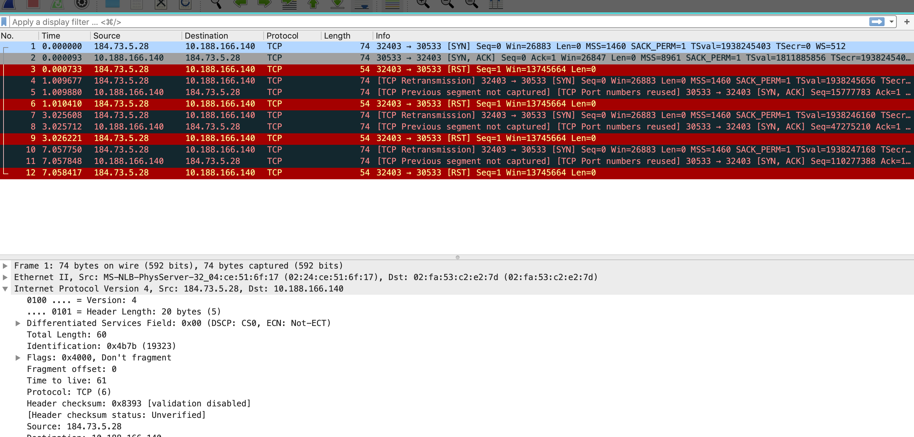
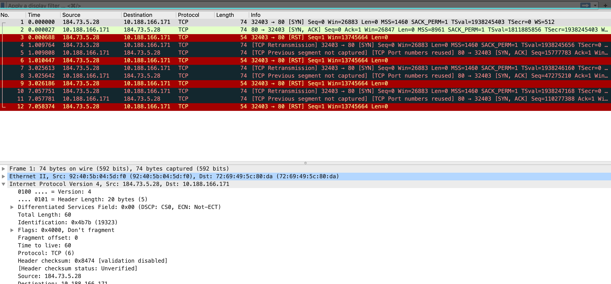
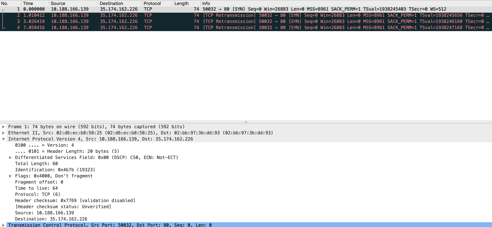
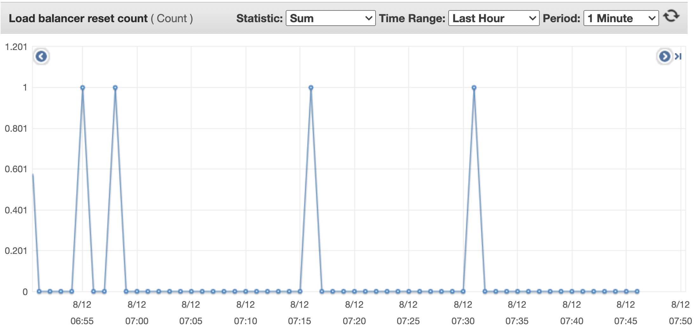
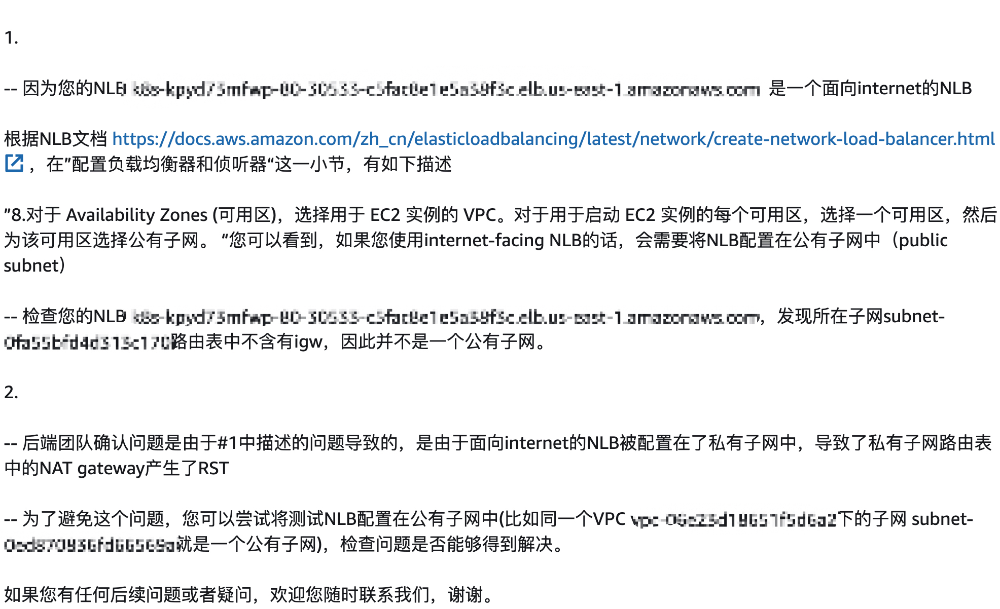

# 背景

业务要使用 k8s service 将集群内部的业务暴露出来，对外提供 tcp/udp 的接入方式，两个传输层的协议使用相同的端口号。

而我们在 aws 上自己建的集群使用的是 aws cloud provider 来实现和 aws 内部资源互联互通调用，而截止 20200810 aws cloud provider 还不支持创建 service 支持tcp/udp使用同一个端口号。

# 如何绕过

有了上面的背景，就准备设计方案绕过目前 aws cloud provider 实现的限制。

walk around 的方案是下面这样设计的：

1. 使用lb将流量转发到节点上。
2. 流量转发到节点上使用 iptables 将流量转发到 pod 中去。

那么围绕着上面的思路，就有2个核心问题。其一是确认使用的 lb 类型。其二是如何管理 iptables 规则将流量转发到节点上。

首先是 lb 类型选择的问题，首先排除 alb 因为只支持 http/https，其次排除 clb 因为 cld 连 udp 都不支持，其实也就只能选择 nlb ，因为 nlb 支持 tcp/udp/tcp_udp 等，至少我要的是有的。

第二个问题是如何将流量从节点上转发到 poc 里面，基于对 kubernetes service 理解，准备使用 node port 来实现。

那么上面这个 poc 的数据链路就是 client -> nlb (listener) -> targetgroup (instance & tcp_udp)-> node (iptables)-> container 。client 使用 nc 来模拟发送 tcp/udp 数据包，nlb 配置没有特别注意的地方只是在创建 listener 的时候类型选择 tcp_udp，targetgroup 创建选择 instance 类型选择 tcp_udp， node 和 container 也没有特别的地方，就是普通的 kubernetes 节点运行着一个 pod 而已。

# nlb 转发后使用 fullnat 的问题

其实基于上面的设计，流量可以的转发到节点上。到了节点上可以使用 iptables 转发规则将流量转到 pod 中。

因为 tcp 和 udp 两个需要对外使用同一个端口，所以单纯使用 node port 将流量转发到 pod 中可能只转发一种协议。

因为使用手动下发 ipbtales 规则又不能 cover 到 pod 的滚动更新，所以这里还有一个*遗留工作留着后面找解决办法*（可能不一定有。

先测试 tcp，针对 TCP 协议使用节点上的 nodeport 在将流量转发到 pod 这个后面的过程中。

基于这个描述在梳理一下调用路径 client -> nlb -> node -> container 这个是流量进入的过程， cotnainer -> node -> nlb -> client 这个是预期的返回路径，但是现在根据在各节点的抓包行为是 container -> node -> nlb 然后 nlb 冒充客户端发了 reset 给 node， node 将这个 reset 转发给了 pod；而真实客户端一致在发送 tcp 重传。

在节点上抓到的数据包：

在容器中抓到额数据包：

但是在客户端抓包是发现的重传，没有发起 tcp rest。

基于上述抓包可以初步断定这个 tcp reset 非常可能是 aws 的设备冒充客户端发过来的。

# nlb 的实现的问题 ？

上述这样的现象真的让知识匮乏的我费解，Google 一下发现发现case[^Adobe大佬的case] ，还有在 fw [^challenge ACK]的场景中有类似的行为。两个文章都提供了关键词`RFC rfc5961`，从文档也没有看出来有什么相关性，这个 rfc 主要是针对 tcp 的安全强化，解决几种针对的 tcp 的攻击 

1. Blind Reset Attack Using the RST Bit
2. Blind Reset Attack Using the SYN Bit 
3. Blind Data Injection Attack

看着上面3个攻击都感觉不到和我场景有什么关系，因为这一类的攻击都是针对 establish 的 tcp 信道的，而在我的 case 里面都没有建立好 tcp 链接。

细看后面的描述 Middlebox Considerations 的 section 的几个 subsection 其实和我场景也不相关，9.1 sub section 说的是某个 endpoint 发送 rst 但是 Middlebox 或者 对端实现滞后于 rfc5961，其余两个也不相关。

提了工单给 aws 了，因为的确在他的 nlb 监控上看到了 

# AWS 的的回复

基于aws的回复确认还是我的使用姿势问题，这个 tcp rest 是 natgw 发送的。

入流量 client -> lb -> instance -> nat -> pod ，返回流程是 pod -> nat -> instance -> natgw 因为保留了客户端真实来源，而 natgw 没有找到对应的条目。

### reference

[^Adobe大佬的case]: [有大佬也遇到过](https://medium.com/swlh/nlb-connection-resets-109720accfc6)
[^challenge ACK]:[challenge ACK]|(https://www.networkdefenseblog.com/post/wireshark-tcp-challenge-ack)