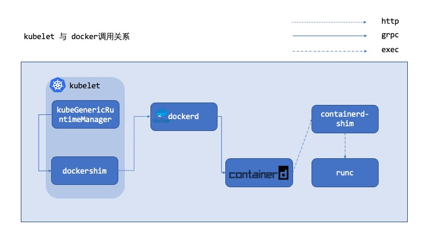

出于 `containerd` 上线需求，走读线上组件的代码确定现有 `POD` 创建流程，主要关注的是组件之间是如何交互沟通的进行 `POD` 创建的。



<!-- START doctoc generated TOC please keep comment here to allow auto update -->
<!-- DON'T EDIT THIS SECTION, INSTEAD RE-RUN doctoc TO UPDATE -->

- [kubelet](#kubelet)
  - [kubelet 如何创建 POD](#kubelet-%E5%A6%82%E4%BD%95%E5%88%9B%E5%BB%BA-pod)
- [dockershim](#dockershim)
- [dockerd 接口](#dockerd-%E6%8E%A5%E5%8F%A3)
  - [/containers/{name:.*}/start](#containersnamestart)
- [containerd](#containerd)
  - [ContainersServer.Create 方法的实现](#containersservercreate-%E6%96%B9%E6%B3%95%E7%9A%84%E5%AE%9E%E7%8E%B0)
  - [TasksServer.Create 方法的实现](#tasksservercreate-%E6%96%B9%E6%B3%95%E7%9A%84%E5%AE%9E%E7%8E%B0)
  - [TasksServer.Start 方法的实现](#tasksserverstart-%E6%96%B9%E6%B3%95%E7%9A%84%E5%AE%9E%E7%8E%B0)
- [containerd-shim 的如何工作](#containerd-shim-%E7%9A%84%E5%A6%82%E4%BD%95%E5%B7%A5%E4%BD%9C)
  - [contained-shim create](#contained-shim-create)
  - [contained-shim start](#contained-shim-start)
- [runc](#runc)
  - [run create --bundle](#run-create---bundle)
  - [runc init](#runc-init)
  - [runc start](#runc-start)

<!-- END doctoc generated TOC please keep comment here to allow auto update -->

# kubelet

线上主要有两个版本的 `k8s`，这次代码走读主要关注 `1.17.4` 版本。观察 `kubelet` 初始化流程可以看到与运行时相关参数如下`--container-runtime=` 参数为 `docker`。查看启动日志，可以看到 `kubelet` 启动了一个 `dockershim` 的服务，这个服务就是目前调研的一个关键点，因为社区在 `1.20` 版本中准备弃用 `dockershim` 了。

```
I1215 16:38:23.359299 2052022 docker_service.go:274] Setting cgroupDriver to cgroupfs
I1215 16:38:23.359435 2052022 kubelet.go:642] Starting the GRPC server for the docker CRI shim.
I1215 16:38:23.359456 2052022 docker_server.go:59] Start dockershim grpc server
...
```

调研社区文档发现，`dockershim` 之所以被提出是为了解决 `kubernetes` 开发者面临多个`runtime`都要接入`kubernetes`导致调用运行时的相关代码接口不稳定的问题。
开发者引入一个抽象层对上屏蔽底层的`runtime`实现差异，这个抽象层称为[CRI]([https://kubernetes.io/blog/2016/12/container-runtime-interface-cri-in-kubernetes/](https://kubernetes.io/blog/2016/12/container-runtime-interface-cri-in-kubernetes/)), 这里的 `dockershim` 就是基于 `docker` 二次封装的一个 `CRI` 实现。
`shim` 这个单词的由来可以从 wiki 上查到 `an application compatibility workaround`。

## kubelet 如何创建 POD

在 `POD` 创建过程中首先需要准备一个被成为 `sandbox` 的容器用来初始化设置基础网络等等诸多事宜。走读 `CRI` 接口发现创建 `Sandbox` 这个是 `CRI` 的一个重要功能。

基于 `kubelet` 的源码分析，通过源码分析了解到 `syncLoopIteration` -> `HandlePodAdditions` -> `dispatchWork`->`UpdatePod`-> `managePodLoop` 这样的一个函数调用关系。

```go
func (p *podWorkers) managePodLoop(podUpdates <-chan UpdatePodOptions) {
	var lastSyncTime time.Time
...
			err = p.syncPodFn(syncPodOptions{ // 就是这个 syncPodFn 函数的实现
				mirrorPod:      update.MirrorPod,
				pod:            update.Pod,
				podStatus:      status,
				killPodOptions: update.KillPodOptions,
				updateType:     update.UpdateType,
			})
```

其中的 `syncPodFn` 具体实现是 `klet.syncPod` 函数，可以通过代码`klet.podWorkers = newPodWorkers(klet.syncPod, kubeDeps.Recorder, klet.workQueue, klet.resyncInterval, backOffPeriod, klet.podCache)`看出。基于以上信息可以推论出 `podWorkers` 才是 `pod` 创建的核心。走读`woker`的 `SyncPod` 这个函数就是就是 `podWorkers` 核心流程了，`worker` 通过 `sync` 函数来调用各个 `CRI` 接口将这些原子接口组装成一个个实际的 `kubernetes` 的 `POD`。

```go
// SyncPod syncs the running pod into the desired pod by executing following steps:
//
//  1. Compute sandbox and container changes.
//  2. Kill pod sandbox if necessary.
//  3. Kill any containers that should not be running.
//  4. Create sandbox if necessary.
//  5. Create ephemeral containers.
//  6. Create init containers.
//  7. Create normal containers.
func (m *kubeGenericRuntimeManager) SyncPod(pod *v1.Pod, podStatus *kubecontainer.PodStatus, pullSecrets []v1.Secret, backOff *flowcontrol.Backoff) (result kubecontainer.PodSyncResult) {
	// Step 1: Compute sandbox and container changes.
	podContainerChanges := m.computePodActions(pod, podStatus) // 还是声明式api模型，将操作序列化
...
	// Step 2: Kill the pod if the sandbox has changed.
	if podContainerChanges.KillPod {
...
		killResult := m.killPodWithSyncResult(pod, kubecontainer.ConvertPodStatusToRunningPod(m.runtimeName, podStatus), nil)
... // 删除一下无关紧要的代码，不影响主线逻辑
	} else {
		// Step 3: kill any running containers in this pod which are not to keep.
		for containerID, containerInfo := range podContainerChanges.ContainersToKill {
			klog.V(3).Infof("Killing unwanted container %q(id=%q) for pod %q", containerInfo.name, containerID, format.Pod(pod))
			killContainerResult := kubecontainer.NewSyncResult(kubecontainer.KillContainer, containerInfo.name)
			result.AddSyncResult(killContainerResult)
			if err := m.killContainer(pod, containerID, containerInfo.name, containerInfo.message, nil); err != nil {
...// 一些在运行，但是应该被删除的 container 处理逻辑，
			}
		}
	}
...
  // Step 4: Create a sandbox for the pod if necessary.
	podSandboxID := podContainerChanges.SandboxID
	if podContainerChanges.CreateSandbox {
...
    createSandboxResult := kubecontainer.NewSyncResult(kubecontainer.CreatePodSandbox, format.Pod(pod))
		result.AddSyncResult(createSandboxResult)
		podSandboxID, msg, err = m.createPodSandbox(pod, podContainerChanges.Attempt) 
    // 这个函数是我们关注的核心，准备pod的沙盒，如何在 sandbox 中调用 CNI 设置网络/存储等
... // 删除一下错误处理，事件的逻辑，网络相关，不影响启动一个不使用网络的 container 😄
 
	// Get podSandboxConfig for containers to start.
	configPodSandboxResult := kubecontainer.NewSyncResult(kubecontainer.ConfigPodSandbox, podSandboxID)
	result.AddSyncResult(configPodSandboxResult)
	podSandboxConfig, err := m.generatePodSandboxConfig(pod, podContainerChanges.Attempt)
	if err != nil {
		message := fmt.Sprintf("GeneratePodSandboxConfig for pod %q failed: %v", format.Pod(pod), err)
		klog.Error(message)
		configPodSandboxResult.Fail(kubecontainer.ErrConfigPodSandbox, message)
		return
	}

	// Helper containing boilerplate common to starting all types of containers.
	// typeName is a label used to describe this type of container in log messages,
	// currently: "container", "init container" or "ephemeral container"
	start := func(typeName string, container *v1.Container) error {
		startContainerResult := kubecontainer.NewSyncResult(kubecontainer.StartContainer, container.Name)
		result.AddSyncResult(startContainerResult)

		isInBackOff, msg, err := m.doBackOff(pod, container, podStatus, backOff)
		if isInBackOff {
			startContainerResult.Fail(err, msg)
			klog.V(4).Infof("Backing Off restarting %v %+v in pod %v", typeName, container, format.Pod(pod))
			return err
		}

		klog.V(4).Infof("Creating %v %+v in pod %v", typeName, container, format.Pod(pod))
		// NOTE (aramase) podIPs are populated for single stack and dual stack clusters. Send only podIPs.
		if msg, err := m.startContainer(podSandboxID, podSandboxConfig, container, pod, podStatus, pullSecrets, podIP, podIPs); err != nil { // 创建 cotnainer 和 启动 container 是两回事，创建说的是准备好相关底层文件资源，启动就是以进程形式在OS可见，具体还要看底层运行时是如何实现的。
      // .. 删除了一部分错误处理的逻辑
      
	// Step 5: start ephemeral containers
	//  这部分逻辑非主线

	// Step 6: start the init container.
	if container := podContainerChanges.NextInitContainerToStart; container != nil {
		// Start the next init container.
		if err := start("init container", container); err != nil {
			return
		}

		// Successfully started the container; clear the entry in the failure
		klog.V(4).Infof("Completed init container %q for pod %q", container.Name, format.Pod(pod))
	}

	// Step 7: start containers in podContainerChanges.ContainersToStart. 
	for _, idx := range podContainerChanges.ContainersToStart { // 就是业务的 container 
		start("container", &pod.Spec.Containers[idx]) // start 可以前面看到定义 start := func(typeName string, container *v1.Container) 
	}

	return
}
```

上面的源码其实已经知道为什么要引入 `sandbox container` 了。分析一下 `createPodSandbox` 这个函数是如何实现的。

```go
// createPodSandbox creates a pod sandbox and returns (podSandBoxID, message, error).
func (m *kubeGenericRuntimeManager) createPodSandbox(pod *v1.Pod, attempt uint32) (string, string, error) {
	podSandboxConfig, err := m.generatePodSandboxConfig(pod, attempt)
	if err != nil {
		message := fmt.Sprintf("GeneratePodSandboxConfig for pod %q failed: %v", format.Pod(pod), err)
		klog.Error(message)
		return "", message, err
	}

	// Create pod logs directory
	err = m.osInterface.MkdirAll(podSandboxConfig.LogDirectory, 0755) // 这个目录就是 kubelet 配置读取下来的
	if err != nil {
		message := fmt.Sprintf("Create pod log directory for pod %q failed: %v", format.Pod(pod), err)
... // 省略错误处理	
... // 删除了非主线逻辑
	podSandBoxID, err := m.runtimeService.RunPodSandbox(podSandboxConfig, runtimeHandler)
... // 省略错误处理
	return podSandBoxID, "", nil
}
```

这就是看到调用的 `func (in instrumentedRuntimeService) RunPodSandboxha` 函数基本是透传，存粹是为了记录一下 `metric` 为监控服务。

```go
func (in instrumentedRuntimeService) RunPodSandbox(config *runtimeapi.PodSandboxConfig, runtimeHandler string) (string, error) {
	const operation = "run_podsandbox"
	startTime := time.Now()
	defer recordOperation(operation, startTime)
	defer metrics.RunPodSandboxDuration.WithLabelValues(runtimeHandler).Observe(metrics.SinceInSeconds(startTime))

	out, err := in.service.RunPodSandbox(config, runtimeHandler)
	recordError(operation, err)
	if err != nil {
		metrics.RunPodSandboxErrors.WithLabelValues(runtimeHandler).Inc()
...
```

在上面记录完成监控相关过后，下面就是准备调用 `grpc` 服务了，可以看到调用的是 `CRI` 的 `/runtime.v1alpha2.RuntimeService/RunPodSandbox` 接口。

```go
// RunPodSandbox creates and starts a pod-level sandbox. Runtimes should ensure
// the sandbox is in ready state.
func (r *RemoteRuntimeService) RunPodSandbox(config *runtimeapi.PodSandboxConfig, runtimeHandler string) (string, error) {
	// Use 2 times longer timeout for sandbox operation (4 mins by default)
	// TODO: Make the pod sandbox timeout configurable.
	ctx, cancel := getContextWithTimeout(r.timeout * 2)
	defer cancel()

	resp, err := r.runtimeClient.RunPodSandbox(ctx, &runtimeapi.RunPodSandboxRequest{
		Config:         config,
		RuntimeHandler: runtimeHandler,
	})
...
	return resp.PodSandboxId, nil
}
```

```go
func (c *runtimeServiceClient) RunPodSandbox(ctx context.Context, in *RunPodSandboxRequest, opts ...grpc.CallOption) (*RunPodSandboxResponse, error) {
	out := new(RunPodSandboxResponse)
	err := c.cc.Invoke(ctx, "/runtime.v1alpha2.RuntimeService/RunPodSandbox", in, out, opts...)
	if err != nil {
		return nil, err
	}
	return out, nil
}
```

以上就是 `kubeGenericRuntimeManager` 所处理的 `POD` 创建流程中的 `sandbox` 的部分，对其 `sandbox` 具体是如何被创建的更多细节就要看 `grpc` 服务端的实现了。

# dockershim

前面梳理出来了 `kubeGenericRuntimeManager` 是如何通过`SyncPod`实现`POD`的创建，但是也发现他的实现完全是面向接口的，完全不关心底层是如何实现 `cotnainer` 的。我们接着上面 `client` 的相关逻辑走读一下`/runtime.v1alpha2.RuntimeService/RunPodSandbox` 的服务端代码逻辑。

```go
var _RuntimeService_serviceDesc = grpc.ServiceDesc{
	ServiceName: "runtime.v1alpha2.RuntimeService",
	HandlerType: (*RuntimeServiceServer)(nil),
	Methods: []grpc.MethodDesc{
...
		{
			MethodName: "RunPodSandbox",
			Handler:    _RuntimeService_RunPodSandbox_Handler,
...
```

下面是 `handler` 注册的过程，其实都是机器生成的代码没有啥好看的。

```go
func _RuntimeService_RunPodSandbox_Handler(srv interface{}, ctx context.Context, dec func(interface{}) error, interceptor grpc.UnaryServerInterceptor) (interface{}, error) {
	in := new(RunPodSandboxRequest)
	if err := dec(in); err != nil {
		return nil, err
	}
	if interceptor == nil {
		return srv.(RuntimeServiceServer).RunPodSandbox(ctx, in)
	}
	info := &grpc.UnaryServerInfo{
		Server:     srv,
		FullMethod: "/runtime.v1alpha2.RuntimeService/RunPodSandbox",
	}
	handler := func(ctx context.Context, req interface{}) (interface{}, error) {
		return srv.(RuntimeServiceServer).RunPodSandbox(ctx, req.(*RunPodSandboxRequest))
```

这里就是 `dockershim` 实现的 `CRI`，走读上下文代码知道了 `ds.client.StartContainer()` 中的 `client` 是 `libdocker` 中，也就是调用的 `dockerClient`。

```go
// RunPodSandbox creates and starts a pod-level sandbox. Runtimes should ensure
// the sandbox is in ready state.
// For docker, PodSandbox is implemented by a container holding the network
// namespace for the pod.
// Note: docker doesn't use LogDirectory (yet).
func (ds *dockerService) RunPodSandbox(ctx context.Context, r *runtimeapi.RunPodSandboxRequest) (*runtimeapi.RunPodSandboxResponse, error) {
	config := r.GetConfig()

	// Step 1: Pull the image for the sandbox.
	image := defaultSandboxImage // 这里就是 Google 的那个 sandbox 的 image
	podSandboxImage := ds.podSandboxImage
	if len(podSandboxImage) != 0 {
		image = podSandboxImage
	}

	// NOTE: To use a custom sandbox image in a private repository, users need to configure the nodes with credentials properly.
	// see: http://kubernetes.io/docs/user-guide/images/#configuring-nodes-to-authenticate-to-a-private-repository
	// Only pull sandbox image when it's not present - v1.PullIfNotPresent.
	if err := ensureSandboxImageExists(ds.client, image); err != nil {
		return nil, err
	}

	// Step 2: Create the sandbox container.
	if r.GetRuntimeHandler() != "" && r.GetRuntimeHandler() != runtimeName {
		return nil, fmt.Errorf("RuntimeHandler %q not supported", r.GetRuntimeHandler())
	}
	createConfig, err := ds.makeSandboxDockerConfig(config, image)
	if err != nil {
		return nil, fmt.Errorf("failed to make sandbox docker config for pod %q: %v", config.Metadata.Name, err)
	}
	createResp, err := ds.client.CreateContainer(*createConfig) // 这里的创建 sandbox 是备好 container 需要底层资源
	if err != nil {
		createResp, err = recoverFromCreationConflictIfNeeded(ds.client, *createConfig, err)
	}

	if err != nil || createResp == nil {
		return nil, fmt.Errorf("failed to create a sandbox for pod %q: %v", config.Metadata.Name, err)
	}
	resp := &runtimeapi.RunPodSandboxResponse{PodSandboxId: createResp.ID}

	ds.setNetworkReady(createResp.ID, false)
	defer func(e *error) {
		// Set networking ready depending on the error return of
		// the parent function
		if *e == nil {
			ds.setNetworkReady(createResp.ID, true)
		}
	}(&err)

	// Step 3: Create Sandbox Checkpoint.
	if err = ds.checkpointManager.CreateCheckpoint(createResp.ID, constructPodSandboxCheckpoint(config)); err != nil {
		return nil, err // 目前来看 checkpoint 功能好像并没有大规模使用？不过这个对我们这次看 pod 创建流程无关经验
	}

	// Step 4: Start the sandbox container.
	// Assume kubelet's garbage collector would remove the sandbox later, if
	// startContainer failed.
	err = ds.client.StartContainer(createResp.ID) // 前面准备好 container 这里才去启动，具体怎么启动 kubelet 并不关心
	if err != nil {
		return nil, fmt.Errorf("failed to start sandbox container for pod %q: %v", config.Metadata.Name, err)
	}

	// 删除了一下网络和安全相关代码和核心流程无关

	// Step 5: Setup networking for the sandbox.
	// All pod networking is setup by a CNI plugin discovered at startup time.
	// This plugin assigns the pod ip, sets up routes inside the sandbox,
	// creates interfaces etc. In theory, its jurisdiction ends with pod
	// sandbox networking, but it might insert iptables rules or open ports
	// on the host as well, to satisfy parts of the pod spec that aren't
	// recognized by the CNI standard yet.
	cID := kubecontainer.BuildContainerID(runtimeName, createResp.ID)
	networkOptions := make(map[string]string)
	if dnsConfig := config.GetDnsConfig(); dnsConfig != nil {
		// Build DNS options.
		dnsOption, err := json.Marshal(dnsConfig)
		if err != nil {
			return nil, fmt.Errorf("failed to marshal dns config for pod %q: %v", config.Metadata.Name, err)
		}
		networkOptions["dns"] = string(dnsOption)
	}
  // CRI 调用 CNI 来设置 POD 的基础网络
	err = ds.network.SetUpPod(config.GetMetadata().Namespace, config.GetMetadata().Name, cID, config.Annotations, networkOptions)

  // 删除了一部分设置容器网络错误的处理流程和核心流程无关

	return resp, nil
}
```

走读的 `dockershim` 的 `RunPodSandbox` 接口发现，它调用了 `docker` 的接口 `ds.client.CreateContainer(*createConfig)` 创建了 `cotnainer`, 又使用了 `ds.client.StartContainer(createResp.ID)` 启动刚刚创建的 `cotnainer`。在往下面实现就需要去走读 `dockerd` 的代码了。

```go
func (ds *dockerService) RunPodSandbox(ctx context.Context, r *runtimeapi.RunPodSandboxRequest) (*runtimeapi.RunPodSandboxResponse, error) {
	config := r.GetConfig()
...
	createConfig, err := ds.makeSandboxDockerConfig(config, image)
	if err != nil {
		return nil, fmt.Errorf("failed to make sandbox docker config for pod %q: %v", config.Metadata.Name, err)
	}
	createResp, err := ds.client.CreateContainer(*createConfig) // 这里的创建 sandbox 是备好 container 需要底层资源
...
	// Step 4: Start the sandbox container.
	// Assume kubelet's garbage collector would remove the sandbox later, if
	// startContainer failed.
	err = ds.client.StartContainer(createResp.ID) // 前面准备好 container 这里才去启动，具体怎么启动 kubelet 并不关心
	if err != nil {
		return nil, fmt.Errorf("failed to start sandbox container for pod %q: %v", config.Metadata.Name, err)
	}
```

这里主要关注 `ds.client.StartContainer()`，是因为 `ds.client.CreateContainer(*createConfig)` 的逻辑比较简单。

```go
	resp, err := cli.post(ctx, "/containers/"+containerID+"/start", query, nil, nil)
```

通过对代码的分析发现 `StartContainer` 最后发出的是 `http` 请求。

# dockerd 接口

##  /containers/{name:.*}/start

基于前面的分析我已经知道 `kubelet` 的 `dockershim` 其实使用调用的 `docker` 的 `resftul api`，根据线上 `docker` 的版本信息 `18.09.9` `checkout`相对应的代码。可以发现 `container` 流程相关的逻辑在 `docker/api/server/router/container/container.go` 的 `initRoutes()` 中。

```go
		router.NewPostRoute("/containers/{name:.*}/start", r.postContainersStart),
```

上面是 handler 主要逻辑很简单，下面就是启动 `container` 的核心流程了。

```go
func (s *containerRouter) postContainersStart(ctx context.Context, w http.ResponseWriter, r *http.Request, vars map[string]string) error {
	// If contentLength is -1, we can assumed chunked encoding
	// or more technically that the length is unknown
	// https://golang.org/src/pkg/net/http/request.go#L139
	// net/http otherwise seems to swallow any headers related to chunked encoding
	// including r.TransferEncoding
	// allow a nil body for backwards compatibility

	// 移除 http 检查相关逻辑，哪些不影响核心
	if err := s.backend.ContainerStart(vars["name"], hostConfig, checkpoint, checkpointDir); err != nil { // here 
...
```

```go
// ContainerStart starts a container.
func (daemon *Daemon) ContainerStart(name string, hostConfig *containertypes.HostConfig, checkpoint string, checkpointDir string) error {
// 删除大量的保护式编程非核心逻辑代码
	return daemon.containerStart(container, checkpoint, checkpointDir, true) // here
}
```

跟如这个`Start`函数发现居然是使用 `grpc `去调用`/containerd.services.tasks.v1.Tasks/Start`的接口。

```go
// containerStart prepares the container to run by setting up everything the
// container needs, such as storage and networking, as well as links
// between containers. The container is left waiting for a signal to
// begin running.
func (daemon *Daemon) containerStart(container *container.Container, checkpoint string, checkpointDir string, resetRestartManager bool) (err error) {
	start := time.Now()
	container.Lock()
	defer container.Unlock()
	// 删除错误处理与一下防御编程

	if err := daemon.conditionalMountOnStart(container); err != nil {
		return err
	}

	if err := daemon.initializeNetworking(container); err != nil {
		return err
	}

	spec, err := daemon.createSpec(container)
	if err != nil {
		return errdefs.System(err)
	}

// 删除一下非核心功能代码

	createOptions, err := daemon.getLibcontainerdCreateOptions(container)
	if err != nil {
		return err
	}

	ctx := context.TODO()

	err = daemon.containerd.Create(ctx, container.ID, spec, createOptions) // 这里最终会调用 cotnainerd 的 create
	// 删除错误处理相关代码
	// TODO(mlaventure): we need to specify checkpoint options here
	pid, err := daemon.containerd.Start(context.Background(), container.ID, checkpointDir, // 这里需要跟进一下
		container.StreamConfig.Stdin() != nil || container.Config.Tty,
		container.InitializeStdio)
  // 忽略错误处理
...
```

`containerStart` 函数准备 `containerd` 运行的一切需要的东西包括存储和网络。但是实际启动可以发现是调用了`daemon.containerd.Create`与`daemon.containerd.Start`接口，细节下面进一步分析。

```go
func (c *client) Create(ctx context.Context, id string, ociSpec *specs.Spec, runtimeOptions interface{}) error {
	if ctr := c.getContainer(id); ctr != nil {
		return errors.WithStack(newConflictError("id already in use"))
	}

	bdir, err := prepareBundleDir(filepath.Join(c.stateDir, id), ociSpec) // 其实就是准备容器启动目录之类的
	if err != nil {
		return errdefs.System(errors.Wrap(err, "prepare bundle dir failed"))
	}

	c.logger.WithField("bundle", bdir).WithField("root", ociSpec.Root.Path).Debug("bundle dir created")

	cdCtr, err := c.client.NewContainer(ctx, id, // 核心代码，更多的逻辑需要下面展开
		containerd.WithSpec(ociSpec),
		// TODO(mlaventure): when containerd support lcow, revisit runtime value
		containerd.WithRuntime(fmt.Sprintf("io.containerd.runtime.v1.%s", runtime.GOOS), runtimeOptions))
	if err != nil {
		return wrapError(err)
	}

	c.Lock()
	c.containers[id] = &container{
		bundleDir: bdir,
		ctr:       cdCtr,
	}
	c.Unlock()

	return nil
}
```

`NewContainer()` 就是这一段代码的核心，需要展开说明

```go
// NewContainer will create a new container in container with the provided id
// the id must be unique within the namespace
func (c *Client) NewContainer(ctx context.Context, id string, opts ...NewContainerOpts) (Container, error) {
   ctx, done, err := c.WithLease(ctx)
   if err != nil {
      return nil, err
   }
   defer done(ctx)

   container := containers.Container{
      ID: id,
      Runtime: containers.RuntimeInfo{
         Name: c.runtime,
      },
   }
   for _, o := range opts {
      if err := o(ctx, c, &container); err != nil {
         return nil, err
      }
   }
   r, err := c.ContainerService().Create(ctx, container) // 核心就是 create 了
   if err != nil {
      return nil, err
   }
   return containerFromRecord(c, r), nil
}
```

可以看到`c.ContainerService().Create(ctx, container)`其实调用了 `container service`，这个个是 `docker` 层面的抽象，具体实现是 `containerd`提供的。

```go
func (r *remoteContainers) Create(ctx context.Context, container containers.Container) (containers.Container, error) {
   created, err := r.client.Create(ctx, &containersapi.CreateContainerRequest{
      Container: containerToProto(&container),
...
```

```go
func (c *containersClient) Create(ctx context.Context, in *CreateContainerRequest, opts ...grpc.CallOption) (*CreateContainerResponse, error) {
	out := new(CreateContainerResponse)
	err := grpc.Invoke(ctx, "/containerd.services.containers.v1.Containers/Create", in, out, c.cc, opts...)
...
```

基于上述`client.create`其实也可以发现，实质性的工作只有一个就是准备启动需要一些目录结构。这一切都是为了准备调用 `/containerd.services.containers.v1.Containers/Create`接口。

`docker` 调用完成 `containerd` 的 `create` 下面就要调用 `daemon.containerd.Start()`。

```go
// Start create and start a task for the specified containerd id
func (c *client) Start(ctx context.Context, id, checkpointDir string, withStdin bool, attachStdio StdioCallback) (int, error) {
	ctr := c.getContainer(id)
	if ctr == nil {
		return -1, errors.WithStack(newNotFoundError("no such container"))
	}
	if t := ctr.getTask(); t != nil {
		return -1, errors.WithStack(newConflictError("container already started"))
	}

	var (
		cp             *types.Descriptor
		t              containerd.Task
		rio            cio.IO
		err            error
		stdinCloseSync = make(chan struct{})
	)

	// 忽略 checkpoint 相关代码

	spec, err := ctr.ctr.Spec(ctx)
	if err != nil {
		return -1, errors.Wrap(err, "failed to retrieve spec")
	}
	uid, gid := getSpecUser(spec)
	t, err = ctr.ctr.NewTask(ctx, // 这里就是调用 containerd, /containerd.services.tasks.v1.Tasks/Create
		func(id string) (cio.IO, error) {
			fifos := newFIFOSet(ctr.bundleDir, InitProcessName, withStdin, spec.Process.Terminal)

			rio, err = c.createIO(fifos, id, InitProcessName, stdinCloseSync, attachStdio)
			return rio, err
		},
		func(_ context.Context, _ *containerd.Client, info *containerd.TaskInfo) error {
			info.Checkpoint = cp
			info.Options = &runctypes.CreateOptions{
				IoUid:       uint32(uid),
				IoGid:       uint32(gid),
				NoPivotRoot: os.Getenv("DOCKER_RAMDISK") != "",
			}
			return nil
		})
// 移除错误处理相关代码
	ctr.setTask(t)

	// Signal c.createIO that it can call CloseIO
	close(stdinCloseSync)

	if err := t.Start(ctx); err != nil { // 这个t是task的缩写, /containerd.services.tasks.v1.Tasks/Start
// 移除错误处理相关代码
```

基于上述代码可以看到，这里还是二次封装了。

`ctr.ctr.NewTask()` 就是准备好参数准备调用 `containerd`的`/containerd.services.tasks.v1.Tasks/Create`接口。

```go
func (c *container) NewTask(ctx context.Context, ioCreate cio.Creator, opts ...NewTaskOpts) (_ Task, err error) {
  // 删除析构函数和错误处理
	cfg := i.Config()
	request := &tasks.CreateTaskRequest{
		ContainerID: c.id,
		Terminal:    cfg.Terminal,
		Stdin:       cfg.Stdin,
		Stdout:      cfg.Stdout,
		Stderr:      cfg.Stderr,
	}
	// 删除部分代码
	response, err := c.client.TaskService().Create(ctx, request) // task service create
	if err != nil {
		return nil, errdefs.FromGRPC(err)
	}
	t.pid = response.Pid
	return t, nil
}
```

```go
func (c *tasksClient) Create(ctx context.Context, in *CreateTaskRequest, opts ...grpc.CallOption) (*CreateTaskResponse, error) {
   out := new(CreateTaskResponse)
   err := grpc.Invoke(ctx, "/containerd.services.tasks.v1.Tasks/Create", in, out, c.cc, opts...)
   if err != nil {
      return nil, err
   }
   return out, nil
}
```

而`t.Start(ctx)`函数的实现更简单，最后调用`containerd`的`/containerd.services.tasks.v1.Tasks/Start`接口

```go
func (c *tasksClient) Start(ctx context.Context, in *StartRequest, opts ...grpc.CallOption) (*StartResponse, error) {
	out := new(StartResponse)
	err := grpc.Invoke(ctx, "/containerd.services.tasks.v1.Tasks/Start", in, out, c.cc, opts...)
	if err != nil {
		return nil, err
	}
	return out, nil
}
```

基于以上分析，其实 `dockerd` 的`ContainerStart`先后会调用到`cotnainerd`的`/containerd.services.containers.v1.Containers/Create`，其次`/containerd.services.tasks.v1.Tasks/Create`，最后是`/containerd.services.tasks.v1.Tasks/Start`。

那么下面就去走读一下 `containerd`的相关实现。

# containerd

根据线上信息 `checkout `出`containerd`版本为`7ad184331fa3e55e52b890ea95e65ba581ae3429`的代码进行走读。根据上一篇结束的接口信息，直接搜索相关`GRPC`接口可以找到实现的 `handler`。

```go
func _Containers_Create_Handler(srv interface{}, ctx context.Context, dec func(interface{}) error, interceptor 
...
	info := &grpc.UnaryServerInfo{
		Server:     srv,
		FullMethod: "/containerd.services.containers.v1.Containers/Create",
	}
	handler := func(ctx context.Context, req interface{}) (interface{}, error) {
		return srv.(ContainersServer).Create(ctx, req.(*CreateContainerRequest))
...    
```

```go
func _Tasks_Create_Handler(srv interface{}, ctx context.Context, dec func(interface{}) error, interceptor grpc.UnaryServerInterceptor) (interface{}, error) {
...
	info := &grpc.UnaryServerInfo{
		Server:     srv,
		FullMethod: "/containerd.services.tasks.v1.Tasks/Create",
	}
	handler := func(ctx context.Context, req interface{}) (interface{}, error) {
		return srv.(TasksServer).Create(ctx, req.(*CreateTaskRequest))
...
```

```go
func _Tasks_Start_Handler(srv interface{}, ctx context.Context, dec func(interface{}) error, interceptor grpc.UnaryServerInterceptor) (interface{}, error) {
...
	info := &grpc.UnaryServerInfo{
		Server:     srv,
		FullMethod: "/containerd.services.tasks.v1.Tasks/Start",
	}
	handler := func(ctx context.Context, req interface{}) (interface{}, error) {
		return srv.(TasksServer).Start(ctx, req.(*StartRequest))
...
```

那么这一篇分别走读一下三个接口是如何实现的。

## ContainersServer.Create 方法的实现

再来看一下`create`实现，通过之前 api 配合 IDE 就能直接转跳到下面的代码实现。

```go
func (l *local) Create(ctx context.Context, req *api.CreateContainerRequest, _ ...grpc.CallOption) (*api.CreateContainerResponse, error) {
	var resp api.CreateContainerResponse

	if err := l.withStoreUpdate(ctx, func(ctx context.Context, store containers.Store) error {
		container := containerFromProto(&req.Container)

		created, err := store.Create(ctx, container) // 将container的信息写入本地的一个数据库
...
```
通过对上面代码走读分析，发现其实 `cotnainerd` 的 `create` 操作仅仅就是写一个数据到 `bucket ` 中去，还有一个 `event`信息 `create container`。目前还不明白这个 `event` 除了使用 `ctr events`看到还有其他的作用么？

## TasksServer.Create 方法的实现

`containerd` 使用 `task` 来管理 `container` 的创建和删除，在 `containerd` 的 `readme` 文档中也写的比较清楚了。

```go
func (l *local) Create(ctx context.Context, r *api.CreateTaskRequest, _ ...grpc.CallOption) (*api.CreateTaskResponse, error) {
	var (
		checkpointPath string
		err            error
	)

	container, err := l.getContainer(ctx, r.ContainerID) // 前面写 db，这里读 db 获取 cotnainer 的信息。
	if err != nil {
		return nil, errdefs.ToGRPC(err)
	}
	opts := runtime.CreateOpts{
		Spec: container.Spec,
		IO: runtime.IO{
			Stdin:    r.Stdin,
			Stdout:   r.Stdout,
			Stderr:   r.Stderr,
			Terminal: r.Terminal,
		},
		Checkpoint:     checkpointPath,
		Runtime:        container.Runtime.Name,
		RuntimeOptions: container.Runtime.Options,
		TaskOptions:    r.Options,
	}
	for _, m := range r.Rootfs {
		opts.Rootfs = append(opts.Rootfs, mount.Mount{
			Type:    m.Type,
			Source:  m.Source,
			Options: m.Options,
		})
	}
	runtime, err := l.getRuntime(container.Runtime.Name) // runtime 名字，现在有 v1.linux, v2 两个实现
	if err != nil {
		return nil, err
	}
	c, err := runtime.Create(ctx, r.ContainerID, opts) // 目前线上使用 v1 （目前是通过 containerd-shim 后面的参数判断出来的，v1/v2 参数差别很明显
	if err != nil {
		return nil, errdefs.ToGRPC(err)
	}
	// TODO: fast path for getting pid on create
	if err := l.monitor.Monitor(c); err != nil {
		return nil, errors.Wrap(err, "monitor task")
	}
	state, err := c.State(ctx)
	if err != nil {
		log.G(ctx).Error(err)
	}
	return &api.CreateTaskResponse{
		ContainerID: r.ContainerID,
		Pid:         state.Pid,
	}, nil
}
```

这里使用 `v1 Linux runtime` 的`create` 方法

```go
// Create a new task
func (r *Runtime) Create(ctx context.Context, id string, opts runtime.CreateOpts) (_ runtime.Task, err error) {
	namespace, err := namespaces.NamespaceRequired(ctx) // 这里 ns 是 moby，就是 docker 那个新的名字
	if err != nil {
		return nil, err
	}

	if err := identifiers.Validate(id); err != nil {
		return nil, errors.Wrapf(err, "invalid task id")
	}

	ropts, err := r.getRuncOptions(ctx, id)
	if err != nil {
		return nil, err
	}

	bundle, err := newBundle(id, // newBundle creates a new bundle on disk at the provided path for the given id
		filepath.Join(r.state, namespace),
		filepath.Join(r.root, namespace),
		opts.Spec.Value)
	if err != nil {
		return nil, err
	}
	defer func() {
		if err != nil {
			bundle.Delete()
		}
	}()

  // ShimLocal is a ShimOpt for using an in process shim implementation
	shimopt := ShimLocal(r.config, r.events)
	if !r.config.NoShim { // 在正常的逻辑会命中这里，我们使用了 shim
		var cgroup string
		if opts.TaskOptions != nil {
			v, err := typeurl.UnmarshalAny(opts.TaskOptions)
			if err != nil {
				return nil, err
			}
			cgroup = v.(*runctypes.CreateOptions).ShimCgroup
		}
		exitHandler := func() {
			log.G(ctx).WithField("id", id).Info("shim reaped")
			t, err := r.tasks.Get(ctx, id)
			if err != nil {
				// Task was never started or was already successfully deleted
				return
			}
			lc := t.(*Task)

			log.G(ctx).WithFields(logrus.Fields{
				"id":        id,
				"namespace": namespace,
			}).Warn("cleaning up after killed shim")
			if err = r.cleanupAfterDeadShim(context.Background(), bundle, namespace, id, lc.pid); err != nil {
				log.G(ctx).WithError(err).WithFields(logrus.Fields{
					"id":        id,
					"namespace": namespace,
				}).Warn("failed to clean up after killed shim")
			}
		}   
		shimopt = ShimRemote(r.config, r.address, cgroup, exitHandler) 
    // 这里目前只是构建好了 shimopt 这个函数，目前还没有真的调用
	}

	// shimopt 这个函数准备好了，这里才开始调用启动 shim 并返回 shim client
	s, err := bundle.NewShimClient(ctx, namespace, shimopt, ropts) 
	if err != nil {
		return nil, err
	}
	defer func() {
		if err != nil {
			if kerr := s.KillShim(ctx); kerr != nil {
				log.G(ctx).WithError(err).Error("failed to kill shim")
			}
		}
	}()

	rt := r.config.Runtime
	if ropts != nil && ropts.Runtime != "" {
		rt = ropts.Runtime
	}
	sopts := &shim.CreateTaskRequest{
		ID:         id,
		Bundle:     bundle.path,
		Runtime:    rt,
		Stdin:      opts.IO.Stdin,
		Stdout:     opts.IO.Stdout,
		Stderr:     opts.IO.Stderr,
		Terminal:   opts.IO.Terminal,
		Checkpoint: opts.Checkpoint,
		Options:    opts.TaskOptions,
	}
	for _, m := range opts.Rootfs {
		sopts.Rootfs = append(sopts.Rootfs, &types.Mount{
			Type:    m.Type,
			Source:  m.Source,
			Options: m.Options,
		})
	}
	// Create a new initial process and container with the underlying OCI runtime 
  // 
	cr, err := s.Create(ctx, sopts) // 也就是 shim 的 create 方法，按住不表到讲 containerd-shim 再说。
	if err != nil {
		return nil, errdefs.FromGRPC(err)
	}
	t, err := newTask(id, namespace, int(cr.Pid), s, r.events, r.tasks, bundle)
	if err != nil {
		return nil, err
	}
	if err := r.tasks.Add(ctx, t); err != nil {
		return nil, err
	}
	// ... 移除一部分 event 相关逻辑
	return t, nil
}
```


基于以上其实就已经准备好了 `task` 并启动 ，在 `cotnainerd` 中调用使用命令行调用 `containerd-shim`。其余的逻辑要到 `cotnainerd-shim` 中去探索了。

##  TasksServer.Start 方法的实现

`create` 操作看完了看一下 `start` 方法是如何实现的，搜索其对应的接口 `/containerd.services.tasks.v1.Tasks/Start`


```go
func (s *service) Start(ctx context.Context, r *api.StartRequest) (*api.StartResponse, error) {
	return s.local.Start(ctx, r)
```

依然是 `v1.linux` 实现

```go
func (l *local) Start(ctx context.Context, r *api.StartRequest, _ ...grpc.CallOption) (*api.StartResponse, error) {
	t, err := l.getTask(ctx, r.ContainerID) // 这里就是从 bucket db 中获取数据
	if err != nil {
		return nil, err
	}
	p := runtime.Process(t)
	if r.ExecID != "" {
		if p, err = t.Process(ctx, r.ExecID); err != nil {
			return nil, errdefs.ToGRPC(err)
		}
	}
	if err := p.Start(ctx); err != nil { // Start the container's user defined process
		return nil, errdefs.ToGRPC(err)
	}
	state, err := p.State(ctx)
	if err != nil {
		return nil, errdefs.ToGRPC(err) // ToGRPC
	}
	return &api.StartResponse{
		Pid: state.Pid,
	}, nil
...
```

```go
// Start the task
func (t *Task) Start(ctx context.Context) error {
	t.mu.Lock()
	hasCgroup := t.cg != nil
	t.mu.Unlock()
	r, err := t.shim.Start(ctx, &shim.StartRequest{ // 调用 shim 的 start
		ID: t.id,
...
```

基于以上两个接口其实发现更多工作 `containerd` 放到了 `conteinrd-shim` 中完成了。

# containerd-shim 的如何工作

初看 `containerd-shim` 的实现模型也不是很复杂，主函数中调用一个 `rpc` 服务常驻后台，对外提供服务。

```go
func main() {
...

	if err := executeShim(); err != nil {
```

```go
func executeShim() error {
....
	}
	server, err := newServer()
	if err != nil {
		return errors.Wrap(err, "failed creating server")
	}
	sv, err := shim.NewService(
		shim.Config{
			Path:          path,
			Namespace:     namespaceFlag,
			WorkDir:       workdirFlag,
			Criu:          criuFlag,
			SystemdCgroup: systemdCgroupFlag,
			RuntimeRoot:   runtimeRootFlag,
		},
		&remoteEventsPublisher{address: addressFlag},
	)
	if err != nil {
		return err
	}
	logrus.Debug("registering ttrpc server")
	shimapi.RegisterShimService(server, sv) // ttrpc 

	socket := socketFlag
	if err := serve(context.Background(), server, socket); err != nil {
		return err
	}
....
```

唯一值得一提的就是`ttrpc`是低内存下面的 rpc 协议，基于 grpc 的低内存版本。

```go
func RegisterShimService(srv *ttrpc.Server, svc ShimService) {
	srv.Register("containerd.runtime.linux.shim.v1.Shim", map[string]ttrpc.Method{
...
		"Create": func(ctx context.Context, unmarshal func(interface{}) error) (interface{}, error) {
			var req CreateTaskRequest
			if err := unmarshal(&req); err != nil {
				return nil, err
			}
			return svc.Create(ctx, &req)
		},
		"Start": func(ctx context.Context, unmarshal func(interface{}) error) (interface{}, error) {
			var req StartRequest
			if err := unmarshal(&req); err != nil {
				return nil, err
			}
			return svc.Start(ctx, &req)
		},
```

这次只关心 `shim` 的 `Create` 与 `Start` 实现。

## contained-shim create

这个就是`containerd`的`s.Create(ctx, sopts)`实现的地方

```go
func (c *local) Create(ctx context.Context, in *shimapi.CreateTaskRequest) (*shimapi.CreateTaskResponse, error) {
	return c.s.Create(ctx, in)
...
```

`create`

```go
// Create a new initial process and container with the underlying OCI runtime
func (s *Service) Create(ctx context.Context, r *shimapi.CreateTaskRequest) (_ *shimapi.CreateTaskResponse, err error) {
	var mounts []proc.Mount
	for _, m := range r.Rootfs {
		mounts = append(mounts, proc.Mount{
			Type:    m.Type,
			Source:  m.Source,
			Target:  m.Target,
			Options: m.Options,
		})
	}

	config := &proc.CreateConfig{
		ID:               r.ID,
		Bundle:           r.Bundle,
		Runtime:          r.Runtime,
		Rootfs:           mounts,
		Terminal:         r.Terminal,
		Stdin:            r.Stdin,
		Stdout:           r.Stdout,
		Stderr:           r.Stderr,
		Checkpoint:       r.Checkpoint,
		ParentCheckpoint: r.ParentCheckpoint,
		Options:          r.Options,
	}
	rootfs := filepath.Join(r.Bundle, "rootfs")
	defer func(rootfs string) {
		if err != nil {
			if err2 := mount.UnmountAll(rootfs, 0); err2 != nil {
				log.G(ctx).WithError(err2).Warn("Failed to cleanup rootfs mount")
			}
		}
	}(rootfs)
	for _, rm := range mounts {
		m := &mount.Mount{
			Type:    rm.Type,
			Source:  rm.Source,
			Options: rm.Options,
		}
		if err := m.Mount(rootfs); err != nil {
			return nil, errors.Wrapf(err, "failed to mount rootfs component %v", m)
		}
	}

	s.mu.Lock()
	defer s.mu.Unlock()

	if len(mounts) == 0 {
		rootfs = ""
	}

	process, err := newInit(
		ctx,
		s.config.Path,
		s.config.WorkDir,
		s.config.RuntimeRoot,
		s.config.Namespace,
		s.config.Criu,
		s.config.SystemdCgroup,
		s.platform,
		config,
		rootfs,
	)
	if err != nil {
		return nil, errdefs.ToGRPC(err)
	}
	if err := process.Create(ctx, config); err != nil {
		return nil, errdefs.ToGRPC(err)
	}
	// save the main task id and bundle to the shim for additional requests
	s.id = r.ID
	s.bundle = r.Bundle
	pid := process.Pid()
	s.processes[r.ID] = process
	return &shimapi.CreateTaskResponse{
		Pid: uint32(pid),
	}, nil
}

```

```go
// Create the process with the provided config
func (p *Init) Create(ctx context.Context, r *CreateConfig) error {
	var (
		err    error
		socket *runc.Socket
	)

	if r.Terminal {
		if socket, err = runc.NewTempConsoleSocket(); err != nil {
			return errors.Wrap(err, "failed to create OCI runtime console socket")
		}
		defer socket.Close()
	} else if hasNoIO(r) {
		if p.io, err = runc.NewNullIO(); err != nil {
			return errors.Wrap(err, "creating new NULL IO")
		}
	} else {
		if p.io, err = runc.NewPipeIO(p.IoUID, p.IoGID, withConditionalIO(p.stdio)); err != nil {
			return errors.Wrap(err, "failed to create OCI runtime io pipes")
		}
	}
	pidFile := filepath.Join(p.Bundle, InitPidFile)
	if r.Checkpoint != "" {
		opts := &runc.RestoreOpts{
			CheckpointOpts: runc.CheckpointOpts{
				ImagePath:  r.Checkpoint,
				WorkDir:    p.WorkDir,
				ParentPath: r.ParentCheckpoint,
			},
			PidFile:     pidFile,
			IO:          p.io,
			NoPivot:     p.NoPivotRoot,
			Detach:      true,
			NoSubreaper: true,
		}
		p.initState = &createdCheckpointState{
			p:    p,
			opts: opts,
		}
		return nil
	}
	opts := &runc.CreateOpts{
		PidFile:      pidFile,
		IO:           p.io,
		NoPivot:      p.NoPivotRoot,
		NoNewKeyring: p.NoNewKeyring,
	}
	if socket != nil {
		opts.ConsoleSocket = socket
	}
	if err := p.runtime.Create(ctx, r.ID, r.Bundle, opts); err != nil {
		return p.runtimeError(err, "OCI runtime create failed")
	}
	if r.Stdin != "" {
		sc, err := fifo.OpenFifo(context.Background(), r.Stdin, syscall.O_WRONLY|syscall.O_NONBLOCK, 0)
		if err != nil {
			return errors.Wrapf(err, "failed to open stdin fifo %s", r.Stdin)
		}
		p.stdin = sc
		p.closers = append(p.closers, sc)
	}
	var copyWaitGroup sync.WaitGroup
	ctx, cancel := context.WithTimeout(ctx, 30*time.Second)
	defer cancel()
	if socket != nil {
		console, err := socket.ReceiveMaster()
		if err != nil {
			return errors.Wrap(err, "failed to retrieve console master")
		}
		console, err = p.Platform.CopyConsole(ctx, console, r.Stdin, r.Stdout, r.Stderr, &p.wg, &copyWaitGroup)
		if err != nil {
			return errors.Wrap(err, "failed to start console copy")
		}
		p.console = console
	} else if !hasNoIO(r) {
		if err := copyPipes(ctx, p.io, r.Stdin, r.Stdout, r.Stderr, &p.wg, &copyWaitGroup); err != nil {
			return errors.Wrap(err, "failed to start io pipe copy")
		}
	}

	copyWaitGroup.Wait()
	pid, err := runc.ReadPidFile(pidFile)
	if err != nil {
		return errors.Wrap(err, "failed to retrieve OCI runtime container pid")
	}
	p.pid = pid
	return nil
}
```

```go
// Create creates a new container and returns its pid if it was created successfully
func (r *Runc) Create(context context.Context, id, bundle string, opts *CreateOpts) error {
	args := []string{"create", "--bundle", bundle} // 这里就是 runc create --bundle 的命令行了
	if opts != nil {
		oargs, err := opts.args()
		if err != nil {
			return err
		}
		args = append(args, oargs...)
	}
	cmd := r.command(context, append(args, id)...)
	if opts != nil && opts.IO != nil {
		opts.Set(cmd)
	}
	cmd.ExtraFiles = opts.ExtraFiles

	if cmd.Stdout == nil && cmd.Stderr == nil {
		data, err := cmdOutput(cmd, true)
		if err != nil {
			return fmt.Errorf("%s: %s", err, data)
		}
		return nil
	}
...
```

## contained-shim start

基于 containerd 的分析其实还看到调用 `t.shim.Start(ctx, &shim.StartRequest{ID: t.id})`

```go
func (c *local) Start(ctx context.Context, in *shimapi.StartRequest) (*shimapi.StartResponse, error) {
   return c.s.Start(ctx, in)  
```

```go
// Start a process
func (s *Service) Start(ctx context.Context, r *shimapi.StartRequest) (*shimapi.StartResponse, error) {
   p, err := s.getExecProcess(r.ID) // get exec process 
   if err != nil {
      return nil, err
   }
   if err := p.Start(ctx); err != nil {
      return nil, err
   }
   return &shimapi.StartResponse{
      ID:  p.ID(),
      Pid: uint32(p.Pid()),
   }, nil
```

```go
func (e *execProcess) Start(ctx context.Context) error {
   e.mu.Lock()
   defer e.mu.Unlock()

   return e.execState.Start(ctx) // execState 这会应该是 created，因为前面已经 runc create --bundle 了
```

```go
func (s *createdState) Start(ctx context.Context) error {
	if err := s.p.start(ctx); err != nil {
```

```go
func (p *Init) start(ctx context.Context) error {
	err := p.runtime.Start(ctx, p.id)
```

```go
// Start will start an already created container
func (r *Runc) Start(context context.Context, id string) error {
   return r.runOrError(r.command(context, "start", id)) // 这里会运行，r.command 返回的 exec.Cmd object 
}
```

```go
func (r *Runc) command(context context.Context, args ...string) *exec.Cmd {
   command := r.Command
   if command == "" {
      command = DefaultCommand // DefaultCommand = "runc"
   }
   cmd := exec.CommandContext(context, command, append(r.args(), args...)...)
   cmd.SysProcAttr = &syscall.SysProcAttr{
      Setpgid: r.Setpgid,
   }
   cmd.Env = filterEnv(os.Environ(), "NOTIFY_SOCKET") // NOTIFY_SOCKET introduces a special behavior in runc but should only be set if invoked from systemd
   if r.PdeathSignal != 0 {
      cmd.SysProcAttr.Pdeathsig = r.PdeathSignal
   }

   return cmd
}
```


那么其实到这里也就看完了 `containrd-shim` 调用 `runc create `/ `runc start `

# runc 

前面看过了 `containerd-shim` 调用了 `runc create` 与 `runc start`，这里梳理一下 `runc` 的相关代码逻辑。

## run create --bundle

```go
func startContainer(context *cli.Context, spec *specs.Spec, action CtAct, criuOpts *libcontainer.CriuOpts) (int, error) {
	id := context.Args().First()
	if id == "" {
		return -1, errEmptyID
	}

	notifySocket := newNotifySocket(context, os.Getenv("NOTIFY_SOCKET"), id)
	if notifySocket != nil {
		notifySocket.setupSpec(context, spec)
	}

	container, err := createContainer(context, id, spec) // 准备 container 在 runc 内存中的 object
	if err != nil {
		return -1, err
	}

	if notifySocket != nil {
		err := notifySocket.setupSocket()
		if err != nil {
			return -1, err
		}
	}

	// Support on-demand socket activation by passing file descriptors into the container init process.
	listenFDs := []*os.File{}
	if os.Getenv("LISTEN_FDS") != "" {
		listenFDs = activation.Files(false)
	}

	logLevel := "info"
	if context.GlobalBool("debug") {
		logLevel = "debug"
	}

	r := &runner{
		enableSubreaper: !context.Bool("no-subreaper"),
		shouldDestroy:   true,
		container:       container,
		listenFDs:       listenFDs,
		notifySocket:    notifySocket,
		consoleSocket:   context.String("console-socket"),
		detach:          context.Bool("detach"),
		pidFile:         context.String("pid-file"),
		preserveFDs:     context.Int("preserve-fds"),
		action:          action,
		criuOpts:        criuOpts,
		init:            true,
		logLevel:        logLevel,
	}
	return r.run(spec.Process) // run
}
```

调用 `createContainer`创建 `cotnainer` 对象，实际的创建由平台相关的工厂函数实现

```go
func createContainer(context *cli.Context, id string, spec *specs.Spec) (libcontainer.Container, error) {
	rootlessCg, err := shouldUseRootlessCgroupManager(context)
	if err != nil {
		return nil, err
	}
	config, err := specconv.CreateLibcontainerConfig(&specconv.CreateOpts{
		CgroupName:       id,
		UseSystemdCgroup: context.GlobalBool("systemd-cgroup"),
		NoPivotRoot:      context.Bool("no-pivot"),
		NoNewKeyring:     context.Bool("no-new-keyring"),
		Spec:             spec,
		RootlessEUID:     os.Geteuid() != 0,
		RootlessCgroups:  rootlessCg,
	})
	if err != nil {
		return nil, err
	}

	factory, err := loadFactory(context) // 返回 Linux 的实现 InitPath 字段为 /proc/self/exe ，InitArgs 字段为 []string{os.Args[0], "init"},
	if err != nil {
		return nil, err
	}
	return factory.Create(id, config)
```

`factory.Create` 创建返回一个 `container`结构体，其中 container 结构体

```go
	c := &linuxContainer{
		id:            id,
		root:          containerRoot, //这里是 cotnainer 的 root 目录
		config:        config, 
		initPath:      l.InitPath, // init path /proc/self/exe
		initArgs:      l.InitArgs, // []string{os.Args[0].}
		criuPath:      l.CriuPath,
		newuidmapPath: l.NewuidmapPath,
		newgidmapPath: l.NewgidmapPath,
		cgroupManager: l.NewCgroupsManager(config.Cgroups, nil),
	}
```

返回上述结构体，继续回到到上层代码继续执行到`r.run(spec.Process)`

```go
func (r *runner) run(config *specs.Process) (int, error) {
...
	process, err := newProcess(*config, r.init, r.logLevel)
	if err != nil {
		return -1, err
	}
....

	switch r.action {
	case CT_ACT_CREATE:
		err = r.container.Start(process) // 这次行为会到这个流程
....
```

回到` r.container.Start(process)` 继续执行

```go
func (c *linuxContainer) Start(process *Process) error {
	c.m.Lock()
	defer c.m.Unlock()
	if process.Init { // 使用 create 这里就是 true
		if err := c.createExecFifo(); err != nil { // create 一个 exec.fifo 用与进程间通信, 只有写时会被阻塞，读写都在时才会正常运行
			return err
		}
	}
	if err := c.start(process); err != nil { // 这才是本次关注点
		if process.Init {
			c.deleteExecFifo()
		}
		return err
	}
	return nil
}
```

`c.start(process)`的实现

```go
func (c *linuxContainer) start(process *Process) error {
	parent, err := c.newParentProcess(process) // 创建父进程， 代码在下面 review
	if err != nil {
		return newSystemErrorWithCause(err, "creating new parent process")
	}
	parent.forwardChildLogs()
	if err := parent.start(); err != nil { // 这里创建父进程的 start，其实也就是 runc init
		// terminate the process to ensure that it properly is reaped.
...
```

`newParentProcess()`其实就是命令行为` runc init` 的 `parentProcess`，返回给上面调用`parent.start()`。

```go
func (c *linuxContainer) newParentProcess(p *Process) (parentProcess, error) {
	parentInitPipe, childInitPipe, err := utils.NewSockPair("init")
	if err != nil {
		return nil, newSystemErrorWithCause(err, "creating new init pipe")
	}
	messageSockPair := filePair{parentInitPipe, childInitPipe}

	parentLogPipe, childLogPipe, err := os.Pipe()
	if err != nil {
		return nil, fmt.Errorf("Unable to create the log pipe:  %s", err)
	}
	logFilePair := filePair{parentLogPipe, childLogPipe}

	cmd, err := c.commandTemplate(p, childInitPipe, childLogPipe) // 准备命令行 
	if err != nil {
		return nil, newSystemErrorWithCause(err, "creating new command template")
	}
	if !p.Init {
		return c.newSetnsProcess(p, cmd, messageSockPair, logFilePair) // 如果不是 init ，所以这一次不关心这里
	}

	// We only set up fifoFd if we're not doing a `runc exec`. The historic
	// reason for this is that previously we would pass a dirfd that allowed
	// for container rootfs escape (and not doing it in `runc exec` avoided
	// that problem), but we no longer do that. However, there's no need to do
	// this for `runc exec` so we just keep it this way to be safe.
	if err := c.includeExecFifo(cmd); err != nil {
		return nil, newSystemErrorWithCause(err, "including execfifo in cmd.Exec setup")
	}
	return c.newInitProcess(p, cmd, messageSockPair, logFilePair) // 返回 initProcess，其中 cmd 为 runc init，并 c.initProcess = init
}
```

`parent.start()`  就是实际开始运行 `runc init`了

````go
func (p *initProcess) start() error {
	defer p.messageSockPair.parent.Close()
	err := p.cmd.Start() // 启动 runc init
	p.process.ops = p
	// close the write-side of the pipes (controlled by child)
	p.messageSockPair.child.Close()
	p.logFilePair.child.Close()
	if err != nil {
		p.process.ops = nil
		return newSystemErrorWithCause(err, "starting init process command")
	}
	// Do this before syncing with child so that no children can escape the
	// cgroup. We don't need to worry about not doing this and not being root
	// because we'd be using the rootless cgroup manager in that case.
	if err := p.manager.Apply(p.pid()); err != nil {
		return newSystemErrorWithCause(err, "applying cgroup configuration for process")
	}
	if p.intelRdtManager != nil {
		if err := p.intelRdtManager.Apply(p.pid()); err != nil {
			return newSystemErrorWithCause(err, "applying Intel RDT configuration for process")
		}
	}
	defer func() {
		if err != nil {
			// TODO: should not be the responsibility to call here
			p.manager.Destroy()
			if p.intelRdtManager != nil {
				p.intelRdtManager.Destroy()
			}
		}
	}()

	if _, err := io.Copy(p.messageSockPair.parent, p.bootstrapData); err != nil {
		return newSystemErrorWithCause(err, "copying bootstrap data to pipe")
	}
	childPid, err := p.getChildPid() // 获取 child 的 pid
	if err != nil {
		return newSystemErrorWithCause(err, "getting the final child's pid from pipe")
	}

	// Save the standard descriptor names before the container process
	// can potentially move them (e.g., via dup2()).  If we don't do this now,
	// we won't know at checkpoint time which file descriptor to look up.
	fds, err := getPipeFds(childPid)
	if err != nil {
		return newSystemErrorWithCausef(err, "getting pipe fds for pid %d", childPid)
	}
	p.setExternalDescriptors(fds)
	// Do this before syncing with child so that no children
	// can escape the cgroup
	if err := p.manager.Apply(childPid); err != nil { // 这里设置调用具体的实现配置 cgroup
		return newSystemErrorWithCause(err, "applying cgroup configuration for process")
	}
	if p.intelRdtManager != nil {
		if err := p.intelRdtManager.Apply(childPid); err != nil {
			return newSystemErrorWithCause(err, "applying Intel RDT configuration for process")
		}
	}
	// Now it's time to setup cgroup namesapce
	if p.config.Config.Namespaces.Contains(configs.NEWCGROUP) && p.config.Config.Namespaces.PathOf(configs.NEWCGROUP) == "" {
		if _, err := p.messageSockPair.parent.Write([]byte{createCgroupns}); err != nil {
			return newSystemErrorWithCause(err, "sending synchronization value to init process")
		}
	}

	// Wait for our first child to exit
	if err := p.waitForChildExit(childPid); err != nil {
		return newSystemErrorWithCause(err, "waiting for our first child to exit")
	}

	defer func() {
		if err != nil {
			// TODO: should not be the responsibility to call here
			p.manager.Destroy()
			if p.intelRdtManager != nil {
				p.intelRdtManager.Destroy()
			}
		}
	}()
	if err := p.createNetworkInterfaces(); err != nil { // 创建网络接口
		return newSystemErrorWithCause(err, "creating network interfaces")
	}
	if err := p.sendConfig(); err != nil { // 把配置发送给子进程
		return newSystemErrorWithCause(err, "sending config to init process")
	}
	var (
		sentRun    bool
		sentResume bool
	)

	ierr := parseSync(p.messageSockPair.parent, func(sync *syncT) error {
		switch sync.Type {
		case procReady:
			// set rlimits, this has to be done here because we lose permissions
			// to raise the limits once we enter a user-namespace
			if err := setupRlimits(p.config.Rlimits, p.pid()); err != nil {
				return newSystemErrorWithCause(err, "setting rlimits for ready process")
			}
			// call prestart hooks
			if !p.config.Config.Namespaces.Contains(configs.NEWNS) {
				// Setup cgroup before prestart hook, so that the prestart hook could apply cgroup permissions.
				if err := p.manager.Set(p.config.Config); err != nil {
					return newSystemErrorWithCause(err, "setting cgroup config for ready process")
				}
				if p.intelRdtManager != nil {
					if err := p.intelRdtManager.Set(p.config.Config); err != nil {
						return newSystemErrorWithCause(err, "setting Intel RDT config for ready process")
					}
				}

				if p.config.Config.Hooks != nil {
					s, err := p.container.currentOCIState()
					if err != nil {
						return err
					}
					// initProcessStartTime hasn't been set yet.
					s.Pid = p.cmd.Process.Pid
					s.Status = "creating"
					for i, hook := range p.config.Config.Hooks.Prestart {
						if err := hook.Run(s); err != nil {
							return newSystemErrorWithCausef(err, "running prestart hook %d", i)
						}
					}
				}
			}
			// Sync with child.
			if err := writeSync(p.messageSockPair.parent, procRun); err != nil {
				return newSystemErrorWithCause(err, "writing syncT 'run'")
			}
			sentRun = true
		case procHooks:
			// Setup cgroup before prestart hook, so that the prestart hook could apply cgroup permissions.
			if err := p.manager.Set(p.config.Config); err != nil {
				return newSystemErrorWithCause(err, "setting cgroup config for procHooks process")
			}
			if p.intelRdtManager != nil {
				if err := p.intelRdtManager.Set(p.config.Config); err != nil {
					return newSystemErrorWithCause(err, "setting Intel RDT config for procHooks process")
				}
			}
			if p.config.Config.Hooks != nil {
				s, err := p.container.currentOCIState()
				if err != nil {
					return err
				}
				// initProcessStartTime hasn't been set yet.
				s.Pid = p.cmd.Process.Pid
				s.Status = "creating"
				for i, hook := range p.config.Config.Hooks.Prestart {
					if err := hook.Run(s); err != nil {
						return newSystemErrorWithCausef(err, "running prestart hook %d", i)
					}
				}
			}
			// Sync with child.
			if err := writeSync(p.messageSockPair.parent, procResume); err != nil {
				return newSystemErrorWithCause(err, "writing syncT 'resume'")
			}
			sentResume = true
		default:
			return newSystemError(fmt.Errorf("invalid JSON payload from child"))
		}

		return nil
	})

	if !sentRun {
		return newSystemErrorWithCause(ierr, "container init")
	}
	if p.config.Config.Namespaces.Contains(configs.NEWNS) && !sentResume {
		return newSystemError(fmt.Errorf("could not synchronise after executing prestart hooks with container process"))
	}
	if err := unix.Shutdown(int(p.messageSockPair.parent.Fd()), unix.SHUT_WR); err != nil {
		return newSystemErrorWithCause(err, "shutting down init pipe")
	}

	// Must be done after Shutdown so the child will exit and we can wait for it.
	if ierr != nil {
		p.wait()
		return ierr
	}
	return nil
}
````

运行到这里也就是 `runc create` 要返回了，但是子进程的 `runc init` 因为父进程的退出被 `1` 号进程接管。

## runc init

这个就是 `contianer` 启动的时候`swap`前的进程

```go
// StartInitialization loads a container by opening the pipe fd from the parent to read the configuration and state
// This is a low level implementation detail of the reexec and should not be consumed externally
func (l *LinuxFactory) StartInitialization() (err error) {
	var (
		pipefd, fifofd int
		consoleSocket  *os.File
		envInitPipe    = os.Getenv("_LIBCONTAINER_INITPIPE")
		envFifoFd      = os.Getenv("_LIBCONTAINER_FIFOFD")
		envConsole     = os.Getenv("_LIBCONTAINER_CONSOLE")
	)

	// Get the INITPIPE.
	pipefd, err = strconv.Atoi(envInitPipe)
	if err != nil {
		return fmt.Errorf("unable to convert _LIBCONTAINER_INITPIPE=%s to int: %s", envInitPipe, err)
	}

	var (
		pipe = os.NewFile(uintptr(pipefd), "pipe")
		it   = initType(os.Getenv("_LIBCONTAINER_INITTYPE"))
	)
	defer pipe.Close()

	// Only init processes have FIFOFD.
	fifofd = -1
	if it == initStandard {
		if fifofd, err = strconv.Atoi(envFifoFd); err != nil {
			return fmt.Errorf("unable to convert _LIBCONTAINER_FIFOFD=%s to int: %s", envFifoFd, err)
		}
	}

	if envConsole != "" {
		console, err := strconv.Atoi(envConsole)
		if err != nil {
			return fmt.Errorf("unable to convert _LIBCONTAINER_CONSOLE=%s to int: %s", envConsole, err)
		}
		consoleSocket = os.NewFile(uintptr(console), "console-socket")
		defer consoleSocket.Close()
	}

	// clear the current process's environment to clean any libcontainer
	// specific env vars.
	os.Clearenv()

	defer func() {
		// We have an error during the initialization of the container's init,
		// send it back to the parent process in the form of an initError.
		if werr := utils.WriteJSON(pipe, syncT{procError}); werr != nil {
			fmt.Fprintln(os.Stderr, err)
			return
		}
		if werr := utils.WriteJSON(pipe, newSystemError(err)); werr != nil {
			fmt.Fprintln(os.Stderr, err)
			return
		}
	}()
	defer func() {
		if e := recover(); e != nil {
			err = fmt.Errorf("panic from initialization: %v, %v", e, string(debug.Stack()))
		}
	}()

	i, err := newContainerInit(it, pipe, consoleSocket, fifofd)
	if err != nil {
		return err
	}

	// If Init succeeds, syscall.Exec will not return, hence none of the defers will be called.
	return i.Init()
}
```

`newContainerInit()`整体逻辑也比较简单

```go
func newContainerInit(t initType, pipe *os.File, consoleSocket *os.File, fifoFd int) (initer, error) {
	var config *initConfig
	if err := json.NewDecoder(pipe).Decode(&config); err != nil {
		return nil, err
	}
	if err := populateProcessEnvironment(config.Env); err != nil {
		return nil, err
	}
	switch t {
	case initSetns:
		return &linuxSetnsInit{
			pipe:          pipe,
			consoleSocket: consoleSocket,
			config:        config,
		}, nil
	case initStandard:
		return &linuxStandardInit{
			pipe:          pipe,
			consoleSocket: consoleSocket,
			parentPid:     unix.Getppid(),
			config:        config,
			fifoFd:        fifoFd,
		}, nil
	}
	return nil, fmt.Errorf("unknown init type %q", t)
}
```

当你运行 `runc crate` 这个时候的 `init` 是调用就是 `linuxStandardInit`

```go
func (l *linuxStandardInit) Init() error {
	runtime.LockOSThread()
	defer runtime.UnlockOSThread()
....	

	if err := setupNetwork(l.config); err != nil { // 根据 config 使用 netlink 进行配置
		return err
	}
	if err := setupRoute(l.config.Config); err != nil { // 使用 netlink 设置 route -
	// signal, so we restore it here.
	if err := pdeath.Restore(); err != nil {
		return errors.Wrap(err, "restore pdeath signal")
	}
	// Compare the parent from the initial start of the init process and make
	// sure that it did not change.  if the parent changes that means it died
	// and we were reparented to something else so we should just kill ourself
	// and not cause problems for someone else.
	if unix.Getppid() != l.parentPid {
		return unix.Kill(unix.Getpid(), unix.SIGKILL)
	}
	// Check for the arg before waiting to make sure it exists and it is
	// returned as a create time error.
	name, err := exec.LookPath(l.config.Args[0])
	if err != nil {
		return err
	}
	// Close the pipe to signal that we have completed our init.
	l.pipe.Close()
	// Wait for the FIFO to be opened on the other side before exec-ing the
	// user process. We open it through /proc/self/fd/$fd, because the fd that
	// was given to us was an O_PATH fd to the fifo itself. Linux allows us to
	// re-open an O_PATH fd through /proc.
  // 看一下注释，这里利用了 fifo 的特点，等待 runc start 来开这个 fifo
	fd, err := unix.Open(fmt.Sprintf("/proc/self/fd/%d", l.fifoFd), unix.O_WRONLY|unix.O_CLOEXEC, 0) // 一起准备就绪过后他就会 hang 在这里
	if err != nil {
		return newSystemErrorWithCause(err, "open exec fifo")
	}
	if _, err := unix.Write(fd, []byte("0")); err != nil { // 当用户调用 runc start 打开 fifo ，就会执行到这里
		return newSystemErrorWithCause(err, "write 0 exec fifo")
	}
	// Close the O_PATH fifofd fd before exec because the kernel resets
	// dumpable in the wrong order. This has been fixed in newer kernels, but
	// we keep this to ensure CVE-2016-9962 doesn't re-emerge on older kernels.
	// N.B. the core issue itself (passing dirfds to the host filesystem) has
	// since been resolved.
	// https://github.com/torvalds/linux/blob/v4.9/fs/exec.c#L1290-L1318
	unix.Close(l.fifoFd)
	// Set seccomp as close to execve as possible, so as few syscalls take
	// place afterward (reducing the amount of syscalls that users need to
	// enable in their seccomp profiles).
	if l.config.Config.Seccomp != nil && l.config.NoNewPrivileges {
		if err := seccomp.InitSeccomp(l.config.Config.Seccomp); err != nil {
			return newSystemErrorWithCause(err, "init seccomp")
		}
	}
	if err := syscall.Exec(name, l.config.Args[0:], os.Environ()); err != nil { // 这里 swap 用户的进程了
		return newSystemErrorWithCause(err, "exec user process")
	}
	return nil
}

```

## runc start 

其实 `runc start` 的逻辑更简单，仅仅是通过 `fifo` 和 `runc init`进程沟通，让他继续执行用户进程。

```go
var startCommand = cli.Command{
	Name:  "start",
...
		container, err := getContainer(context)
		if err != nil {
			return err
		}
		status, err := container.Status()
		if err != nil {
			return err
		}
		switch status {
		case libcontainer.Created:
			return container.Exec()
```

```go
func (c *linuxContainer) Exec() error {
	c.m.Lock()
	defer c.m.Unlock()
	return c.exec()
}
```

打开子进程的`fifo.exec` 文件，子进程就能继续执行下去了。

```go
func (c *linuxContainer) exec() error {
	path := filepath.Join(c.root, execFifoFilename)
	pid := c.initProcess.pid()
	blockingFifoOpenCh := awaitFifoOpen(path)
	for {
		select {
		case result := <-blockingFifoOpenCh:
			return handleFifoResult(result)

		case <-time.After(time.Millisecond * 100):
			stat, err := system.Stat(pid)
			if err != nil || stat.State == system.Zombie {
				// could be because process started, ran, and completed between our 100ms timeout and our system.Stat() check.
				// see if the fifo exists and has data (with a non-blocking open, which will succeed if the writing process is complete).
				if err := handleFifoResult(fifoOpen(path, false)); err != nil {
					return errors.New("container process is already dead")
				}
				return nil
			}
		}
	}
}
```

```go
func handleFifoResult(result openResult) error {
	if result.err != nil {
		return result.err
	}
	f := result.file
	defer f.Close()
	if err := readFromExecFifo(f); err != nil { //
		return err
	}
	return os.Remove(f.Name())
}
```

```go
func readFromExecFifo(execFifo io.Reader) error {
	data, err := ioutil.ReadAll(execFifo)
	if err != nil {
		return err
	}
	if len(data) <= 0 {
		return fmt.Errorf("cannot start an already running container")
	}
	return nil
}
```

打开 `fifo`，如果 `data` 小于 0 说明这个  `fifo` 里面 0 已经被读完了，也就是 running 的。

## reference

[container-runtime-interface-cri-in-kubernetes/](https://kubernetes.io/blog/2016/12/container-runtime-interface-cri-in-kubernetes/)