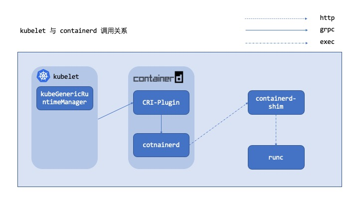

梳理这个目的是为了以后 `containerd` 上线提前储备相关知识，预设问题还是之前的 POD 是如何创建，以此来摸索他的调用链路。



# 参数对比

对比一下` kubelet` 使用 `dockerd` 和 `cotnainerd` 参数的对比，最核心的地方就是 ` --container-runtime=remote --container-runtime-endpoint=/run/containerd/containerd.sock`  指定  `CRI` 的地址调用地址，而 docker 默认是使用的 `/var/run/docker.sock`

`docker` 的命令行参数

`
/usr/bin/kubelet --bootstrap-kubeconfig=/etc/kubernetes/bootstrap-kubelet.conf --kubeconfig=/etc/kubernetes/kubelet.conf --config=/var/lib/kubelet/config.yaml --allowed-unsafe-sysctls=net.core.somaxconn --cloud-provider=aws --eviction-hard=memory.available<1Mi,nodefs.available<1Mi,nodefs.inodesFree<1 --max-pods=110 --network-plugin=cni
`

`containerd` 的命令行参数

`
/usr/bin/kubelet --bootstrap-kubeconfig=/etc/kubernetes/bootstrap-kubelet.conf --kubeconfig=/etc/kubernetes/kubelet.conf --config=/var/lib/kubelet/config.yaml --container-runtime=remote --container-runtime-endpoint=/run/containerd/containerd.sock --fail-swap-on=false --node-ip= --fail-swap-on=false
`

# `containerd` 的 `CRI` 实现

分析一下 `containerd` 的启动信息，会对关键信息做出标示。

```bash
Jan 06 06:58:39 kind-control-plane systemd[1]: Started containerd container runtime.
Jan 06 06:58:40 kind-control-plane containerd[6056]: time="2021-01-06T06:58:40.310871000Z" level=info msg="starting containerd" revision=449e926990f8539fd00844b26c07e2f1e306c760 version=v1.3.3-14-g449e9269 // 版本信息
...  删除和当前话题不相关的日志
Jan 06 06:58:40 kind-control-plane containerd[6056]: time="2021-01-06T06:58:40.628292200Z" level=info msg="loading plugin \"io.containerd.grpc.v1.cri\"..." type=io.containerd.grpc.v1
Jan 06 06:58:40 kind-control-plane containerd[6056]: time="2021-01-06T06:58:40.628593500Z" level=info msg="Start cri plugin with config {PluginConfig:{ContainerdConfig:{Snapshotter:overlayfs DefaultRuntimeName:runc DefaultRuntime:{Type: Engine: PodAnnotations:[] Root: Options:<nil> PrivilegedWithoutHostDevices:false} UntrustedWorkloadRuntime:{Type: Engine: PodAnnotations:[] Root: Options:<nil> PrivilegedWithoutHostDevices:false} Runtimes:map[runc:{Type:io.containerd.runc.v2 Engine: PodAnnotations:[] Root: Options:<nil> PrivilegedWithoutHostDevices:false} test-handler:{Type:io.containerd.runc.v2 Engine: PodAnnotations:[] Root: Options:<nil> PrivilegedWithoutHostDevices:false}] NoPivot:false} CniConfig:{NetworkPluginBinDir:/opt/cni/bin NetworkPluginConfDir:/etc/cni/net.d NetworkPluginMaxConfNum:1 NetworkPluginConfTemplate:} Registry:{Mirrors:map[docker.io:{Endpoints:[https://registry-1.docker.io]}] Configs:map[] Auths:map[]} DisableTCPService:true StreamServerAddress:127.0.0.1 StreamServerPort:0 StreamIdleTimeout:4h0m0s EnableSelinux:false SandboxImage:k8s.gcr.io/pause:3.2 StatsCollectPeriod:10 SystemdCgroup:false EnableTLSStreaming:false X509KeyPairStreaming:{TLSCertFile: TLSKeyFile:} MaxContainerLogLineSize:16384 DisableCgroup:false DisableApparmor:false RestrictOOMScoreAdj:false MaxConcurrentDownloads:3 DisableProcMount:false} ContainerdRootDir:/var/lib/containerd ContainerdEndpoint:/run/containerd/containerd.sock RootDir:/var/lib/containerd/io.containerd.grpc.v1.cri StateDir:/run/containerd/io.containerd.grpc.v1.cri}"
Jan 06 06:58:40 kind-control-plane containerd[6056]: time="2021-01-06T06:58:40.628725100Z" level=info msg="Connect containerd service"
Jan 06 06:58:40 kind-control-plane containerd[6056]: time="2021-01-06T06:58:40.629022800Z" level=info msg="Get image filesystem path \"/var/lib/containerd/io.containerd.snapshotter.v1.overlayfs\""
Jan 06 06:58:40 kind-control-plane containerd[6056]: time="2021-01-06T06:58:40.654848300Z" level=info msg="loading plugin \"io.containerd.grpc.v1.introspection\"..." type=io.containerd.grpc.v1
Jan 06 06:58:40 kind-control-plane containerd[6056]: time="2021-01-06T06:58:40.656292800Z" level=info msg=serving... address=/run/containerd/containerd.sock.ttrpc 
Jan 06 06:58:40 kind-control-plane containerd[6056]: time="2021-01-06T06:58:40.656821700Z" level=info msg=serving... address=/run/containerd/containerd.sock // 这里就是启动的关键点，对外提供一个 sock 
Jan 06 06:58:40 kind-control-plane containerd[6056]: time="2021-01-06T06:58:40.657936200Z" level=info msg="containerd successfully booted in 0.349859s"
Jan 06 06:58:40 kind-control-plane containerd[6056]: time="2021-01-06T06:58:40.656645700Z" level=info msg="Start subscribing containerd event"
Jan 06 06:58:40 kind-control-plane containerd[6056]: time="2021-01-06T06:58:40.659444000Z" level=info msg="Start recovering state"
Jan 06 06:58:41 kind-control-plane containerd[6056]: time="2021-01-06T06:58:41.336754900Z" level=info msg="Start event monitor"
Jan 06 06:58:41 kind-control-plane containerd[6056]: time="2021-01-06T06:58:41.337037100Z" level=info msg="Start snapshots syncer"
Jan 06 06:58:41 kind-control-plane containerd[6056]: time="2021-01-06T06:58:41.337099000Z" level=info msg="Start streaming server"
```

## `io.containerd.grpc.v1.cri` 的实现

我们测试环境的版本是 `1.3.3`，checkout 出相关代码可以看到如下代码。在新的版本中 `cotnaienrd cri` 代码仓库已经合并到了的 `containerd` 代码仓库了。

```go
import _ "github.com/containerd/cri"
```

从代码分析可以看出端倪，当前版本包装了 `containerd` 实现了的是 `v1alpha2` 的 CRI 定义。

```go
func (c *criService) register(s *grpc.Server) error {
	instrumented := newInstrumentedService(c)
	runtime.RegisterRuntimeServiceServer(s, instrumented) // 这个 runtime 是 import runtime "k8s.io/cri-api/pkg/apis/runtime/v1alpha2"
	runtime.RegisterImageServiceServer(s, instrumented)
	return nil
}
```

看一下核心函数 `CRI` 的核心接口  `RunPodSandbox`，之所以先看这个函数主要原因是因为这个函数给POD准备了网络等等也符合POD的创建的时间序列

```go
func (in *instrumentedService) RunPodSandbox(ctx context.Context, r *runtime.RunPodSandboxRequest) (res *runtime.RunPodSandboxResponse, err error) {
	if err := in.checkInitialized(); err != nil {
		return nil, err
	}
	log.G(ctx).Infof("RunPodsandbox for %+v", r.GetConfig().GetMetadata())
	defer func() {
		if err != nil {
			log.G(ctx).WithError(err).Errorf("RunPodSandbox for %+v failed, error", r.GetConfig().GetMetadata())
		} else {
			log.G(ctx).Infof("RunPodSandbox for %+v returns sandbox id %q", r.GetConfig().GetMetadata(), res.GetPodSandboxId())
		}
	}()
	res, err = in.c.RunPodSandbox(ctrdutil.WithNamespace(ctx), r)
	return res, errdefs.ToGRPC(err)
}
```

`container` 已 `plugin` 实现的 `RunPodSandbox`和 `dockershim` 的版本实现没有本质区别。

```go
// RunPodSandbox creates and starts a pod-level sandbox. Runtimes should ensure
// the sandbox is in ready state.
func (c *criService) RunPodSandbox(ctx context.Context, r *runtime.RunPodSandboxRequest) (_ *runtime.RunPodSandboxResponse, retErr error) {
	config := r.GetConfig()
	log.G(ctx).Debugf("Sandbox config %+v", config)

	// Generate unique id and name for the sandbox and reserve the name.
	id := util.GenerateID()
	metadata := config.GetMetadata() // 都是 kubelet 传入的
	if metadata == nil {
		return nil, errors.New("sandbox config must include metadata")
	}
	name := makeSandboxName(metadata)
	log.G(ctx).Debugf("Generated id %q for sandbox %q", id, name)
	// Reserve the sandbox name to avoid concurrent `RunPodSandbox` request starting the
	// same sandbox.
	if err := c.sandboxNameIndex.Reserve(name, id); err != nil {
		return nil, errors.Wrapf(err, "failed to reserve sandbox name %q", name)
	}
	defer func() {
		// Release the name if the function returns with an error.
		if retErr != nil {
			c.sandboxNameIndex.ReleaseByName(name)
		}
	}()

	// Create initial internal sandbox object.
	sandbox := sandboxstore.NewSandbox(
		sandboxstore.Metadata{
			ID:             id,
			Name:           name,
			Config:         config,
			RuntimeHandler: r.GetRuntimeHandler(),
		},
		sandboxstore.Status{
			State: sandboxstore.StateUnknown,
		},
	)

	// Ensure sandbox container image snapshot.
	image, err := c.ensureImageExists(ctx, c.config.SandboxImage, config)
	if err != nil {
		return nil, errors.Wrapf(err, "failed to get sandbox image %q", c.config.SandboxImage)
	}
	containerdImage, err := c.toContainerdImage(ctx, *image)
	if err != nil {
		return nil, errors.Wrapf(err, "failed to get image from containerd %q", image.ID)
	}

	ociRuntime, err := c.getSandboxRuntime(config, r.GetRuntimeHandler())
	if err != nil {
		return nil, errors.Wrap(err, "failed to get sandbox runtime")
	}
	log.G(ctx).Debugf("Use OCI %+v for sandbox %q", ociRuntime, id)

	securityContext := config.GetLinux().GetSecurityContext()
	//Create Network Namespace if it is not in host network
	hostNet := securityContext.GetNamespaceOptions().GetNetwork() == runtime.NamespaceMode_NODE
	if !hostNet {
		// If it is not in host network namespace then create a namespace and set the sandbox
		// handle. NetNSPath in sandbox metadata and NetNS is non empty only for non host network
		// namespaces. If the pod is in host network namespace then both are empty and should not
		// be used.
		sandbox.NetNS, err = netns.NewNetNS()
		if err != nil {
			return nil, errors.Wrapf(err, "failed to create network namespace for sandbox %q", id)
		}
		sandbox.NetNSPath = sandbox.NetNS.GetPath()
		defer func() {
			if retErr != nil {
				if err := sandbox.NetNS.Remove(); err != nil {
					log.G(ctx).WithError(err).Errorf("Failed to remove network namespace %s for sandbox %q", sandbox.NetNSPath, id)
				}
				sandbox.NetNSPath = ""
			}
		}()
		// Setup network for sandbox.
		// Certain VM based solutions like clear containers (Issue containerd/cri-containerd#524)
		// rely on the assumption that CRI shim will not be querying the network namespace to check the
		// network states such as IP.
		// In future runtime implementation should avoid relying on CRI shim implementation details.
		// In this case however caching the IP will add a subtle performance enhancement by avoiding
		// calls to network namespace of the pod to query the IP of the veth interface on every
		// SandboxStatus request.
		if err := c.setupPodNetwork(ctx, &sandbox); err != nil {
			return nil, errors.Wrapf(err, "failed to setup network for sandbox %q", id)
		}
		defer func() {
			if retErr != nil {
				// Teardown network if an error is returned.
				if err := c.teardownPodNetwork(ctx, sandbox); err != nil {
					log.G(ctx).WithError(err).Errorf("Failed to destroy network for sandbox %q", id)
				}
			}
		}()
	}

	// Create sandbox container.
	spec, err := c.generateSandboxContainerSpec(id, config, &image.ImageSpec.Config, sandbox.NetNSPath, ociRuntime.PodAnnotations)
	if err != nil {
		return nil, errors.Wrap(err, "failed to generate sandbox container spec")
	}
	log.G(ctx).Debugf("Sandbox container %q spec: %#+v", id, spew.NewFormatter(spec))

	var specOpts []oci.SpecOpts
	userstr, err := generateUserString(
		"",
		securityContext.GetRunAsUser(),
		securityContext.GetRunAsGroup(),
	)
	if err != nil {
		return nil, errors.Wrap(err, "failed to generate user string")
	}
	if userstr == "" {
		// Lastly, since no user override was passed via CRI try to set via OCI
		// Image
		userstr = image.ImageSpec.Config.User
	}
	if userstr != "" {
		specOpts = append(specOpts, oci.WithUser(userstr))
	}

	seccompSpecOpts, err := generateSeccompSpecOpts(
		securityContext.GetSeccompProfilePath(),
		securityContext.GetPrivileged(),
		c.seccompEnabled)
	if err != nil {
		return nil, errors.Wrap(err, "failed to generate seccomp spec opts")
	}
	if seccompSpecOpts != nil {
		specOpts = append(specOpts, seccompSpecOpts)
	}

	sandboxLabels := buildLabels(config.Labels, containerKindSandbox)

	runtimeOpts, err := generateRuntimeOptions(ociRuntime, c.config)
	if err != nil {
		return nil, errors.Wrap(err, "failed to generate runtime options")
	}
	opts := []containerd.NewContainerOpts{
		containerd.WithSnapshotter(c.config.ContainerdConfig.Snapshotter),
		customopts.WithNewSnapshot(id, containerdImage),
		containerd.WithSpec(spec, specOpts...),
		containerd.WithContainerLabels(sandboxLabels),
		containerd.WithContainerExtension(sandboxMetadataExtension, &sandbox.Metadata),
		containerd.WithRuntime(ociRuntime.Type, runtimeOpts)}

	container, err := c.client.NewContainer(ctx, id, opts...) // 上一篇的调用 containerd 写 metadata 
	if err != nil {
		return nil, errors.Wrap(err, "failed to create containerd container")
	}
	defer func() {
		if retErr != nil {
			deferCtx, deferCancel := ctrdutil.DeferContext()
			defer deferCancel()
			if err := container.Delete(deferCtx, containerd.WithSnapshotCleanup); err != nil {
				log.G(ctx).WithError(err).Errorf("Failed to delete containerd container %q", id)
			}
		}
	}()

	// Create sandbox container root directories.
	sandboxRootDir := c.getSandboxRootDir(id)
	if err := c.os.MkdirAll(sandboxRootDir, 0755); err != nil {
		return nil, errors.Wrapf(err, "failed to create sandbox root directory %q",
			sandboxRootDir)
	}
	defer func() {
		if retErr != nil {
			// Cleanup the sandbox root directory.
			if err := c.os.RemoveAll(sandboxRootDir); err != nil {
				log.G(ctx).WithError(err).Errorf("Failed to remove sandbox root directory %q",
					sandboxRootDir)
			}
		}
	}()
	volatileSandboxRootDir := c.getVolatileSandboxRootDir(id)
	if err := c.os.MkdirAll(volatileSandboxRootDir, 0755); err != nil {
		return nil, errors.Wrapf(err, "failed to create volatile sandbox root directory %q",
			volatileSandboxRootDir)
	}
	defer func() {
		if retErr != nil {
			// Cleanup the volatile sandbox root directory.
			if err := c.os.RemoveAll(volatileSandboxRootDir); err != nil {
				log.G(ctx).WithError(err).Errorf("Failed to remove volatile sandbox root directory %q",
					volatileSandboxRootDir)
			}
		}
	}()

	// Setup sandbox /dev/shm, /etc/hosts, /etc/resolv.conf and /etc/hostname.
	if err = c.setupSandboxFiles(id, config); err != nil {
		return nil, errors.Wrapf(err, "failed to setup sandbox files")
	}
	defer func() {
		if retErr != nil {
			if err = c.unmountSandboxFiles(id, config); err != nil {
				log.G(ctx).WithError(err).Errorf("Failed to unmount sandbox files in %q",
					sandboxRootDir)
			}
		}
	}()

	// Update sandbox created timestamp.
	info, err := container.Info(ctx)
	if err != nil {
		return nil, errors.Wrap(err, "failed to get sandbox container info")
	}

	// Create sandbox task in containerd.
	log.G(ctx).Tracef("Create sandbox container (id=%q, name=%q).",
		id, name)

	var taskOpts []containerd.NewTaskOpts
	// TODO(random-liu): Remove this after shim v1 is deprecated.
	if c.config.NoPivot && (ociRuntime.Type == plugin.RuntimeRuncV1 || ociRuntime.Type == plugin.RuntimeRuncV2) {
		taskOpts = append(taskOpts, containerd.WithNoPivotRoot)
	}
	// We don't need stdio for sandbox container.
	task, err := container.NewTask(ctx, containerdio.NullIO, taskOpts...) // 我们熟悉的调用 cotnainer 的 task 启动创建 contianer
	if err != nil {
		return nil, errors.Wrap(err, "failed to create containerd task")
	}
	defer func() {
		if retErr != nil {
			deferCtx, deferCancel := ctrdutil.DeferContext()
			defer deferCancel()
			// Cleanup the sandbox container if an error is returned.
			if _, err := task.Delete(deferCtx, containerd.WithProcessKill); err != nil && !errdefs.IsNotFound(err) {
				log.G(ctx).WithError(err).Errorf("Failed to delete sandbox container %q", id)
			}
		}
	}()

	// wait is a long running background request, no timeout needed.
	exitCh, err := task.Wait(ctrdutil.NamespacedContext()) // 等待 task 完成
	if err != nil {
		return nil, errors.Wrap(err, "failed to wait for sandbox container task")
	}

	if err := task.Start(ctx); err != nil {
		return nil, errors.Wrapf(err, "failed to start sandbox container task %q", id)
	}

	if err := sandbox.Status.Update(func(status sandboxstore.Status) (sandboxstore.Status, error) {
		// Set the pod sandbox as ready after successfully start sandbox container.
		status.Pid = task.Pid()
		status.State = sandboxstore.StateReady
		status.CreatedAt = info.CreatedAt
		return status, nil
	}); err != nil {
		return nil, errors.Wrap(err, "failed to update sandbox status")
	}

	// Add sandbox into sandbox store in INIT state.
	sandbox.Container = container

	if err := c.sandboxStore.Add(sandbox); err != nil {
		return nil, errors.Wrapf(err, "failed to add sandbox %+v into store", sandbox)
	}

	// start the monitor after adding sandbox into the store, this ensures
	// that sandbox is in the store, when event monitor receives the TaskExit event.
	//
	// TaskOOM from containerd may come before sandbox is added to store,
	// but we don't care about sandbox TaskOOM right now, so it is fine.
	c.eventMonitor.startExitMonitor(context.Background(), id, task.Pid(), exitCh)

	return &runtime.RunPodSandboxResponse{PodSandboxId: id}, nil
}
```


有了 `dockershim` 上次的基础，这次再看 `containerd` 中不同插件之间调用就要简单的多，过多细节不在赘述。